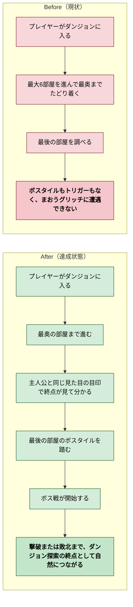
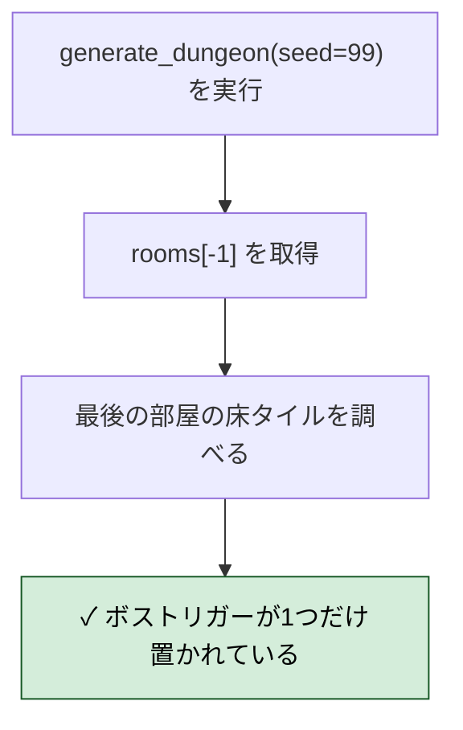
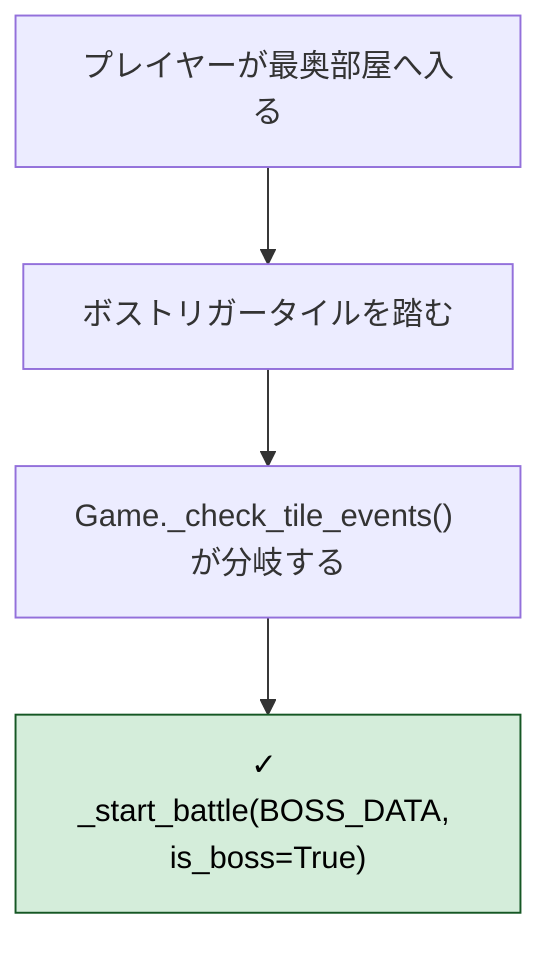
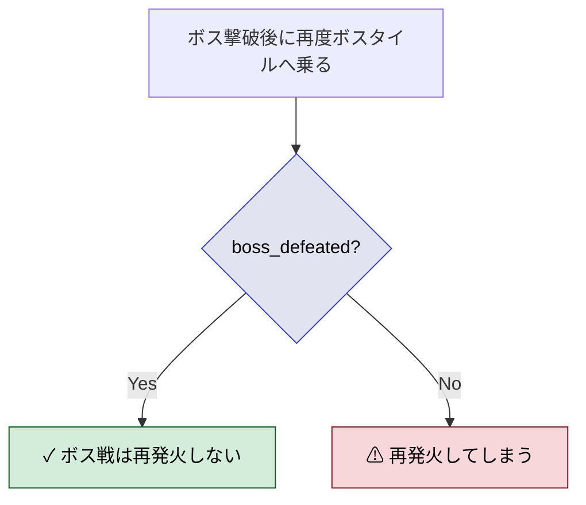
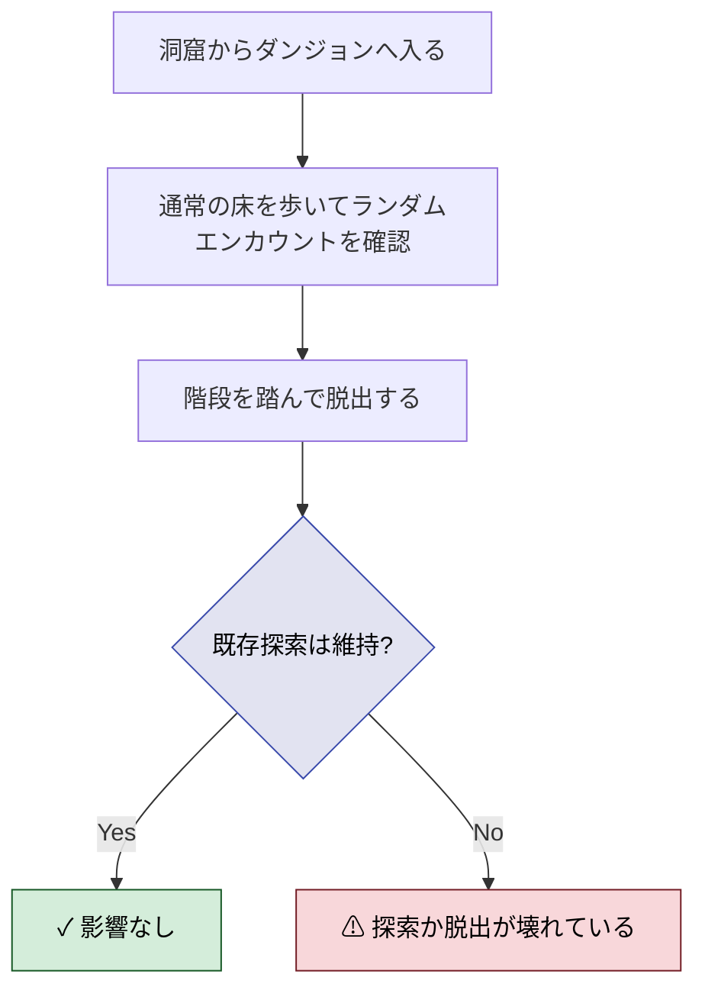
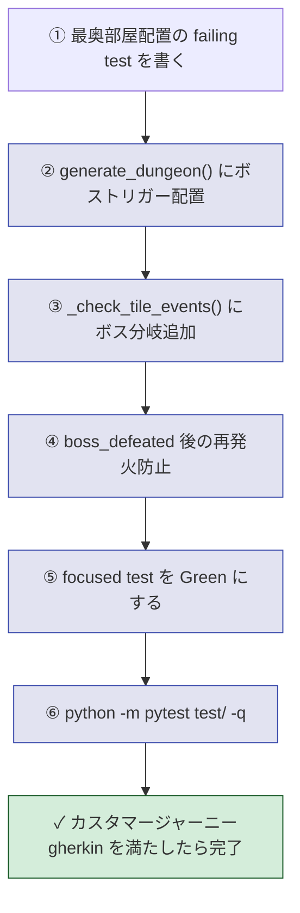
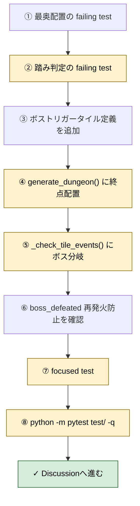

# 2026年4月13日 J38 ダンジョン最奥でボス戦が始まるようにする

> 状態：(6) Discussion
> 次のゲート：（ユーザー）必要なら実画面確認 or 次タスク

---

## 1) 改善対象ジャーニー

- **深層的目的**：ダンジョン探索の終点に「まおうグリッチ」との対決をちゃんと置き、最後まで進んだ手応えを子どもが受け取れるようにする
- **やらないこと**：ダンジョン生成アルゴリズムの全面刷新、通常エンカウントの再設計、ボスの能力値や演出の大幅追加、別ルートの新規実装

### 現状

- `generate_dungeon()` は最大6部屋を生成するが、最後の部屋にボス専用タイルや到達演出が置かれていない
- `get_zone()` はダンジョン内を常に `zone 4` として扱うため、ボス相当の `zone 5` へは進まない
- `_build_zone_enemies()` では `is_boss=True` の敵がランダムエンカウントから除外されており、通常戦闘では出てこない
- `_start_battle(BOSS_DATA, is_boss=True)` を起動する経路が存在せず、`BOSS_DATA` が実質的に未接続になっている
- その結果、プレイヤーは最奥まで進んでもボスに会えず、ダンジョンの締めが抜けたままになっている
- さらに、最奥に着いても「どこがボス位置か」を示す見た目の目印がなく、子どもには探索の終点が分かりにくい

### 今回の方針

- ボスはランダム遭遇ではなく、ダンジョン最奥の部屋に置く明示トリガーとして扱う
- 最後の部屋に「ここが終点だ」と分かるボスタイルを1か所だけ配置し、踏んだ瞬間にボス戦へ入る流れを作る
- ボスタイルの位置には主人公と同じ見た目の目印キャラを重ね描きし、近づくだけで終点だと分かるようにする
- ボス戦開始条件は「最奥部屋に到達した」「まだボス未撃破」の2点に絞り、通常探索や通常エンカウントとは分離する
- ボス撃破後は再度同じボス戦が始まらないようにしつつ、既存のダンジョン入退場や探索フローは壊さない
- まずは「遭遇手段がない幽霊状態」を解消することを優先し、追加演出や報酬拡張は今回の外に置く

### 委任度

- 🟢 CC主導で仕様化まで進められる。実装では `generate_dungeon()` と `Game._check_tile_events()` の2か所を主軸に進めればよい

---

## 2) カスタマージャーニーgherkin（完了条件）

### シナリオ1：正常系（最奥の部屋にボストリガーが置かれる）

> {固定シードでダンジョンを生成する} で {最後の部屋を確認する} と {最奥の部屋内にボストリガータイルが1つだけ置かれ、入口階段とは別位置になっている}

### シナリオ2：正常系（ボストリガーを踏むとボス戦が始まる）

> {プレイヤーがダンジョン内にいて boss_defeated=False} で {最奥のボストリガータイルを踏む} と {_start_battle(BOSS_DATA, is_boss=True) が1回だけ呼ばれ、ボス戦として開始する}

---

### シナリオ3：異常系（撃破後や通常床ではボス戦が再発火しない）

> {ボストリガー追加済み} で {boss_defeated=True の状態で同じタイルを踏む、または通常の床を歩く} と {ボス戦は始まらず、通常探索か既存の脱出導線だけが動く}

---

### シナリオ4：リスク確認（既存のダンジョン探索を壊さない）

> {ボストリガー追加済み} で {ダンジョン入口、通常エンカウント、階段脱出を確認する} と {ダンジョン探索は zone 4 のまま維持され、ボスはランダム遭遇せず、階段脱出も従来どおり動く}

### 委任度

- 🟢 カスタマージャーニーgherkin は固定できた。実装では「最奥部屋への配置」「踏み判定」「再発火防止」「回帰確認」の順に進めればよい

---

## 3) Design（どうやるか）

- **関連スキル・MCP**：`superpowers:systematic-debugging`、`superpowers:test-driven-development`、`superpowers:verification-before-completion`
- **MCP**：追加なし

```mermaid
flowchart LR
    subgraph INPUT["インプット"]
        I1["generate_dungeon() の rooms[-1]"]
        I2["BOSS_DATA と battle_is_boss 経路"]
        I3["Game._check_tile_events() のタイル分岐"]
    end

    subgraph PROCESS["処理・変換"]
        P1["最奥部屋にボストリガータイルを置く"]
        P2["ボスタイル踏破で _start_battle(BOSS_DATA, is_boss=True)"]
        P3["boss_defeated なら再発火しないように抑止"]
    end

    subgraph OUTPUT["アウトプット"]
        O1["最奥でだけボス戦が始まる"]
        O2["通常探索と階段脱出はそのまま"]
    end

    INPUT --> PROCESS --> OUTPUT

    classDef io fill:#e2e3f1,stroke:#3949ab,color:#000000;
    classDef proc fill:#fff3cd,stroke:#856404,color:#000000;
    classDef out fill:#d4edda,stroke:#155724,color:#000000;

    class I1,I2,I3 io;
    class P1,P2,P3 proc;
    class O1,O2 out;
```

### 設計の要点

- ボス遭遇は `zone 5` へ寄せず、最奥タイルの explicit trigger で開始する。これにより `get_zone()` と `ZONE_ENEMIES` の通常探索ロジックを広く触らずに済む
- ボス戦専用BGMと文言は既に `battle_is_boss=True` 経路で成立しているため、必要なのは `BOSS_DATA` への接続だけでよい
- 最奥の目印は `main.py` 内のコード定義タイルとして追加する。`*.pyxres` を直接触らずに済み、tilemap bake/derive の往復でも保持できる
- `generate_dungeon()` では `rooms` が存在する場合に `rooms[-1]` を終点部屋として扱い、部屋内の代表1マスへボストリガータイルを置く。入口階段のある `rooms[0]` とは別位置を保証する
- `Game._check_tile_events()` にダンジョン内ボストリガー分岐を足し、`p["in_dungeon"] and not p["boss_defeated"]` のときだけ `_start_battle(BOSS_DATA, is_boss=True)` を呼ぶ
- ボス位置の分かりやすさは NPC 追加ではなく `draw_map()` の描画オーバーレイで解決する。イベント判定は `T_BOSS_TRIGGER` のまま維持し、表示だけを後から重ねる
- 目印キャラには既存の `hero_down` スプライトを再利用し、`boss_defeated=True` になったら描画しない。これで撃破後は自然に消え、追加の状態管理を増やさずに済む
- ボス撃破後はタイルを消さなくても `boss_defeated` ガードで再発火を防げる。既存の「階段または外周脱出で ending へ進む」流れはそのまま残せる
- ランダムエンカウント側は現状維持とする。`_build_zone_enemies()` が `is_boss=True` を除外し続けること自体は正しく、今回の修正対象ではない

### 既存ファイルとの対応

- `main.py`
  ボストリガータイル定義、`generate_dungeon()` の終点配置、`Game._check_tile_events()` の踏み判定、`draw_map()` の目印キャラ描画を追加する主対象
- `test/test_dungeon_boss_trigger.py`（新規想定）
  最奥部屋配置、踏み判定、再発火防止、目印キャラの表示 / 非表示、通常探索回帰を固定する
- 既存の `test/test_audio_system.py`
  既に `battle_is_boss=True` で boss BGM へ入る経路を押さえているため、ここは回帰確認だけで足りる

### 検証方針

- まず pure 寄りのテストで `generate_dungeon()` の最奥配置を固定する
- 次に `Game` を軽量生成するテストで `_check_tile_events()` が `BOSS_DATA` を `is_boss=True` 付きで起動することを確認する
- 追加で `draw_map()` が未撃破時だけ最奥の目印キャラを描き、撃破後は描かないことを確認する
- 追加で `boss_defeated=True` 時に同じタイルを踏んでも再戦しないこと、通常床のランダムエンカウントにボスが混ざらないことを確認する
- 最後に `python -m pytest test/ -q` を回して dialogue / audio / 既存 dungeon 導線への回帰がないことを確認する

### 委任度

- 🟢 設計は実装可能な粒度まで落ちた。主変更箇所は `main.py` と新規テスト1本に集約できる

---

## 4) Tasklist

> 必ず上から順に実施。最小修正でボス導線だけを復旧し、横に広げない。

- [x] `test/test_dungeon_boss_trigger.py` を追加し、`generate_dungeon()` の最奥部屋にボストリガーが1つ置かれる failing test を書いた
- [x] 同テストで、`boss_defeated=False` のときだけ `_check_tile_events()` が `_start_battle(BOSS_DATA, is_boss=True)` を呼ぶ failing test を書いた
- [x] `main.py` にコード定義のボストリガータイルを追加し、tilemap bake/derive で往復できるようにした
- [x] `generate_dungeon()` で `rooms[-1]` の代表1マスへボストリガータイルを配置した
- [x] `Game._check_tile_events()` にダンジョン内ボストリガー分岐を追加した
- [x] `boss_defeated=True` 時は同じタイルを踏んでも再戦しないことを focused test で確認した
- [x] 同テストに、未撃破時だけ `draw_map()` が最奥の目印キャラを描く focused test を追加した
- [x] `main.py` の `draw_map()` に主人公スプライトを使う目印キャラ描画を追加した
- [x] `boss_defeated=True` 時は目印キャラも描かれないことを focused test で確認した
- [x] `python -m pytest test/test_dungeon_boss_trigger.py -q` で focused test を Green にした
- [x] `python -m pytest test/ -q` で全体回帰を確認した

---

## 5) 結果

- ダンジョン最奥の `T_BOSS_TRIGGER` を踏むと `BOSS_DATA` のボス戦が始まり、探索終点が実際に機能するようになった
- 最奥部屋には主人公と同じ見た目の目印キャラが立つようになり、子どもが魔王の場所を見た目で見つけやすくなった
- `boss_defeated=True` になると、同じタイルでも再戦せず、目印キャラも自動で消える
- 回帰確認として `python -m pytest test/test_dungeon_boss_trigger.py -q` では `5 passed`、`python -m pytest test/ -q` では `153 passed, 2 skipped` を確認済み

---

## 6) Discussion（記録・反省）

> Observe → Think → Act を刻む。未来の自分が復元できることが目的。

### 2026年4月13日 22:18（起票）

**Observe**：ダンジョンは最大6部屋まで生成されるが、最奥の部屋にボスタイルも戦闘トリガーもなく、`get_zone()` もダンジョン全体を `zone 4` として扱っている。さらに `_build_zone_enemies()` は `is_boss=True` を通常エンカウントから除外しているため、`BOSS_DATA` は存在しても遭遇導線がない。
**Think**：問題はボスデータ不足ではなく、最奥部屋を「終点イベント」として結線できていないことにある。ランダムエンカウント側へ寄せるより、最奥部屋に明示トリガーを置いて `_start_battle(BOSS_DATA, is_boss=True)` へつなぐ方が自然で副作用も小さい。
**Act**：ダンジョン最奥のボス遭遇導線を復旧するタスクとして J38 ノートを起票し、改善対象ジャーニーを記入した。

### 2026年4月13日 22:23（カスタマージャーニーgherkin・Design追記）

**Observe**：コード確認の結果、`generate_dungeon()` は階段配置までしかしておらず、`_check_tile_events()` にもダンジョン内のボス分岐がない。一方で `battle_is_boss=True` 側のBGM・文言・撃破フラグ処理は既に揃っていた。
**Think**：不足しているのは「ボス戦の中身」ではなく「最奥到達をボス戦へ変換する接続」だけだった。したがって `get_zone()` を `zone 5` 化して探索全体へ影響を広げるより、終点タイルと explicit trigger を追加する方が修正境界が小さい。
**Act**：`カスタマージャーニーgherkin`、`Design`、`Tasklist` を explicit trigger 案で記入し、実装時の主変更点を `main.py` と新規テストへ絞った。

### 2026年4月13日 22:37（実装・検証）

**Observe**：`test/test_dungeon_boss_trigger.py` を先に追加すると、現状コードには `T_BOSS_TRIGGER` 自体が存在せず Red になった。根本原因どおり、欠けていたのは「終点タイル」と「踏み判定」だった。
**Think**：この修正は `zone` や通常エンカウントへ触れずに閉じられる。`main.py` のタイル定義、`generate_dungeon()` の最奥配置、`_check_tile_events()` の分岐だけで要件を満たせるのが確認できた。
**Act**：ボストリガータイルをコード定義で追加し、最奥部屋へ1マス配置、踏んだら `_start_battle(BOSS_DATA, is_boss=True)` を呼ぶよう実装した。`python -m pytest test/test_dungeon_boss_trigger.py -q` は `3 passed`、`python -m pytest test/ -q` は `149 passed, 2 skipped`。`python tools/test_headless.py` は sandbox の Pyxel/音声環境で停止したため、補助検証としては未完了。

### 2026年4月13日 22:52（目印キャラ追加）

**Observe**：ボストリガー自体は復旧したが、最奥部屋に着いてもどのマスを踏めばよいかが視覚的に弱く、子どもには「魔王の場所」が少し見つけにくかった。
**Think**：新しい NPC 管理やタイル絵差し替えまで広げる必要はない。既存の `T_BOSS_TRIGGER` をそのまま使い、`draw_map()` で主人公スプライトを重ねるだけなら、見た目の改善だけを小さく足せる。
**Act**：`draw_map()` から最奥ボスタイルに主人公と同じ見た目の目印キャラを描くようにし、`boss_defeated=True` 後は描画を止めた。`test/test_dungeon_boss_trigger.py` に「未撃破なら表示」「撃破後は非表示」を追加し、focused test は `5 passed` になった。

### 2026年4月13日 23:08（完了処理）

**Observe**：J38 は `Tasklist` も `結果` も埋まっており、実装ファイルと focused test も現行ツリーに残っていたが、ノートだけが `status: open` のままだった。  
**Think**：必要なのは仕様追加ではなく、fresh な回帰確認を付けて完了扱いへ整理することだけだった。  
**Act**：`python -m pytest test/test_dungeon_boss_trigger.py -q` で `5 passed`、`python -m pytest test/ -q` で `153 passed, 2 skipped` を再確認し、J38 を `steering/done/` へ移した。
