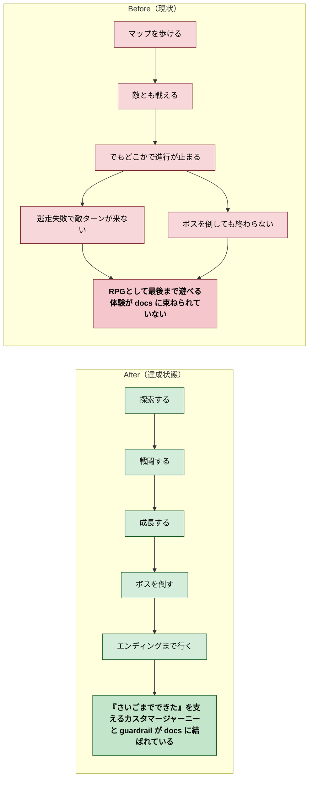

# 2026年4月13日 J42 子どもが冒険を最後までやり切れる

> 状態：(5) Discussion
> 次のゲート：（ユーザー）必要なら実装側のヘッドレス強化タスク化 or 次タスク

---

## 1) 改善対象ジャーニー

- **深層的目的**：RPGとして成立していることを、子どもの体験として docs に明示する
- **やらないこと**：このノートでヘッドレス実装まで終わらせること、既存 `CJ01-CJ41` の番号を振り直すこと、guardrail の改造レイヤーを増やすこと

### 現状

- `docs/customer-journeys.md` には `CJ39: システムを変えたらゲーム全体が壊れた` があり、壊れ方の説明はある
- しかし「探索 → 戦闘 → 成長 → ボス → エンディング」を最後まで通せること自体を、正の体験として束ねたカスタマージャーニーはない
- そのため、「逃走失敗後に敵ターンが来ない」のようなバグを `RPGとして成立していない` 問題として受け止める軸が docs 上で弱い
- `docs/cj-gherkin-guardrails.md` には主要パス完走や戦闘完走の考え方はあるが、`CJ42` のような守る対象としてはまだ結ばれていない

### 今回の方針

- `customer-journeys.md` の `育てるループ` に新しい `CJ42` を追加する
- 物理的な置き場所は `育てるループ` だが、既存参照を壊さないため番号は `CJ42` にする
- `CJ42` の job は `J2: 好循環` のみとし、まずは「最後まで遊べる」体験に絞る
- `cj-gherkin-guardrails.md` は `CJ35-CJ42` を対象カスタマージャーニーに広げ、既存の `CJG38/CJG39` の本文と scenario で `CJ42` を守る構成にする
- 新しい改造レイヤーは増やさず、`CJ42` は既存レイヤーをまたぐ縦断体験として扱う

### 委任度

- 🟢 CC主導で docs 追記は進められる。実装側のヘッドレスシナリオ強化は別タスクに分けてもよい

---

## 2) カスタマージャーニーgherkin（完了条件）

### シナリオ1：正常系（カスタマージャーニーに RPG 完走体験が追加される）

> {`customer-journeys.md` を更新する} で {育てるループを確認する} と {`CJ42: 子どもが冒険を最後までやり切れる` が追加され、探索→戦闘→成長→ボス→エンディングの体験が正のカスタマージャーニーとして読める}

### シナリオ2：正常系（guardrail が CJ42 を守る構成になる）

> {`cj-gherkin-guardrails.md` を更新する} で {対象カスタマージャーニーと関連 section を確認する} と {`CJ35-CJ42` が対象になり、`CJG38/CJG39` が `CJ42` を守る縦断 guardrail として読める}

### シナリオ3：正常系（逃走失敗バグを guardrail で表現できる）

> {戦闘システムの guardrail を更新する} で {逃走失敗ケースを確認する} と {`逃走失敗 → 敵ターンが来る → 次ターンへ進む` が明記され、無限逃走状態が失敗条件として表現される}

### シナリオ4：リスク確認（既存の番号体系とレイヤー分類を壊さない）

> {CJ42 を追加済み} で {ジャーニー一覧と guardrail の改造レイヤー表を確認する} と {既存 `CJ01-CJ41` の番号は変わらず、新しい改造レイヤーも増えていない}

---

## 3) Design（どうやるか）

- **関連スキル・MCP**：`superpowers:brainstorming`、`superpowers:verification-before-completion`
- **MCP**：追加なし

- `docs/customer-journeys.md`
  `育てるループ` の末尾に `CJ42: 子どもが冒険を最後までやり切れる` を追加する。本文は「探索 → 戦闘 → 成長 → ボス → エンディング」が最後までつながることを、子どもの達成体験として書く
- `docs/customer-journeys.md`
  下部のジャーニー一覧にも `CJ42 | 育てる | 子どもが冒険を最後までやり切れる | J2: 好循環` を追加する
- `docs/cj-gherkin-guardrails.md`
  冒頭の `対象カスタマージャーニー` を `CJ35-CJ42` に変更する
- `docs/cj-gherkin-guardrails.md`
  `CJ42` は新しい layer にはせず、`CJG38/CJG39` 本文で「CJ42 を守る縦断体験をここで担保する」と説明する
- `docs/cj-gherkin-guardrails.md`
  既存の主要パス走破 scenario を `探索 → 通常戦闘 → 経験値獲得 → 成長確認 → ボス撃破 → エンディング` に強化する
- `docs/cj-gherkin-guardrails.md`
  `CJG39` に `逃走失敗後も戦闘ターンが継続する` scenario を追加し、無限に逃走を試せる状態を失敗条件として明記する

### 検証方針

- `customer-journeys.md` に `CJ42` を追加しても、既存番号参照が壊れないことを `rg "CJ4[0-2]" docs` で目視確認する
- `cj-gherkin-guardrails.md` で `CJ35-CJ42` と本文の `CJ42` 説明が矛盾しないことを確認する
- `CJG38/CJG39` の既存 scenario と重複しすぎず、役割分担が読めることを差分で確認する

---

## 4) Tasklist

- [x] `customer-journeys.md` に `CJ42: 子どもが冒険を最後までやり切れる` を追加する
- [x] `customer-journeys.md` のジャーニー一覧へ `CJ42` を追加する
- [x] `cj-gherkin-guardrails.md` の対象カスタマージャーニーを `CJ35-CJ42` に更新する
- [x] `cj-gherkin-guardrails.md` の `CJG38/CJG39` 本文に `CJ42` を守る説明を追加する
- [x] 主要パス scenario を `探索 → 通常戦闘 → 経験値獲得 → 成長確認 → ボス撃破 → エンディング` に強化する
- [x] `CJG39` に `逃走失敗後も戦闘ターンが継続する` scenario を追加する
- [x] 差分確認で既存番号や layer 追加が起きていないことを確認する

---

## 5) Discussion（記録・反省）

> Observe → Think → Act を刻む。未来の自分が復元できることが目的。

### 2026年4月13日 23:25（起票）

**Observe**：既存 docs には `CJ39` のような「壊れたRPG」の説明はあるが、「最後まで遊べるRPG」を正の体験として束ねたカスタマージャーニーがない。  
**Think**：`逃走失敗で敵ターンが来ない` のようなバグを `RPGとして成立していない` と扱うには、正のカスタマージャーニーとそれを守る guardrail をセットで置く必要がある。  
**Act**：`CJ42: 子どもが冒険を最後までやり切れる` を `育てるループ` に追加し、`CJG38/CJG39` を通じて guardrail と結ぶ task note を起票した。

### 2026年4月13日 23:29（docs更新・検証完了）

**Observe**：`customer-journeys.md` には `CJ42` がなく、`cj-gherkin-guardrails.md` でも `CJ35-CJ41` の範囲に止まっていたため、「RPGとして最後まで遊べる」正の体験と、その体験を守る guardrail の接続が弱かった。  
**Think**：新しい改造レイヤーを増やすより、`育てるループ` に `CJ42` を追加し、`CJG38/CJG39` の本文と scenario を縦断体験の保護へ寄せる方が、既存構造を壊さずに意図を明確化できる。  
**Act**：`docs/customer-journeys.md` に `CJ42: 子どもが冒険を最後までやり切れる` と一覧行を追加し、`docs/cj-gherkin-guardrails.md` では対象カスタマージャーニーを `CJ35-CJ42` に拡張、`CJG38/CJG39` に `CJ42` を守る説明を追加、主要パス scenario を `探索 → 通常戦闘 → 経験値獲得 → 成長確認 → ボス撃破 → エンディング` へ強化し、`逃走失敗後も戦闘ターンが継続する` scenario を新設した。`rg -n "CJ4[0-2]" docs` で `CJ42` 追加と既存番号維持を確認し、`python -m pytest test/ -q` で `153 passed, 2 skipped` を確認した。

---

### 反省とルール化

- 記入先：observe-situation / manage-tasknotes / AGENTS.md
- 次にやること：必要なら `CJ42` を実コードで担保するため、ヘッドレスの縦断シナリオ強化を別タスクとして起票する
