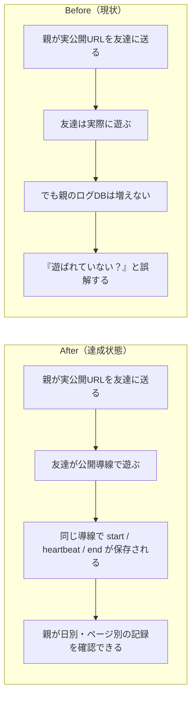

# 2026年4月14日 J43 実公開URLで遊んでもアクセスログが残らない

> 状態：(5) Discussion
> 次のゲート：（ユーザー）必要なら commit / push or 起動方式の永続化を別タスク化

---

## 1) 改善対象ジャーニー

- **根拠となるカスタマージャーニー**：`docs/customer-journeys.md` の `CJ43: 実公開で遊ばれた記録が見える`
- **関連するカスタマージャーニー**：`docs/customer-journeys.md` の `CJ21: 友達に見せる`
- **深層的目的**：このVMで実際に公開している URL で遊ばれた事実が `.runtime/play_sessions.sqlite3` に残り、親が「届いているか」を勘ではなく記録で確認できる状態へ戻す
- **やらないこと**：このタスクで分析ダッシュボードを作ること、行動分析を細かく増やすこと、共有導線そのものを全面刷新すること

### 現状

- `play.html` は `/internal/play-sessions/start|heartbeat|end` へ `POST` する設計になっている
- しかし、このVMで `code-quest-pyxel` を配っている実サーバは `python3 -m http.server 8888 --bind 0.0.0.0` で、`POST /internal/play-sessions/start` に `501 Unsupported method` を返す
- そのため、実公開URLで人が遊んでいても `.runtime/play_sessions.sqlite3` は増えず、CJ43 の「実公開で遊ばれた記録が見える」を満たせていない
- CJ21 の task note では `tools/web_runtime_server.py` を前提にしていたが、実運用の公開経路はそこへつながっていない

### 今回の方針

- まず「実公開URLを配っているプロセス」が `POST /internal/play-sessions/*` を同一 origin で受けられるようにする
- 第一候補は、現行の静的 `http.server` を `python tools/web_runtime_server.py --host 0.0.0.0 --port 8888` へ置き換えること
- もし公開都合で別プロセスを残す必要があるなら、少なくとも `code-quest-pyxel` 側の実公開経路から `tools/web_runtime_server.py` に到達できる構成へ変える
- docs / test / runtime 確認をそろえて、「機能はあるが実公開では記録されない」状態を done 扱いしないようにする

### 委任度

- 🟢 CC主導で調査・task 分解までは完了。次は実公開プロセスの差し替えと確認に進める

---

## 2) カスタマージャーニーgherkin（完了条件）

### シナリオ1：正常系（実公開URLのプレイ記録が残る）

> {親がこのVMの実公開URLを友達に共有した} で {友達が実公開の `play.html` からゲームを開く} と {`.runtime/play_sessions.sqlite3` に `page_kind` と開始時刻を含む session 記録が残る}

### シナリオ2：異常系（静的サーバのまま見逃さない）

> {実公開サーバが静的ファイルしか配っていない} で {`/internal/play-sessions/start` へ疎通確認する} と {未対応が検知され、CJ43 未達のまま done としない}

### シナリオ3：回帰確認（共有導線を壊さない）

> {実公開ログ経路を直した} で {`index.html -> play.html -> pyxel.html` を開く} と {これまでどおり遊べて、追加でログだけが残る}

### 対応するカスタマージャーニーgherkin

- `docs/cj-gherkin-platform.md` `CJG43`
- `Scenario: 親が実公開のアクセスログで遊ばれているか確認できる`
- `Scenario: 公開サーバがログAPIを持たないなら見逃さない`

---

## 3) Design（どうやるか）

- **関連スキル・MCP**：`superpowers:systematic-debugging`、`superpowers:verification-before-completion`
- **MCP**：追加なし

- `play.html`
  実公開導線でも `/internal/play-sessions` へ送る前提はそのまま維持する
- `tools/web_runtime_server.py`
  静的配信と内部ログAPIを同じプロセスで持つ実装を、実公開で使う候補として採用する
- 実公開の起動方式
  現在の `python3 -m http.server 8888 --bind 0.0.0.0` との差し替え、または同等の reverse proxy / routing を整理する
- `tools/report_play_sessions.py`
  実公開URLを開いたあとに `.runtime/play_sessions.sqlite3` を要約できることを確認する

### 調査起点

- `play.html:57-126`
  実際に `/internal/play-sessions` へ `POST` している
- `tools/web_runtime_server.py:26-89`
  `POST /internal/play-sessions/*` を受ける唯一の repo 内実装
- 実運用の待受け
  `python3 -m http.server 8888 --bind 0.0.0.0` が `code-quest-pyxel` を配っており、`POST` に `501 Unsupported method` を返す

### 検証方針

- 実公開サーバで `POST /internal/play-sessions/start` が `204` になることを確認する
- 実公開URLで `play.html` を開いたあと `python tools/report_play_sessions.py` で記録が見えることを確認する
- `python -m pytest test/ -q` と必要なら `python tools/test_web_compat.py` を回して共有導線の回帰を確認する

---

## 4) Tasklist

- [x] `CJ21` と `CJ43` の責務分離を docs 上で反映する
- [x] 実公開URLを配っているプロセスを `code-quest-pyxel` に限定して特定する
- [x] 実公開プロセスが `POST /internal/play-sessions/*` を受けられない根本原因を固定する
- [x] 実公開サーバを `tools/web_runtime_server.py` 相当へ差し替える
- [x] 実公開サーバの起動方式を user systemd service として永続化する
- [x] 実公開URLを実際に開いて `.runtime/play_sessions.sqlite3` に記録が残ることを確認する
- [x] `python tools/report_play_sessions.py`、`python -m pytest test/ -q`、必要なら `python tools/test_web_compat.py` で回帰確認する

---

## 5) Discussion（記録・反省）

> Observe → Think → Act を刻む。未来の自分が復元できることが目的。

### 2026年4月14日 00:35（起票）

**Observe**：`CJ21` は done だが、`.runtime/play_sessions.sqlite3` は空だった。一方で、このVMの `code-quest-pyxel` は `python3 -m http.server 8888 --bind 0.0.0.0` で配られており、`play.html` が送る `POST /internal/play-sessions/start` に対して `501 Unsupported method` を返していた。  
**Think**：問題は「ログ機能がない」ことではなく、「CJ21 で作ったログ機能が実公開導線につながっていない」ことだった。これは `CJ21` よりも `CJ43: 実公開で遊ばれた記録が見える` の未達として扱う方が自然。  
**Act**：`customer-journeys.md` と `cj-gherkin-platform.md` で `CJ43` を新設し、実公開ログ経路の修正タスクとしてこの note を起票した。

### 2026年4月14日 00:42（実公開導線の修正・確認）

**Observe**：`tools/web_runtime_server.py` を 127.0.0.1:8890 で試すと、`GET /index.html` は `200`、`POST /internal/play-sessions/start` は `204` で、`.runtime/play_sessions.sqlite3` に session が保存された。つまりコード側のログ基盤は正常で、壊れていたのは 8888 の実公開プロセスだけだった。  
**Think**：修正はコード変更ではなく公開プロセスの差し替えが中心になる。実際の `python3 -m http.server 8888 --bind 0.0.0.0` を止めて `python3 tools/web_runtime_server.py --host 0.0.0.0 --port 8888` に替えれば、既存の `index.html -> play.html -> pyxel.html` を維持したまま同一 origin でログを受けられる。  
**Act**：8888 の実公開プロセスを `web_runtime_server.py` へ差し替え、`curl -I http://127.0.0.1:8888/index.html` で `200`、`POST /internal/play-sessions/start` で `204` を確認した。さらに Playwright で `http://127.0.0.1:8888/play.html` を実際に開き、`.runtime/play_sessions.sqlite3` に `1051ac4a-97b5-46cc-9a2f-e1db88b501cc` が追加されることを確認した。`python tools/report_play_sessions.py` は `2026-04-14 current: sessions=1 avg=0s short=1 middle=0 long=0`、`python -m pytest test/ -q` は `157 passed, 2 skipped` だった。コンソールエラーは `favicon.ico` の `404` のみ。

### 2026年4月14日 00:45（起動方式の永続化）

**Observe**：手動セッションで 8888 を直しても、そのままではシェル終了や VM 再起動で消える。`code-quest-pyxel` には再現用の service 定義も残っていなかった。  
**Think**：このタスクの本質は「今だけ通る」ではなく「実公開で継続して記録される」ことなので、起動方式を user systemd へ載せる必要がある。repo 側には service template を残し、VM 側には実 path を埋めた service を install するのが最小で再現しやすい。  
**Act**：`ops/systemd/code-quest-pyxel-runtime.service.example` を追加し、`~/.config/systemd/user/code-quest-pyxel-runtime.service` へ展開した。`systemctl --user daemon-reload` と `systemctl --user enable --now code-quest-pyxel-runtime.service` を実行し、service は `active (running)`、`ExecStart=/bin/python3 /home/exedev/code-quest-pyxel/tools/web_runtime_server.py --host 0.0.0.0 --port 8888` で起動していることを確認した。検証は `curl -I http://127.0.0.1:8888/index.html` で `200`、`POST /internal/play-sessions/start` で `204`、`python tools/report_play_sessions.py` で `2026-04-14 current: sessions=2 avg=90s short=1 middle=1 long=0`、`python -m pytest test/ -q` で `157 passed, 2 skipped`、`python tools/test_web_compat.py` で `OK: Web版テスト通過` を確認した。
