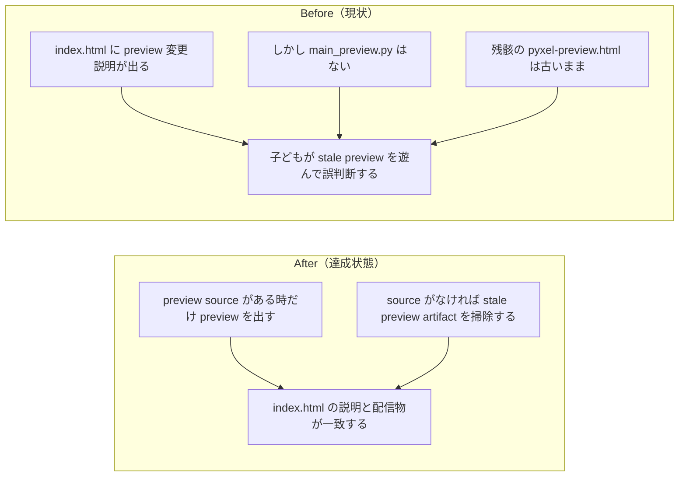

# 2026年4月14日 J44 stale preview を子どもに見せない

> 状態：(5) Discussion
> 次のゲート：（ユーザー）必要なら preview 運用の再開フロー整備

---

## 1) 改善対象ジャーニー

- **根拠となるカスタマージャーニー**：CJ31, CJ32, CJ33
- **関連するカスタマージャーニー**：CJ35
- **深層的目的**：子どもが比較画面の説明を信じて遊んだとき、実体もその説明どおりである状態を守る
- **やらないこと**：失われた `main_preview.py` の内容を推測で復元すること

### 人間の期待

- **この note が `done` なら、人間は何が成立していると思うか**：選択ページに `おためしばん` が出ているなら、その中身は説明どおりの preview であり、古い build を誤って踏まない
- **その期待を裏切りやすいズレ**：`top_changes.json` だけ新しく、`pyxel-preview.html` / `play-preview.html` が古いまま残ること
- **ズレを潰すために見るべき現物**：`index.html`、`play-preview.html`、`pyxel-preview.html`、`main_preview.py` の有無、`code-quest-pyxel-runtime.service`

### 現状

- `index.html` と live 8888 は `4/13 にげる しっぱいの あとも てきが こうげきする` を preview 変更として表示している
- しかし `main_preview.py` と `preview_meta.json` は存在しない
- `pyxel-preview.html` の埋め込み `app/main.py` は逃走失敗時にまだ `battle_phase = "enemy_attack"` で、敵ターンが飛ぶ
- live 8888 の `pyxel-preview.html` もローカル stale artifact と一致していた

### 今回の方針

- 通常 build で `main_preview.py` が存在しないなら stale preview artifact を消す
- selector は preview が利用可能な時だけ `おためしばん` を表示する
- `--preview` build のときだけ preview artifact と preview change list を生成する

### 委任度

- 🟢 CC主導で実装と検証を進められる

---

## 2) カスタマージャーニーgherkin（完了条件）

### シナリオ1：正常系

> {`main_preview.py` がない通常 build} で {配信物を生成する} と {`index.html` に stale preview 導線が残らず、preview artifact も配信対象から消える}

### シナリオ2：異常系

> {stale な `pyxel-preview.html` / `play-preview.html` が残っている} で {通常 build を実行する} と {古い preview をそのまま子どもに見せない}

### シナリオ3：回帰確認

> {`main_preview.py` と `preview_meta.json` がある} で {`--preview` build を実行する} と {従来どおり `おためしばん` と `もとのままばん` の比較導線が生成される}

### 対応するカスタマージャーニーgherkin

- `docs/cj-gherkin-platform.md`
  `CJG31`
  `Scenario: 親がAIに頼んだ変更はまずおためし版に入る`
- `docs/cj-gherkin-platform.md`
  `CJG31`
- `Scenario: 選択ページの変更説明が実際の配信内容と一致する`
- `docs/cj-gherkin-platform.md`
  `CJG33`
  `Scenario: 変更一覧が実際のおためし版とずれるなら build で検知できる`

---

## 3) Design（どうやるか）

- **関連スキル・MCP**：`systematic-debugging`、`test-driven-development`、`verification-before-completion`
- **MCP**：追加なし

### 調査起点

- `tools/build_web_release.py`
- `templates/selector.html`
- `test/test_build_web_release.py`

### 実世界の確認点

- **実際に見るURL / path**：`/home/exedev/code-quest-pyxel/index.html`、`/home/exedev/code-quest-pyxel/play-preview.html`、`/home/exedev/code-quest-pyxel/pyxel-preview.html`、`http://127.0.0.1:8888/index.html`
- **実際に動いている process / service**：`code-quest-pyxel-runtime.service`
- **実際に増えるべき file / DB / endpoint**：preview source 不在時は preview artifact が消えること

### 検証方針

- まず normal build が stale preview を掃除しない現状をテストで Red にする
- build / selector を最小修正して Green にする
- `python -m pytest test/test_build_web_release.py -q`
- `python -m pytest test/ -q`
- live 8888 の `index.html` / `play-preview.html` / `pyxel-preview.html` を再確認する

---

## 4) Tasklist

- [x] docs / カスタマージャーニー / カスタマージャーニーgherkin の根拠をそろえる
- [x] 根本原因をコードだけでなく runtime / deploy まで含めて固定する
- [x] 人間の期待を裏切るズレがないか確認する
- [x] 実装する
- [x] 実世界の path / process / file を直接確認する
- [x] `python -m pytest test/ -q` を実行する

---

## 5) Discussion（記録・反省）

> Observe → Think → Act を刻む。未来の自分が復元できることが目的。

### 2026年4月14日 12:55（起票）

**Observe**：current の `pyxel.html` は逃走失敗修正済みだが、`pyxel-preview.html` の埋め込み `main.py` はまだ `battle_phase = "enemy_attack"` のままで、live 8888 もその stale preview を返していた。一方で `index.html` は preview 側に `4/13 にげる しっぱいの あとも てきが こうげきする` と表示している。
**Think**：問題は preview 実装そのものより、「preview source がないのに stale preview artifact を配り続けている」 build / runtime 導線にある。失われた `main_preview.py` を推測復元するより、source 不在時は preview を出さないほうが CJ31/CJ33 の期待に合う。
**Act**：J44 を起票し、通常 build が stale preview を掃除し selector も preview 非表示にできるよう、まず failing test から着手する。

### 2026年4月14日 13:25（修正・検証完了）

**Observe**：Red テストでは、空の preview href でも selector が `おためしばん` を描いてしまい、通常 build も stale `play-preview.html` / `pyxel-preview.html` を残したままだった。
**Think**：最小修正は `build_web_release()` 側で preview source / output の鮮度を判定し、preview を見せてよい時だけ selector に preview card を出すことだった。preview source がない時に stale artifact を掃除すれば、失われた `main_preview.py` を無理に復元せず CJ31/CJ33 の期待を守れる。
**Act**：`templates/selector.html` と `tools/build_web_release.py` を更新し、preview 非表示分岐と stale preview 削除を実装した。`test/test_build_web_release.py` に回帰テストを追加し、`python -m pytest test/test_build_web_release.py -q` で `20 passed`、`python -m pytest test/ -q` で `159 passed, 2 skipped`、`python tools/build_web_release.py` 実行後に `python tools/test_web_compat.py` で `OK: Web版テスト通過` を確認した。実世界確認は `code-quest-pyxel-runtime.service` が `tools/web_runtime_server.py --port 8888` で動作中のまま、`curl -I http://127.0.0.1:8888/index.html` と `curl -I http://127.0.0.1:8888/play.html` が `200`、`curl -I http://127.0.0.1:8888/play-preview.html` と `curl -I http://127.0.0.1:8888/pyxel-preview.html` が `404`、live `index.html` から `おためしばん` が消えていることまで確認した。
