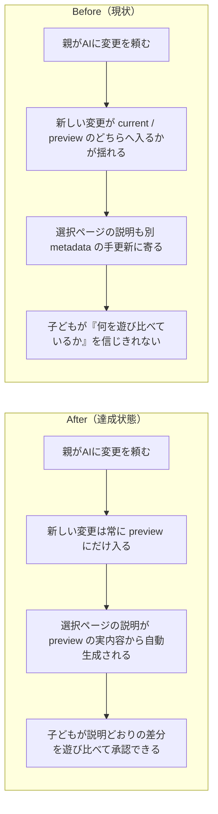
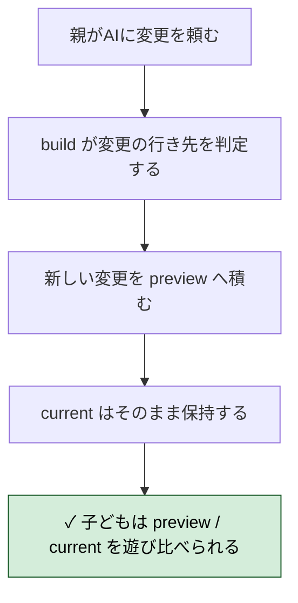
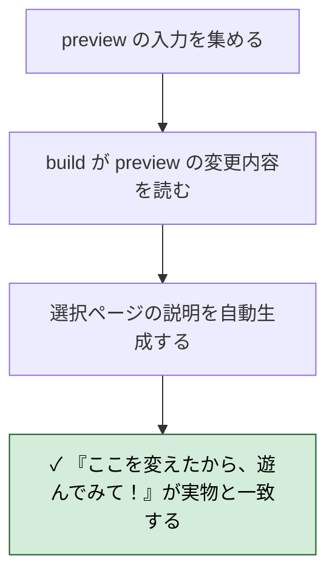
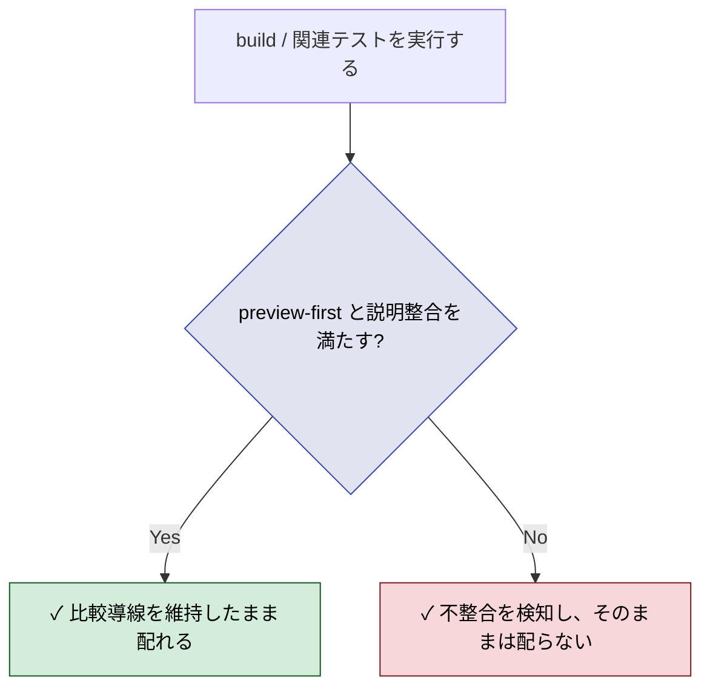

# 2026年4月16日 J47 preview を新しい変更の受け皿に固定し選択ページ説明を自動化する

> 状態：(5) Discussion
> 次のゲート：（ユーザー）必要なら preview-first の厳格化を追加で切り出す

---

## 1) 改善対象ジャーニー

- **根拠となるカスタマージャーニー**：`docs/customer-journeys.md` の `CJ31: 子どもが変更を承認する`
- **関連するカスタマージャーニー**：`docs/customer-journeys.md` の `CJ33: 子どもが変更を選んで適用する`
- **深層的目的**：親がAIに頼んだ変更を、必ず `おためしばん` で遊び比べてから子どもが選べるようにする
- **やらないこと**：この note で個別のゲームロジック修正を先に進めること、選択ページの見た目だけを単独で磨くこと

### 人間の期待

- **この note が `done` なら、人間は何が成立していると思うか**：親がAIに変更を頼んだら、その新しい内容は常に `preview` / `おためしばん` に入り、選択ページには「ここを変えたから、遊んでみて！」という説明が preview の実内容から自動で出る
- **その期待を裏切りやすいズレ**：新しい変更が先に `current` に入ってしまう、`main.py` と `main_preview.py` の役割が混ざる、選択ページの説明が `preview_meta.json` などの手更新に依存して実物とずれる
- **ズレを潰すために見るべき現物**：`docs/customer-journeys.md`、`docs/cj-gherkin-platform.md`、`tools/build_web_release.py`、`main.py`、`main_preview.py`、選択ページ用 metadata

### 現状

- `customer-journeys.md` と `cj-gherkin-platform.md` は、今回の整理で「AI変更の受け皿は常に preview」「説明は preview から自動生成」という期待へ更新した
- しかし現行実装は、通常 build と preview build の責務、`main.py` と `main_preview.py` の運用、選択ページ説明の SoT がまだその期待に揃い切っていない
- 直近の洞窟脱出修正でも、修正自体は `main.py` と `main_preview.py` の両方へ入った一方、子どもに見せる導線としては「preview に入った新変更を説明つきで試す」という筋が弱い
- このままだと、CJ31/CJ33 で定義した「親が直した内容を、子どもが説明つきで preview から選ぶ」流れが実装・運用どちらでも再び崩れやすい

### 今回の方針

- この問題は `CJ31` の承認導線と `CJ33` の変更説明導線を同時に支える土台のズレとして扱う
- まず「新しい変更は常に preview に積む」「current は承認まで保持する」「選択ページ説明は preview 実物から自動で出す」という人間期待を改善対象ジャーニーとして固定する
- そのうえで次フェーズで、build 導線・metadata・ファイル責務をどう整理すればこの期待を満たせるかをカスタマージャーニーgherkin に落とす

### 委任度

- 🟡 CC主導で調査と素案作成は進められるが、preview/current の運用原則としてどこまで強く固定するかはユーザー確認を前提に詰める

---

## 2) カスタマージャーニーgherkin（完了条件）

### シナリオ1：正常系（新しい変更が常に preview に入る）

> {親がAIに変更を頼んだ} で {おためし版を build する} と {新しい変更は preview にだけ入り current は承認まで変わらない}

---

### シナリオ2：正常系（選択ページ説明が preview 実物から自動で出る）

> {preview に新しい変更が入っている} で {選択ページを生成する} と {説明は preview の実内容から自動生成され手書き metadata に依存しない}

---

### シナリオ3：異常系・回帰確認（実物と説明や導線がずれるなら検知される）

> {新しい変更が current に混ざる / 説明が preview 実物とずれる} で {build または関連テストを実行する} と {不整合が検知され比較導線を壊したまま配らない}

---

### 対応するカスタマージャーニーgherkin

- `docs/cj-gherkin-platform.md`
  `CJG31`
  `Scenario: 親がAIに頼んだ変更はまずおためし版に入る`
- `docs/cj-gherkin-platform.md`
  `CJG31`
  `Scenario: 変更内容が子どもに理解できる`
- `docs/cj-gherkin-platform.md`
  `CJG31`
  `Scenario: 選択ページの変更説明が実際の配信内容と一致する`
- `docs/cj-gherkin-platform.md`
  `CJG33`
  `Scenario: 変更一覧はおためし版から自動生成される`
- `docs/cj-gherkin-platform.md`
  `CJG33`
  `Scenario: 変更一覧が実際のおためし版とずれるなら build で検知できる`

---

## 3) Design（どうやるか）

- **関連スキル・MCP**：`superpowers:test-driven-development`、`superpowers:verification-before-completion`
- **MCP**：追加なし

### 設計方針

- `main.py` を current の唯一の実行ソース、`main_preview.py` を未承認変更の唯一の実行ソースとして役割分担を固定する
- `build_web_release()` は current を配る入口、`build_preview_release()` は preview を比較用に出す入口として責務を分けたまま、preview-first の規則を明示的に保証する
- 選択ページの preview 説明は、`preview_meta.json` のような人手更新ファイルを SoT にせず、preview source set そのものに紐づく build 所有の情報から生成する
- `preview_meta.json` が残るとしても人間が直接編集する説明ソースではなく、build が扱う中間成果物または互換レイヤとしてのみ扱う
- `promote(preview)` だけが `main_preview.py` の内容を `main.py` に昇格できる入口になり、通常の修正作業では `main.py` に未承認変更を先入れしない

### 調査起点

- `tools/build_web_release.py`
  `build_web_release()` / `build_preview_release()` / `validate_preview_files()` / `promote()` の責務境界
- `test/test_build_web_release.py`
  preview build、昇格、versioned URL、stale preview pruning の既存回帰点
- `main.py` と `main_preview.py`
  current / preview の実運用が混ざっていないか、今回の洞窟修正のように両方へ同時反映される経路がどこにあるか
- `top_changes.json` と `preview_meta.json`
  現在どこまで selector 説明の入力として残っているか、どちらが current / preview の手書き metadata になっているか

### 実世界の確認点

- **実際に見る URL / path**：
  `/home/exedev/code-quest-pyxel/main.py`
  `/home/exedev/code-quest-pyxel/main_preview.py`
  `/home/exedev/code-quest-pyxel/index.html`
  `/home/exedev/code-quest-pyxel/play.html`
  `/home/exedev/code-quest-pyxel/play-preview.html`
  `/home/exedev/code-quest-pyxel/pyxel.html`
  `/home/exedev/code-quest-pyxel/pyxel-preview.html`
- **実際に動いている process / service**：
  `python tools/build_web_release.py`
  `python tools/build_web_release.py --preview`
  `python tools/build_web_release.py --promote preview|current`
  必要なら `python tools/test_web_compat.py`
- **実際に増えるべき file / DB / endpoint**：
  preview-first の規則を満たした `main_preview.py`
  build が所有する preview 説明用データ
  selector / wrapper / pyxel の preview 配信物

### 検証方針

- まずテストで `preview` にだけ新変更が入る規則を固定し、`main.py` に未承認変更が先に入る経路を Red にする
- 次に selector 説明が preview source set から決まることを固定し、人手 metadata だけ更新して通る経路を Red にする
- そのうえで `--preview` build、`--promote preview`、通常 build の3経路を回し、`index.html` から `play*.html` までの比較導線が壊れていないことを確認する
- 最後に preview を開いたとき、説明と実物が一致していることを実ファイルと必要なら web 互換テストで確認する

---

## 4) Tasklist

- [x] `test/test_build_web_release.py` に preview 説明の自動生成と手書き metadata 非依存の Red テストを追加する
- [x] `tools/build_web_release.py` で preview diff から変更説明を自動生成し、build-owned `preview_meta.json` を再生成する
- [x] `python tools/build_web_release.py --preview` で preview 配信物と selector を再生成する
- [x] `python -m pytest test/ -q` と必要なら `python tools/test_web_compat.py` で回帰確認する

---

## 5) Discussion（記録・反省）

> Observe → Think → Act を刻む。未来の自分が復元できることが目的。

### 2026年4月16日 05:35（起票）

**Observe**：docs 側では「AI変更の受け皿は常に preview」「選択ページの説明は preview から自動生成」に寄せたが、実装はまだ `top_changes.json` / `preview_meta.json` の手更新前提が残っていた。  
**Think**：このままだと、preview を遊ばせる比較導線と selector 説明の SoT がまた分離する。まずは task note で人間期待を固定し、build が何を所有すべきかを絞る必要がある。  
**Act**：J47 を起票し、改善対象ジャーニー → カスタマージャーニーgherkin → Design の順で preview-first と selector 自動化の前提を固めた。

### 2026年4月16日 06:15（実装・検証完了）

**Observe**：Red テストでは、`generate_top_selector()` が依然として `top_changes.json` を読んでおり、`validate_preview_files()` も `preview_meta.json` の手入力を信用していた。`main.py` と `main_preview.py` の差分自体から preview 説明は作られていなかった。  
**Think**：最小で筋の良い修正は、preview build のたびに差分から change list を作り、`preview_meta.json` を build-owned な中間成果物へ下げることだった。selector はその生成済み metadata を読むだけにすれば、手書き説明を SoT から外せる。  
**Act**：`tools/build_web_release.py` に preview diff からの自動 change list 生成、`preview_meta.json` の自動再生成、selector の preview metadata 読み込みを実装した。`python -m pytest test/test_build_web_release.py -q` は `23 passed`、`python -m pytest test/ -q` は `167 passed, 2 skipped`、`make build` は完走、`python tools/build_web_release.py --preview` 後の `preview_meta.json` と `index.html` には `つうしんとうの ノイズガーディアンが フィールドに でない` が一致して入り、`python tools/test_web_compat.py` も `OK: Web版テスト通過` を確認した。
