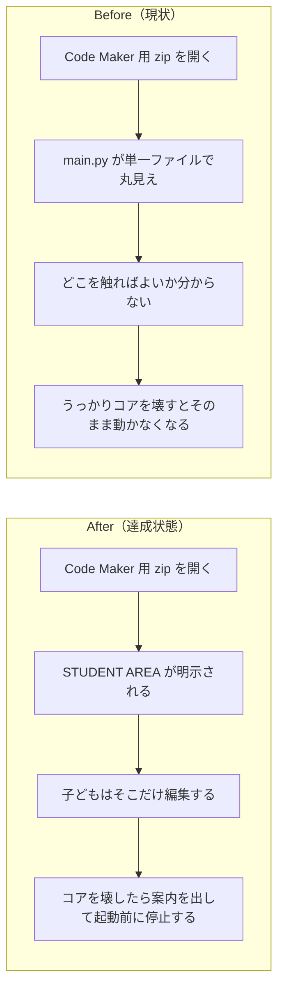

# 2026年4月18日 CJ26 Code Maker 教材版で編集可能領域を明示しコア改変時は停止する

> 状態：完了
> 次のゲート：なし

---

## 1) 改善対象ジャーニー

- **根拠となるカスタマージャーニー**：`CJ26: 「自分たちのゲーム」と言えるようになる`
- **関連するカスタマージャーニー**：`CJ25: 親子で役割を交代する`
- **深層的目的**：Pyxel Code Maker の単一 `main.py` 環境でも、子どもが「ここを触ればいい」と分かり、うっかりコアを壊した版は起動前に止めることで、安全に「自分たちのゲーム」を触れる状態を作る
- **やらないこと**：IDE レベルの真の編集ロック、複数ファイル化、AST ベースの強い制限、復元機能の UX 実装、値の clamp 追加

### 人間の期待

- **この note が `done` なら、人間は何が成立していると思うか**：Code Maker 用に生成される `main.py` に `STUDENT AREA` が明示され、そこだけ触ればよいと分かる。もしコア領域を壊したら、ゲームはそのまま起動せず「コアを変更しています」のような案内を出して止まる
- **その期待を裏切りやすいズレ**：コメントだけ追加して runtime 側の検査がない、検査対象に student area まで含めてしまい何も編集できない、検査が遅くて起動後に壊れる、repo 本体の `main.py` を直接教材化して通常 runtime まで巻き込む
- **ズレを潰すために見るべき現物**：`tools/build_codemaker.py`、生成後の `code-maker.zip` 内 `block-quest/main.py`、`main.py` 本体との差分、将来追加する build test、Code Maker 相当の実行結果

### 現状

- `tools/build_codemaker.py` は現行 `main.py` と `.pyxres` を zip に詰めるだけで、教材向けの編集領域分離はない
- Pyxel Code Maker は単一 `main.py` を編集する前提なので、通常の「このファイルは read-only」という project 構成ベースの防御を使えない
- そのため、子どもにとっては「どこを触ってよいか」が見えにくく、事故でコアを壊すとそのまま起動失敗になる
- 既存 guardrail は repo 側の編集や build 配信を守るものが中心で、Code Maker 内での教材ガードレールはまだ定義されていない

### 今回の方針

- この 1 本目の note は Code Maker 用生成物に限定して扱う
- 生成される `main.py` の中で、編集可能領域を `STUDENT AREA` マーカーで明示する
- コア領域は build 時にハッシュを埋め込み、起動前に自己検査する
- コアが改変されていたら、子ども向けの案内を出してゲームを開始しない
- 復元機能、値の clamp、より強い構文制限は次の note に分離する

### 委任度

- 🟡 build 時のコード生成と Code Maker runtime の両方をまたぐので、実装自体は狭いが設計のズレを出しやすい

---

## 2) カスタマージャーニーgherkin（完了条件）

### シナリオ1：正常系

> {Code Maker 用教材版を build した} で {生成された `main.py` を開く} と {`STUDENT AREA` が明示され、コア自己検査を通ってゲームが起動する}

### シナリオ2：異常系

> {生成された `main.py` のコア領域が改変されている} で {Run する} と {ゲームは開始せず、コアを変更している旨の案内を出して停止する}

### シナリオ3：回帰確認

> {`STUDENT AREA` の中だけを変更した} で {Run する} と {コア自己検査は通り、既存ゲームの起動フローは壊れない}

### 対応するカスタマージャーニーgherkin

- `docs/cj-gherkin-platform.md`
  反映済み: `CJG26: Code Maker 教材版では編集可能領域が明示される`
- `docs/cj-gherkin-platform.md`
  反映済み: `CJG26: Code Maker 教材版で STUDENT AREA だけを編集しても起動できる`
- `docs/cj-gherkin-guardrails.md`
  反映済み: `CJG41: Code Maker 教材版のコア領域が壊れていたら開始前に止める`

---

## 3) Design（どうやるか）

- **関連スキル・MCP**：`superpowers:test-driven-development`、`superpowers:verification-before-completion`
- **MCP**：追加なし

### 調査起点

- `docs/customer-journeys.md`
  `CJ25` と `CJ26` のどちらを主軸に置くか確認する
- `docs/cj-gherkin-guardrails.md`
  `CJG35` と `CJG41` にどこまで寄せるかを確認する
- `tools/build_codemaker.py`
  現在の zip 生成責務を把握する
- `steering/done/20260412-g12-rebuild-codemaker-zip.md`
  Code Maker build まわりの既存前提を確認する
- `steering/done/20260418-cj26-preview-codemaker-download.md`
  selector から Code Maker へ持ち出す導線との接続を確認する

### 実世界の確認点

- **実際に見るURL / path**：`/home/exedev/code-quest-pyxel/tools/build_codemaker.py`、`/home/exedev/code-quest-pyxel/code-maker.zip`、zip 内 `block-quest/main.py`
- **実際に動いている process / service**：`python tools/build_codemaker.py`、必要なら zip 展開後のローカル Pyxel 実行
- **実際に増えるべき file / DB / endpoint**：Code Maker 用に教材化された `main.py`、その中の `STUDENT AREA` マーカーとコア自己検査コード

### 検証方針

- 先に build 生成物テストを追加し、教材版 `main.py` に `STUDENT AREA` と自己検査がない現状を Red にする
- 次にコア改変時の停止動作を focused test で固定する
- 実装後は `python -m pytest test/ -q` を通す
- `python tools/build_codemaker.py` を実行し、生成された zip 内 `main.py` を直接確認する
- 必要なら zip 展開後にローカルで起動し、正常起動と停止メッセージの両方を確認する

---

## 4) Tasklist

- [x] docs / カスタマージャーニー / gherkin の根拠をそろえる
- [x] Code Maker 単一ファイル制約を根本原因として note に固定する
- [x] `STUDENT AREA` とコア自己検査の責務を build 生成物側に限定する
- [x] build 生成物テストを追加する
- [x] 実装する
- [x] 実世界の path / process / file を直接確認する
- [x] `python -m pytest test/ -q` を実行する

---

## 5) Discussion（記録・反省）

> Observe → Think → Act を刻む。未来の自分が復元できることが目的。

### 2026年4月18日 17:20（起票）

**Observe**：Pyxel Code Maker は単一 `main.py` をその場で編集して実行する環境なので、通常の project 構成のように「このファイルは編集可 / 不可」で守る方法を使えない。現状の `code-maker.zip` も repo の `main.py` をそのまま渡しているだけで、子どもが触ってよい場所は明示されていない。  
**Think**：この問題は `CJ26` の「自分たちのゲームを触れる」価値を支えつつ、`CJ25` の役割交代を事故なく回すための教材ガードレールとして扱うのが自然だった。本物のロックを目指すより、まずは「ここを触る」と「ここを壊したら止める」を最小構成で入れる方が現実的。  
**Act**：1 本目の task note として、Code Maker 教材版 `main.py` に `STUDENT AREA` を明示し、コア改変時は自己検査で停止する範囲までを切り出して起票した。復元機能や clamp は次段に分ける前提にした。

### 2026年4月18日 HH:MM（修正・検証完了）

**Observe**：`tools/build_codemaker.py` は `main.py` をそのまま zip に入れていたので、Code Maker 側では編集境界がなく、子どもがどこを触るべきか分からなかった。最初に focused test を追加して、教材版 `main.py` に `STUDENT AREA` とコア自己検査が入ること、コア改変時に案内を出して停止することを Red/Green で固定した。その後、全体 `pytest` を回すと `test_build_web_release.py` の 2 件だけが「zip 内 main.py は素の `main.py` と一致する」という古い前提で落ちた。  
**Think**：根本原因は build 本体ではなく回帰テストの期待値だった。`build_web_release` はすでに `build_codemaker_zip()` を通して教材版 `main.py` を生成していたため、テスト側だけを `build_codemaker_main_text()` 基準へ合わせるのが最小で正しい修正だった。  
**Act**：`tools/build_codemaker.py` に classroom bundle 生成を実装し、zip 内 `main.py` に `CORE_BLOCK` / `CORE_HASH` / `verify_core()` / `STUDENT AREA` を入れた。`test/test_build_codemaker.py` を追加して 3 本の挙動テストで固定し、`test/test_build_web_release.py` の期待値も教材版生成仕様へ更新した。あわせて `customer-journeys.md`、`cj-gherkin-platform.md`、`cj-gherkin-guardrails.md` を更新した。実物確認として `python tools/build_codemaker.py` を実行し、`unzip -p code-maker.zip block-quest/main.py | rg -n "CORE_HASH|verify_core|BEGIN STUDENT AREA|END STUDENT AREA|コアを へんこうしています|game = Game\\(|game.start\\("` で必要要素が zip 内に入っていることを確認した。最終確認は `python -m pytest test/ -q` で `210 passed` だった。
