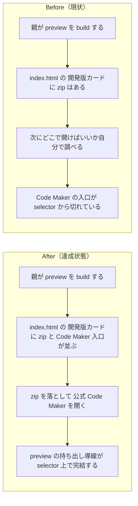

# 2026年4月18日 CJ26 開発版カードから Pyxel Code Maker を開けるようにする

> 状態：(5) Discussion
> 次のゲート：（ユーザー）必要なら commit / push or 次タスク

---

## 1) 改善対象ジャーニー

- **根拠となるカスタマージャーニー**：`CJ26: 「自分たちのゲーム」と言えるようになる`
- **関連するカスタマージャーニー**：`CJ31: 子どもが変更を承認する`、`CJ33: 子どもが変更を選んで適用する`
- **深層的目的**：親が `index.html` の `開発版` カードから preview 用 zip を落とした直後に、迷わず公式 Pyxel Code Maker を開けるようにして、改造の往復導線を selector 上で完結させる
- **やらないこと**：zip の自動インポート、Code Maker 側への自動遷移制御、`本番` カードへの同導線追加、upload/import 導線

### 人間の期待

- **この note が `done` なら、人間は何が成立していると思うか**：`index.html` の `開発版` カードに preview 用 zip のダウンロード導線に加えて、公式 Pyxel Code Maker を開くリンクがある。親は `zip を落とす` と `Code Maker を開く` の順で迷わず次の操作に進める
- **その期待を裏切りやすいズレ**：リンク先が非公式URLや古いURL、preview がないのに外部リンクだけ浮く、`本番` と `開発版` の文脈が崩れて何を開けばよいか分からない
- **ズレを潰すために見るべき現物**：`templates/selector.html`、`tools/build_web_release.py`、`test/test_build_web_release.py`、生成後の `index.html`、リンク先として使う公式 Pyxel Code Maker URL

### 現状

- `開発版` カードには `Code Makerでひらく` として preview zip のダウンロード導線がある
- ただし、実際に編集先となる公式 Pyxel Code Maker への入口は selector 上にまだない
- そのため利用者は zip を落としたあとに別途検索して Code Maker を探す必要がある
- 今回の scope では `本番` カードに同じ導線を広げる必要はなく、preview 用 round-trip の入口を分かりやすくすることが目的

### 今回の方針

- `開発版` カードの Code Maker 関連導線を2本にする
- 1本は既存どおり preview zip のダウンロード
- もう1本は公式 Pyxel Code Maker の外部リンク
- preview カードが出ないときは外部リンクも一緒に出さない
- 文言と配置は `開発版を Code Maker に持っていく` という一連の行動として読めるようにそろえる

### 委任度

- 🟢 docs / selector / build / test の範囲で CC 主導で進められる

---

## 2) カスタマージャーニーgherkin（完了条件）

### シナリオ1：正常系

> {親がAIに変更を頼んでおためし版を build した} で {親が `index.html` の `開発版` カードを見る} と {preview zip のダウンロード導線に加えて公式 Pyxel Code Maker を開くリンクが表示される}

### シナリオ2：異常系

> {いま有効な preview source または preview artifact がない} で {親が `index.html` を開く} と {開発版カード自体が出ず、Pyxel Code Maker 外部リンクも孤立して表示されない}

### シナリオ3：回帰確認

> {開発版カードに Pyxel Code Maker 外部リンクを追加した} で {preview build と通常 build を実行する} と {既存の `あそんでみる` と preview zip ダウンロード導線は壊れず、`index.html` に公式URLだけが入る}

### 対応するカスタマージャーニーgherkin

- `docs/cj-gherkin-platform.md` `CJG26`
  `Scenario: 選択ページの開発版から Code Maker 用 zip を落とせる`
- 追加候補:
  `CJG26: 選択ページの開発版から公式 Pyxel Code Maker を開ける`
- `docs/cj-gherkin-platform.md` `CJG31`
  `Scenario: おためし版がない時は開発版の Code Maker zip 導線を出さない`
- 追加候補:
  `CJG31: おためし版がない時は Pyxel Code Maker 外部リンクも出さない`

---

## 3) Design（どうやるか）

- **関連スキル・MCP**：`superpowers:test-driven-development`、`superpowers:verification-before-completion`
- **MCP**：追加なし

### 調査起点

- `templates/selector.html`
- `tools/build_web_release.py`
- `test/test_build_web_release.py`
- `docs/customer-journeys.md`
- `docs/cj-gherkin-platform.md`
- 既存 note:
  `steering/done/20260418-cj26-preview-codemaker-download.md`

### 実世界の確認点

- **実際に見るURL / path**：`/home/exedev/code-quest-pyxel/index.html`、`/home/exedev/code-quest-pyxel/templates/selector.html`
- **実際に動いている process / service**：`python tools/build_web_release.py --preview`、必要なら `python tools/build_web_release.py`
- **実際に増えるべき file / DB / endpoint**：生成後 `index.html` の `開発版` カード内に入る Pyxel Code Maker 外部リンク。リンク先は公式 URL `https://kitao.github.io/pyxel/wasm/code-maker/`

### 検証方針

- selector 生成テストを先に追加し、preview 時だけ公式 Pyxel Code Maker リンクが出ることを Red にする
- `templates/selector.html` と selector 生成処理で preview カードに外部リンクを追加する
- `python -m pytest test/test_build_web_release.py -q`
- `python -m pytest test/ -q`
- `python tools/build_web_release.py --preview`
- 必要なら生成後の `index.html` を直接確認し、公式 URL が入っていることを確かめる

---

## 4) Tasklist

- [x] docs / カスタマージャーニー / gherkin の根拠をそろえる
- [x] `CJ26` を主にした preview round-trip 導線として期待を固定する
- [x] 公式 Pyxel Code Maker URL の扱いを selector 実装に落とす
- [x] preview がない時に外部リンクを出さない条件を固定する
- [x] 実装する
- [x] 実世界の path / process / file を直接確認する
- [x] `python -m pytest test/ -q` を実行する

---

## 5) Discussion（記録・反省）

> Observe → Think → Act を刻む。未来の自分が復元できることが目的。

### 2026年4月18日 16:55（起票）

**Observe**：`開発版` カードから preview 用 `code-maker-preview.zip` は落とせるようになったが、その次に開くべき公式 Pyxel Code Maker への入口は selector 上にない。結果として、利用者は zip を落としたあとに別タブで検索して公式URLを探す必要がある。  
**Think**：これは `Code Maker に持っていく` 体験が selector 上で途中で切れている状態で、`CJ26` の round-trip 価値を最後まで届けきれていない。scope は広げず、まずは `開発版` カードにだけ公式入口を足すのが自然。  
**Act**：`CJ26` を主軸に、preview zip 導線の隣へ公式 Pyxel Code Maker 外部リンクを追加する task note を起票した。

### 2026年4月18日 17:07（修正・検証完了）

**Observe**：`開発版` カードに preview 用 `code-maker-preview.zip` 導線はあるのに、公式 Pyxel Code Maker を開くリンクは template / selector 生成 / build テストのどこにも入っておらず、未表示の原因は「未実装」だった。  
**Think**：preview round-trip の入口は zip ダウンロードと外部 Code Maker 入口がセットで初めて成立する。外部リンクだけを単独で出すと preview 不在時に文脈が崩れるため、preview zip を出す条件と同じ場所に束ねるのが筋だった。  
**Act**：`templates/selector.html` と `tools/build_web_release.py` を更新し、preview zip が出るときだけ `Pyxel Code Makerをひらく` を同じカードに表示するようにした。`test/test_build_web_release.py` には selector 生成と preview/normal build の回帰テストを追加し、docs では `customer-journeys.md` と `cj-gherkin-platform.md` を更新した。検証は `python -m pytest test/test_build_web_release.py -q`、`python -m pytest test/ -q`、`python tools/build_web_release.py --preview`、`python tools/build_web_release.py` で行い、生成後の `index.html` に `https://kitao.github.io/pyxel/wasm/code-maker/` が入ることを確認した。
