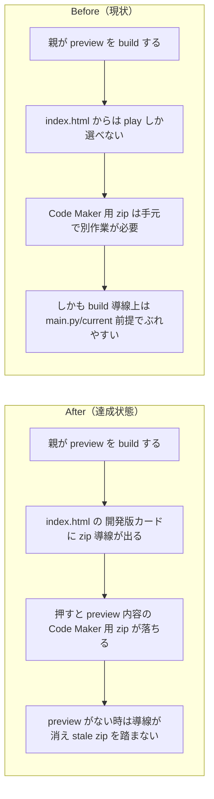

# 2026年4月18日 CJ26 開発版 Code Maker zip を index.html から落とせるようにする

> 状態：(5) Discussion
> 次のゲート：（ユーザー）必要なら commit / push or 次タスク

---

## 1) 改善対象ジャーニー

- **根拠となるカスタマージャーニー**：`CJ26: 「自分たちのゲーム」と言えるようになる`
- **関連するカスタマージャーニー**：`CJ31: 子どもが変更を承認する`、`CJ33: 子どもが変更を選んで適用する`
- **深層的目的**：子どもと親が `おためしばん` を Pyxel Code Maker にそのまま持ち出して触れられるようにし、preview の配布導線を `index.html` 上で完結させる
- **やらないこと**：Code Maker から保存した zip のアップロード導線、resource 取り込み、current 用 zip 導線の整理、selector の全面デザイン変更

### 人間の期待

- **この note が `done` なら、人間は何が成立していると思うか**：`index.html` の `開発版` カードに Code Maker 用 zip のダウンロード導線があり、押すとその時点の preview 内容を含む zip が落ちる。preview がないときはその導線自体が出ない
- **その期待を裏切りやすいズレ**：リンク先が current 用 `code-maker.zip` のまま、preview artifact はあるのに Code Maker 用 zip は stale、preview がないのに古い zip ダウンロードだけ残る
- **ズレを潰すために見るべき現物**：`index.html`、`templates/selector.html`、`tools/build_web_release.py`、`tools/build_codemaker.py`、`code-maker.zip`、想定される preview 用 zip artifact、`main_preview.py`、`preview_meta.json`

### 現状

- `CJG26` には「Code Maker からダウンロードした zip がローカルでも動く」はあるが、プロジェクト側から Code Maker 用 zip を配る入口は定義されていない
- `index.html` は `開発版` / `本番` の play 導線は持つが、Code Maker 用 zip のダウンロード導線はまだない
- `tools/build_codemaker.py` は現状 `main.py` 固定で `code-maker.zip` を生成するだけで、preview 用 zip artifact の概念がない
- ローカルでは一度 `main_preview.py` を詰めた `code-maker.zip` を手で作れたが、これは build flow や selector と結びついておらず、再現可能な運用にはなっていない

### 今回の方針

- selector 上の体験は `開発版` カードの配布導線追加に絞る
- preview 用 Code Maker zip は current 用 artifact と分けて build 所有の生成物として扱う
- preview source がないときは zip 導線も artifact も出さない
- upload/import はこの note では扱わず、必要になったら別 note に切り出す

### 委任度

- 🟢 docs / build / selector / artifact をまとめて CC 主導で進められる

---

## 2) カスタマージャーニーgherkin（完了条件）

### シナリオ1：正常系

> {`main_preview.py` があり preview を build した} で {親が `index.html` の `開発版` カードを見る} と {Code Maker 用 zip のダウンロード導線が表示され、その zip は preview 内容を含む}

### シナリオ2：異常系

> {preview source または preview artifact がない} で {親が `index.html` を開く} と {開発版の Code Maker zip 導線は表示されず、古い zip を踏ませない}

### シナリオ3：回帰確認

> {開発版の Code Maker zip 導線を追加した} で {preview build と通常 build を実行する} と {既存の `あそんでみる` 導線と current / preview の比較フローは壊れず、zip artifact も対応版と一致する}

### 対応するカスタマージャーニーgherkin

- `docs/cj-gherkin-platform.md` `CJG26`
  `Scenario: Code Makerからダウンロードしたzipがローカルでも動く`
- `docs/cj-gherkin-platform.md` `CJG31`
  `Scenario: 親がAIに頼んだ変更はまずおためし版に入る`
- `docs/cj-gherkin-platform.md` `CJG33`
  `Scenario: 変更一覧は今の依頼に対応するおためし版だけを説明する`
- 追加候補:
  `CJG26: index.html から開発版 Code Maker zip をダウンロードできる`
- 追加候補:
  `CJG31: preview がない時は開発版 Code Maker zip 導線を出さない`

---

## 3) Design（どうやるか）

- **関連スキル・MCP**：`superpowers:test-driven-development`、`superpowers:verification-before-completion`
- **MCP**：追加なし

### 調査起点

- `index.html`
- `templates/selector.html`
- `tools/build_web_release.py`
- `tools/build_codemaker.py`
- `test/test_build_web_release.py`
- 既存 note:
  `steering/done/20260412-g12-rebuild-codemaker-zip.md`
- 既存 note:
  `steering/done/20260412-j31-fix-selector-links.md`
- 既存 note:
  `steering/done/20260414-j44-stale-preview-selector-runtime.md`

### 実世界の確認点

- **実際に見るURL / path**：`/home/exedev/code-quest-pyxel/index.html`、`/home/exedev/code-quest-pyxel/templates/selector.html`、`/home/exedev/code-quest-pyxel/code-maker.zip`、preview 用 zip artifact、必要なら `http://127.0.0.1:8888/index.html`
- **実際に動いている process / service**：`python tools/build_web_release.py --preview`、必要なら `python tools/build_web_release.py`、必要なら runtime の `tools/web_runtime_server.py --port 8888`
- **実際に増えるべき file / DB / endpoint**：preview 専用 Code Maker zip artifact、selector 内の preview zip リンク、preview 不在時に消える preview zip artifact

### 検証方針

- 先に build / selector テストを追加し、preview zip 導線なし・stale zip 許容の現状を Red にする
- preview build 時に preview 専用 zip artifact を生成し、selector がその artifact にだけリンクするようにする
- 通常 build 時は preview source がなければ preview zip artifact を掃除する
- `python -m pytest test/test_build_web_release.py -q`
- `python -m pytest test/ -q`
- 必要なら `python tools/build_web_release.py --preview` と live `index.html` で download link の表示を確認する

---

## 4) Tasklist

- [x] docs / カスタマージャーニー / gherkin の根拠をそろえる
- [x] `CJ26` と `CJ31/CJ33` をまたぐ期待を task note に固定する
- [x] preview 用 Code Maker zip artifact 名と生成責務を決める
- [x] selector に preview zip 導線を追加する
- [x] preview 不在時に stale zip 導線と artifact を出さないようにする
- [x] 実装する
- [x] 実世界の path / process / file を直接確認する
- [x] `python -m pytest test/ -q` を実行する

---

## 5) Discussion（記録・反省）

> Observe → Think → Act を刻む。未来の自分が復元できることが目的。

### 2026年4月18日 16:45（起票）

**Observe**：preview の play 導線は `index.html` にある一方、Code Maker 用 zip を配る入口はなく、`tools/build_codemaker.py` も current の `main.py` 固定だった。ローカルでは preview を詰めた zip を手で作れたが、再現可能な build flow には乗っていない。  
**Think**：人が期待するのは「開発版カードから、そのまま Code Maker に入れられる preview zip が落ちる」ことであり、手元で別コマンドや手作業を覚えることではない。まずは download 導線だけに絞り、upload/import は別 note に切るのが筋。  
**Act**：`CJ26` を主、`CJ31/CJ33` を副に据えて、preview 用 Code Maker zip を selector に接続する task note を起票した。

### 2026年4月18日 16:38（修正・検証完了）

**Observe**：`customer-journeys.md` には `CJ26` 自体が欠けており、`cj-gherkin-platform.md` にも selector から開発版 zip を落とすシナリオがなかった。実装上も `tools/build_codemaker.py` は current 固定で、preview build 後でも `index.html` から Code Maker へ持ち出す導線は存在しなかった。さらに通常 build を回すと `top_changes.json` の freshness guard で止まり、selector SoT のズレも残っていた。  
**Think**：必要なのは preview/current で別々の Code Maker zip artifact を build 所有で生成し、selector は preview zip が fresh な時だけそのリンクを出すことだった。あわせて `CJ26` の欠番を docs で埋め、`top_changes.json` も今の shipped content に合わせ直さないと通常 build を閉じられない。  
**Act**：`tools/build_codemaker.py` を helper 化し、`tools/build_web_release.py` で `code-maker.zip` と `code-maker-preview.zip` を生成するようにした。`templates/selector.html` と selector 生成では `Code Makerでひらく` リンクを `開発版` カードに追加し、preview 不在時は stale preview zip ごと掃除するようにした。docs では `customer-journeys.md` に `CJ26` を追加し、`cj-gherkin-platform.md` に開発版 zip ダウンロードと非表示条件の scenario を追記した。検証は `python -m pytest test/test_build_web_release.py -q` で `38 passed`、`python tools/build_web_release.py --preview`、`python tools/build_web_release.py`、`python -m pytest test/ -q` で `205 passed`、`python tools/test_web_compat.py` で `OK: Web版テスト通過（10秒間クラッシュ・致命的エラーなし）` を確認した。実物確認では `index.html` に `href="code-maker-preview.zip?v=1776530062"` が入り、`sha256sum` 比較で `code-maker.zip` 内 `block-quest/main.py` は `main.py`、`code-maker-preview.zip` 内 `block-quest/main.py` は `main_preview.py`、両 zip 内 `my_resource.pyxres` は `assets/blockquest.pyxres` と一致した。
