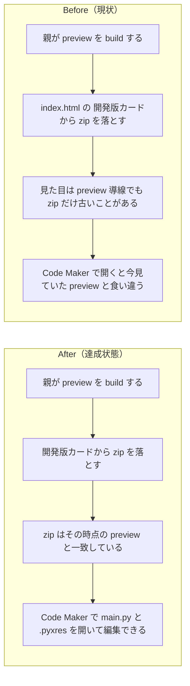

# 2026年4月19日 CJ26 開発版 Code Maker zip は今の preview と一致すると保証する

> 状態：(5) Discussion
> 次のゲート：（ユーザー）必要なら commit / push or 次タスク

---

## 1) 改善対象ジャーニー

- **根拠となるカスタマージャーニー**：`CJ26: 「自分たちのゲーム」と言えるようになる`
- **関連するカスタマージャーニー**：`CJ31: 子どもが変更を承認する`、`CJ33: 子どもが変更を選んで適用する`
- **深層的目的**：親が `index.html` の `開発版` カードから落とした Code Maker 用 zip を、そのまま今の preview と信じて開き、子どもと一緒にリソースを編集できるようにする
- **やらないこと**：`本番` カードの redesign、Code Maker からの upload/import 導線、preview 以外の配布物整理、Code Maker 自体の UI 改変

### 人間の期待

- **この note が `done` なら、人間は何が成立していると思うか**：`index.html` の `開発版` カードから落とす `code-maker-preview.zip` は、その時点の preview と一致している。親はそれを公式 Pyxel Code Maker で開き、`main.py` と `.pyxres` を読み込んで編集を始められる
- **その期待を裏切りやすいズレ**：ページや `play-preview.html` は新しいのに `code-maker-preview.zip` だけ古い、zip 生成ロジックが変わっても preview zip が再生成されない、preview はあるのに stale zip を現在の候補として出し続ける
- **ズレを潰すために見るべき現物**：`index.html`、`code-maker-preview.zip`、`main_preview.py`、`preview_meta.json`、`tools/build_web_release.py`、`tools/build_codemaker.py`、`test/test_build_web_release.py`

### 現状

- `CJG26` には `開発版カードから Code Maker 用 zip を落とせる` と `preview がない時は古い zip を見せない` はある
- しかし `preview はあるが zip だけ stale` という状態を明示的に禁じておらず、`その時点の preview と一致している` までは仕様で固定できていない
- 実際の不具合では、公開ページ自体は新しい一方で `code-maker-preview.zip` だけ古く残っていた
- 根本原因は、preview zip の freshness 判定が `tools/build_codemaker.py` の変更を依存関係として見ておらず、zip 生成ロジック変更後でも stale artifact を有効と見なせたことだった
- つまり今回のズレは `リンクがあるか` ではなく、`そのリンク先が今の preview を本当に表しているか` の不足にある

### 今回の方針

- この問題は `CJ26` を主に扱い、「開発版のリソースファイルをダウンロードして編集できる」体験の欠落として固定する
- `CJG26` に `freshness` と `実際に Code Maker で開いて編集できること` を追加し、単なるリンク存在確認で閉じない
- build 実装では preview zip の freshness 判定を preview source だけでなく zip 生成ロジックの変更にも追従させる
- selector 側は `fresh` な preview zip がある時だけ導線を出し、不整合な artifact を見せない

### 委任度

- 🟢 docs / build / selector / test まで CC 主導で進めやすい

---

## 2) カスタマージャーニーgherkin（完了条件）

### シナリオ1：正常系

> {親がAIに変更を頼んで preview を build した} で {親が `index.html` の `開発版` カードから Code Maker 用 zip をダウンロードして公式 Pyxel Code Maker で開く} と {その zip はその時点の preview 内容を反映し、`main.py` と `.pyxres` を読み込んで編集を始められる}

### シナリオ2：異常系

> {preview zip が古い、または zip 生成ロジックが変わって現行 preview と一致しない} で {親が `index.html` を開く、または preview build を実行する} と {stale な preview zip は再生成されるか、少なくとも開発版カードの現在候補としては表示されない}

### シナリオ3：回帰確認

> {`tools/build_codemaker.py` など Code Maker zip の生成依存が変わった} で {preview zip の availability 判定と build テストを実行する} と {`code-maker-preview.zip` を fresh と誤判定せず、selector / preview 配布導線も今の preview と一致したまま保たれる}

### 対応するカスタマージャーニーgherkin

- `docs/cj-gherkin-platform.md`
  `CJG26`
  `Scenario: 選択ページの開発版から Code Maker 用 zip を落とせる`
- 追加候補:
  `CJG26: 選択ページの開発版から落とす Code Maker 用 zip は今の preview と一致する`
- 追加候補:
  `CJG26: 選択ページから落とした preview zip を Code Maker で開いてリソースを編集できる`
- `docs/cj-gherkin-platform.md`
  `CJG31`
  `Scenario: おためし版がない時は開発版の Code Maker zip 導線を出さない`

---

## 3) Design（どうやるか）

- **関連スキル・MCP**：`superpowers:test-driven-development`、`superpowers:verification-before-completion`
- **MCP**：追加なし

### 調査起点

- `docs/cj-gherkin-platform.md`
  `CJG26` に何があり、何が不足しているか
- `steering/done/20260418-cj26-preview-codemaker-download.md`
  すでに note 側で定義されている人間期待と、今回の stale zip 事象がどこで漏れたか
- `tools/build_web_release.py`
  `preview_codemaker_zip_is_available()` と preview zip の freshness 判定
- `tools/build_codemaker.py`
  preview/current の zip 生成ロジックと、変更時に invalidation すべき依存
- `test/test_build_web_release.py`
  preview zip 導線、freshness、artifact pruning の既存回帰点

### 実世界の確認点

- **実際に見るURL / path**：
  `/home/exedev/code-quest-pyxel/index.html`
  `/home/exedev/code-quest-pyxel/code-maker-preview.zip`
  `/home/exedev/code-quest-pyxel/main_preview.py`
  `/home/exedev/code-quest-pyxel/preview_meta.json`
  `/home/exedev/code-quest-pyxel/tools/build_web_release.py`
  `/home/exedev/code-quest-pyxel/tools/build_codemaker.py`
- **実際に動いている process / service**：
  `python tools/build_web_release.py --preview`
  必要なら `python tools/build_web_release.py`
  必要なら public runtime の `tools/web_runtime_server.py --port 8888`
- **実際に増えるべき file / DB / endpoint**：
  新規 endpoint なし。必要なのは fresh な `code-maker-preview.zip` と、それを正しく露出する selector

### 検証方針

- 先に `test/test_build_web_release.py` に、zip 生成依存変更後の stale preview zip を弾く Red テストを追加する
- `CJG26` に freshness / editability の scenario を追記し、仕様上も `リンクがあるだけ` で終わらないようにする
- `tools/build_web_release.py` の preview zip availability 判定を見直し、`tools/build_codemaker.py` 変更時も stale zip を再生成または非表示にする
- `python tools/build_web_release.py --preview` で artifact を再生成し、`code-maker-preview.zip` の中身が `main_preview.py` と一致することを直接確認する
- `python -m pytest test/test_build_web_release.py -q`
- `python -m pytest test/ -q`

---

## 4) Tasklist

- [x] `CJ26` を主ジャーニー、`CJ31/CJ33` を補助線とする根拠を note と docs で固定する
- [x] `CJG26` に `freshness` と `Code Maker で開いて編集できる` scenario を追加する
- [x] `test/test_build_web_release.py` に stale preview zip を弾く failing test を追加する
- [x] `tools/build_web_release.py` の preview zip freshness 判定に zip 生成依存を含める
- [x] 必要なら selector の preview zip 表示条件を見直し、stale artifact を出さない
- [x] `python -m pytest test/test_build_web_release.py -q` を実行する
- [x] `python -m pytest test/ -q` を実行する

---

## 5) Discussion（記録・反省）

> Observe → Think → Act を刻む。未来の自分が復元できることが目的。

### 2026年4月19日 10:20（起票）

**Observe**：`CJG26` には preview zip 導線の存在はあるが、`preview はあるのに zip だけ古い` という状態を止める条件がなかった。実際の不具合でも、公開ページは新しい一方で `code-maker-preview.zip` だけ古いまま残っていた。  
**Think**：今回の問題は `CJ31` の preview 意味づけより一段手前で、`CJ26` の「ダウンロードして編集できる」が人間期待どおりに閉じていないことだった。`リンクがある` だけでは足りず、`今の preview と一致していて、そのまま Code Maker で編集に入れる` まで gherkin に上げる必要がある。  
**Act**：`CJ26` を主、`CJ31/CJ33` を補助線として、preview Code Maker zip の freshness と editability を仕様・build・test で保証する task note を起票した。

### 2026年4月19日 12:13（修正・検証完了）

**Observe**：根本原因は `preview_codemaker_zip_is_available()` が `main_preview.py` と `preview_meta.json` しか見ておらず、`tools/build_codemaker.py` の更新後でも `code-maker-preview.zip` を fresh と誤判定できたことだった。さらに preview zip の version token も play-preview と同じ依存で計算されており、Code Maker 生成ロジック変更時の cache bust が弱かった。  
**Think**：最小の筋の良い修正は、preview play 用 token と preview Code Maker zip 用 token を分け、preview zip だけは `main_preview.py`・`assets/blockquest.pyxres`・`tools/build_codemaker.py` に追従させることだった。これで stale zip は通常 build の selector から消え、preview build をやり直したときも zip URL が更新される。  
**Act**：`tools/build_web_release.py` に preview Code Maker zip 専用依存を追加し、normal/preview build の selector で専用 token を使うようにした。`test/test_build_web_release.py` には `tools/build_codemaker.py` が新しくなったときに `code-maker-preview.zip` 導線を隠すテストと、preview build で zip URL の token が変わるテストを追加した。docs では `cj-gherkin-platform.md` の `CJG26` に freshness と editability の scenario を追記した。検証は `python -m pytest test/test_build_web_release.py -q` で `42 passed`、`python -m pytest test/ -q` で `212 passed`、`python tools/build_web_release.py --preview` の実行後に `index.html` で `play-preview.html?v=1776531820` と `code-maker-preview.zip?v=1776533174` が別 token で出ること、`code-maker-preview.zip` に `block-quest/main.py` と `block-quest/my_resource.pyxres` が入り、`main.py` が `main_preview.py` 由来であることを直接確認した。
