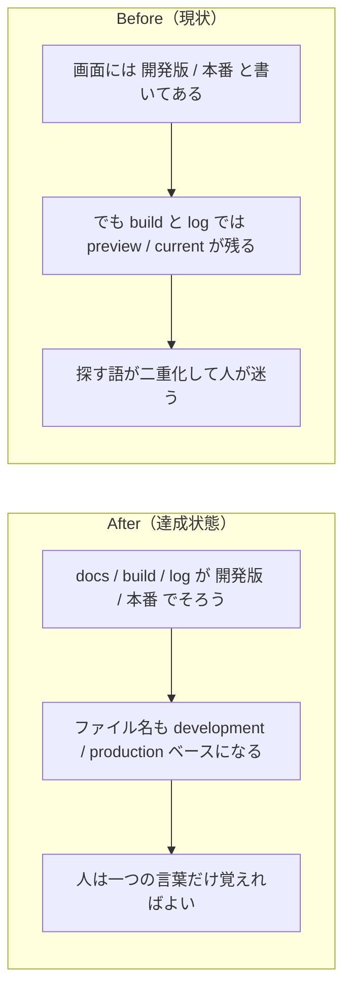

# 2026年4月19日 J50 開発版 / 本番の用語を build 配布物まで統一する

> 状態：(5) Discussion
> 次のゲート：（ユーザー）必要なら commit / push or 次タスク

---

## 1) 改善対象ジャーニー

- **根拠となるカスタマージャーニー**：CJ26
- **関連するカスタマージャーニー**：CJ31, CJ33
- **深層的目的**：親子が `開発版` と `本番` を同じ意味で理解できるようにし、selector 文言だけでなく build artifact / CLI / runtime log でも語彙のズレを消す
- **やらないこと**：ゲーム内容の仕様変更、配布フローそのものの再設計、旧 URL の恒久互換保証

### 人間の期待

- **この note が `done` なら、人間は何が成立していると思うか**：`開発版` と `本番` という言葉が docs だけでなく build 生成物、CLI、runtime 集計にも通っており、`preview/current` を探さなくてよい
- **その期待を裏切りやすいズレ**：UI は `開発版` / `本番` でも、実ファイル名や CLI が `preview/current` のままで結局そこを覚える必要がある
- **ズレを潰すために見るべき現物**：`main_development.py`、`development_meta.json`、`play-development.html`、`pyxel-development.html`、`code-maker-development.zip`、`python tools/build_web_release.py --help`、runtime の session summary

### 現状

- selector や PRD の見える文言は `開発版` / `本番` に寄せた
- ただし build 入力、artifact 名、CLI flag、`page_kind`、集計出力は `preview/current` が残っている

### 今回の方針

- build / runtime の SSoT 名を `development/production` に寄せる
- ユーザー向け説明は `開発版` / `本番` のまま維持する
- 旧 `preview/current` は必要最小限の内部互換だけ検討し、help と生成物の正面からは消す

### 委任度

- 🟡

---

## 2) カスタマージャーニーgherkin（完了条件）

### シナリオ1：正常系

> {親が開発版を build する} で {生成物と CLI を確認する} と {`development` / `production` 系の artifact 名と説明が一致する}

### シナリオ2：異常系

> {開発版入力がない} で {通常 build を行う} と {開発版 artifact は残らず、本番だけが露出する}

### シナリオ3：回帰確認

> {runtime で play session を記録する} で {集計を表示する} と {page kind が `development` / `production` で集計される}

### 対応するカスタマージャーニーgherkin

- `CJG26`
- `CJG31`
- `CJG33`

---

## 3) Design（どうやるか）

- **関連スキル・MCP**：test-driven-development, verification-before-completion
- **MCP**：追加なし

### 調査起点

- `tools/build_web_release.py`
- `test/test_build_web_release.py`
- `templates/wrapper.html`
- `src/play_session_logging.py`
- `tools/report_play_sessions.py`
- `test/test_play_session_logging.py`
- `test/test_report_play_sessions.py`
- `test/test_web_runtime_server.py`
- `tools/sync_main_data.py`

### 実世界の確認点

- **実際に見るURL / path**：`/home/exedev/code-quest-pyxel/index.html`、`/home/exedev/code-quest-pyxel/play-development.html`、`/home/exedev/code-quest-pyxel/pyxel-development.html`、`/home/exedev/code-quest-pyxel/code-maker-development.zip`
- **実際に動いている process / service**：`python tools/build_web_release.py --development`、必要なら `python tools/web_runtime_server.py --port 8888`
- **実際に増えるべき file / DB / endpoint**：`main_development.py`、`development_meta.json`、開発版 artifact 群、`page_kind=development|production`

### 検証方針

- 先に build / runtime test を Red にする
- その後 rename を実装し、targeted test と full test を通す
- 最後に help 文言、生成 artifact 名、zip 中身、runtime summary を実物で確認する

---

## 4) Tasklist

- [x] docs / task note 上で rename scope を固定する
- [x] failing test を追加して `development/production` 名を期待させる
- [x] build 入力・artifact・CLI を rename する
- [x] runtime logging / report の `page_kind` を rename する
- [x] 実物 artifact と help を確認する
- [x] `python -m pytest test/ -q` を実行する

---

## 5) Discussion（記録・反省）

> Observe → Think → Act を刻む。未来の自分が復元できることが目的。

### 2026年4月19日 00:00（起票）

**Observe**：docs と selector 表示は `開発版` / `本番` に寄ってきたが、build flow と runtime 周辺には `preview/current` が広く残っている。  
**Think**：このままだと人は見える言葉と実ファイル名の両方を覚える必要があり、CJ26 の「開発版を持ち出して編集できる」を支える導線としてはまだぶれる。  
**Act**：build / runtime の rename を別 note として切り出し、artifact、CLI、session logging まで含めて scope を固定した。

### 2026年4月19日 13:05（修正・検証完了）

**Observe**：内部 rename の中心は `main_preview.py` / `preview_meta.json` / `play-preview.html` / `pyxel-preview.html` / `code-maker-preview.zip` / `--preview` 系 flag / `page_kind=current|preview` だった。ここが残ると selector だけ `開発版` / `本番` でも、実務では古い語を探す必要が残った。  
**Think**：build/release の SSoT を `development/production` に寄せ、ユーザー向け表示は `開発版` / `本番` のまま維持するのが最小で筋が良い。runtime 集計も `development` / `production` にすると、公開後の報告と build の言葉が揃う。  
**Act**：`main_development.py`、`development_meta.json`、`play-development.html`、`pyxel-development.html`、`code-maker-development.zip` へ rename し、`tools/build_web_release.py` の CLI を `--development` / `--approve-development` / `--reject-development` に更新した。`templates/wrapper.html` と runtime logging 周辺では `page_kind` を `development` / `production` に変更した。検証は `python -m pytest test/ -q` で `212 passed`、`python tools/sync_main_data.py --check` で `main.py generated sections are up to date.` と `main_development.py generated sections are up to date.`、`python tools/build_web_release.py --help` で新 flag 表示、`python tools/build_web_release.py --development` で `pyxel-development.html` / `play-development.html` / `code-maker-development.zip` / `development_meta.json` を実生成し、`index.html` と `play-development.html` で新名リンクと `data-page-kind=\"development\"` を直接確認した。
