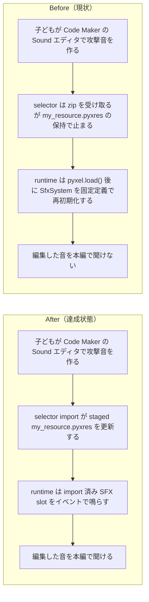

# 2026年4月20日 CJ24 Soundエディタで作ったSFXを本編で鳴らす

> 状態：`done`
> 次のゲート：なし

---

## 1) 改善対象ジャーニー

- **根拠となるカスタマージャーニー**：`CJ24 効果音を自分で作る`
- **関連するカスタマージャーニー**：`CJ17`, `CJ26`, `CJG17`, `CJG24`, `CJG26`, `CJG37`, `CJG41`
- **深層的目的**：子どもが Code Maker の `Sound` エディタで作った攻撃音や回復音を、selector から戻したあとも今の game code のまま本編で聞けるようにする
- **やらないこと**：`Music` / BGM の取り込み、image bank / tilemap の責務見直し、zip 内 `main.py` の採用、`.pyxres` の直接編集

### 人間の期待

- **この note が `done` なら、人間は何が成立していると思うか**：Code Maker で `Sound` を変えて `code-maker.zip` を selector に戻すと、攻撃・回復・レベルアップなどの SFX が実ゲームでもその音に変わる
- **その期待を裏切りやすいズレ**：`pyxel.load()` で読んだ Sound データを `SfxSystem` が固定の `SFX_DEFINITIONS` で上書きする
- **ズレを潰すために見るべき現物**：`main.py`、`main_development.py`、`src/shared/services/audio_system.py`、`test/test_audio_system.py`、`test/test_build_web_release.py`

### 現状

- `main.py` / `main_development.py` には inlined `SFX_DEFINITIONS` と `SfxSystem` がある
- `Game.__init__()` は `_setup_image_banks()` のあとに `self.sfx = SfxSystem(pyxel)` を再初期化している
- そのため Code Maker で Sound を作っても、本編は固定 SFX へ戻りやすい
- image bank 側は今回の主語ではなく、ユーザー確認どおり既に別問題ではない

### 今回の方針

- **authoring**：効果音の中身は人が Code Maker の `Sound` エディタで決める
- **import/build**：selector import は `my_resource.pyxres` staging を維持し、Sound editor の結果を development 候補へ運ぶ
- **runtime**：`SfxSystem` は event 名と再生の責務だけを持ち、slot に既に入っている imported SFX を正本として扱う
- **packaging**：Code Maker 用 zip は current / development の code と、現在の `my_resource.pyxres` を持ち出す
- **verify**：`Sound editor -> selector import -> battle / recovery / levelup` の往復を test で固定する

### 委任度

- 🟡 Code Maker import / runtime audio / build export / verify をまたぐが、`音を作る`, `音を取り込む`, `音を鳴らす`, `zip を組む` に責務を分けられる

---

## 2) カスタマージャーニーgherkin（完了条件）

### シナリオ1：正常系

> {子どもが Code Maker の Sound エディタで攻撃音を編集して Save した} で {selector から code-maker.zip を取り込んで攻撃する} と {編集した SFX が戦闘中に再生される}

### シナリオ2：異常系

> {zip に `main.py` と `my_resource.pyxres` が入っている} で {取り込みを実行する} と {今の code は維持され、SFX だけが import 対象になる}

### シナリオ3：回帰確認

> {image bank / tilemap の往復は既に成立している} で {CJ24 の SFX round-trip を追加する} と {画像系は壊さず、Sound エディタで作った音だけが新しく本編一致する}

### 対応するカスタマージャーニーgherkin

- `CJG17: 人が作ったSFXを行動イベントに結びつけられる`
- `CJG24: Soundエディタで編集したSFXがゲーム内で使われる`
- `CJG26: Code Maker から戻す時は code を巻き戻さず必要な asset を取り込む`
- `CJG37: Sound import は hardcoded SFX で上書きしない`
- `CJG41: Code Maker 互換はビルド時点で守る`

---

## 3) Design（どうやるか）

- **関連スキル・MCP**：`test-driven-development`, `verification-before-completion`, `pyxel`
- **MCP**：`pyxel` で import 後 SFX の実音確認を行う

### 調査起点

- `docs/customer-journeys.md`
- `docs/cj-gherkin-av.md`
- `docs/cj-gherkin-platform.md`
- `docs/cj-gherkin-guardrails.md`
- `main.py`, `main_development.py`
- `src/shared/services/audio_system.py`
- `src/shared/services/codemaker_resource_store.py`
- `test/test_audio_system.py`

### 実世界の確認点

- **実際に見るURL / path**：
  `/home/exedev/code-quest-pyxel/development/code-maker.zip`
  `/home/exedev/code-quest-pyxel/.runtime/codemaker_resource_imports/development/my_resource.pyxres`
  `/home/exedev/code-quest-pyxel/main.py`
  `/home/exedev/code-quest-pyxel/src/shared/services/audio_system.py`
- **実際に動いている process / service**：
  `python tools/build_web_release.py --development`
  `python tools/build_web_release.py`
- **実際に増えるべき file / DB / endpoint**：
  SFX round-trip test

### 検証方針

- `SfxSystem` の hardcoded overwrite を先に失敗テストで固定する
- Code Maker import -> runtime SFX playback の往復テストを追加する
- `python -m pytest test/ -q` を回す
- 実装後は attack / heal / levelup の少なくとも1つを実音で確認する

---

## 4) Tasklist

- [x] `CJ24` と関連 `CJG17/CJG24/CJG26/CJG37/CJG41` の完了条件を SFX round-trip に揃える
- [x] `SfxSystem` が imported Sound を上書きしない実装境界を決める
- [x] selector import staging を前提に runtime SFX truth を fixed definition から切り離す
- [x] selector / runtime / docs の契約を test で固定する
- [x] `python -m pytest test/ -q` を実行する

---

## 5) Discussion（記録・反省）

> Observe → Think → Act を刻む。未来の自分が復元できることが目的。

### 2026年4月20日 23:45（起票）

**Observe**：ユーザー確認では image bank は既にうまくいっており、残っているズレは `Sound / Music` 側だった。特に `CJ24` は `Sound エディタで作った音がゲーム内で使われる` 契約なのに、現在の `SfxSystem` は `pyxel.load()` 後に固定 SFX を再初期化している。  
**Think**：いきなり audio 全体をまとめて直すより、まず `CJ24` の SFX round-trip を切り出した方が done を定義しやすい。`Music` は別 note で扱えても、`CJ24` は単独で閉じられる。  
**Act**：広い audio note から `CJ24` 実装に必要な部分だけを切り出し、`Sound エディタ -> selector import -> gameplay SFX` の往復を主語にした task note として起票した。

### 2026年4月20日 23:59（完了）

**Observe**：`main.py` / `main_development.py` の `SfxSystem` は、slot に既に音が入っていても固定 `SFX_DEFINITIONS` をそのまま書き戻していた。selector import 自体は `my_resource.pyxres` staging までできていたので、壊れていたのは import 経路より runtime overwrite だった。  
**Think**：`CJ24` の done は「Sound editor で作った音がそのまま戦闘中に鳴る」であり、ここで必要なのは code-side asset 新設ではなく、runtime が imported slot を真として扱うことだった。`Music` や audio asset 化は別タスクでよいが、`SfxSystem` が Sound editor の結果を潰さないことは今回閉じるべきだった。  
**Act**：`SfxSystem` に populated slot 優先を入れ、`main.py` / `main_development.py` の両方で imported SFX が残ることを `test/test_cj24_sound_editor_truth.py` で固定した。selector import panel の文言期待値も現仕様へ更新し、`python -m pytest test/ -q` で `260 passed in 10.61s` を確認した。
