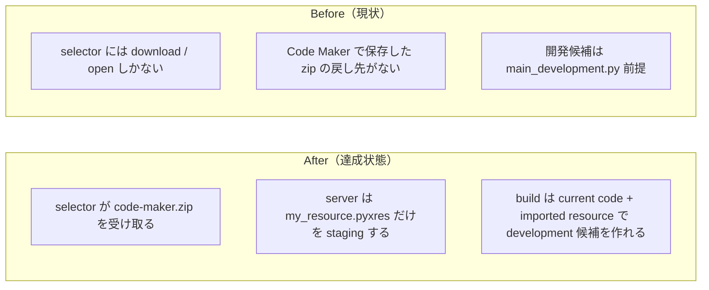

# 2026年4月20日 CJ26 Code Maker zip から resource だけを取り込めるようにする

> 状態：`done`
> 次のゲート：なし

---

## 1) 改善対象ジャーニー

- **根拠となるカスタマージャーニー**：`CJ26 「自分たちのゲーム」と言えるようになる`
- **関連するカスタマージャーニー**：`CJG26`, `CJG31`, `CJG37`, `共通条件 Code Maker制約`
- **深層的目的**：親子が Code Maker で触った見た目や音を selector から戻し、今の候補へ短時間で反映しつつ、AI が作る code と人が触る resource の境界を崩さない
- **やらないこと**：zip 内 `main.py` の取り込み、`.pyxres` の意味解釈、public static host だけで完結する upload UI

### 人間の期待

- **この note が `done` なら、人間は何が成立していると思うか**：selector から `code-maker.zip` を取り込めば `my_resource.pyxres` だけが development 候補へ反映され、zip 内 `main.py` では今の code が置き換わらない
- **その期待を裏切りやすいズレ**：zip の code まで戻してしまう、resource-only だと development 候補が作れない、upload UI が static 配信で死んでいる、approve/reject で resource staging が残骸化する
- **ズレを潰すために見るべき現物**：`templates/selector.html`、`tools/web_runtime_server.py`、`tools/build_web_release.py`、`src/shared/services/codemaker_resource_store.py`、`.runtime/codemaker_resource_imports/*`、`development_meta.json`

### 現状

- `CJ26` には持ち出し導線はあったが、Code Maker から戻す導線はなかった
- `tools/web_runtime_server.py` は play session API しか持たず、upload の責務がなかった
- `tools/build_web_release.py` は `main_development.py` がないと development 候補を作れなかった

### 今回の方針

- **service**：`src/shared/services/codemaker_resource_store.py` に zip 解凍・resource staging・manifest を閉じ込める
- **ui**：`templates/selector.html` は file picker と status 表示だけを持ち、zip の中身を解釈しない
- **tool/server**：`tools/web_runtime_server.py` は upload/status endpoint と rebuild trigger を持つが、resource の意味解釈は service に委譲する
- **tool/build**：`tools/build_web_release.py` は `preview code` と `imported resource` を別責務で解決し、approve/reject で昇格または破棄する

### 委任度

- 🟡 selector / server / build / runtime staging をまたぐが、責務境界は明確に切れる

---

## 2) カスタマージャーニーgherkin（完了条件）

### シナリオ1：正常系

> {親子が Code Maker で resource を編集して Save した} で {selector から code-maker.zip を取り込む} と {`my_resource.pyxres` だけが development 候補へ反映される}

### シナリオ2：異常系

> {zip に `main.py` が入っている} で {取り込みを実行する} と {zip 内 `main.py` は無視され、現在の code source は変わらない}

### シナリオ3：回帰確認

> {code 差分がなく `main_development.py` もない} で {resource だけを取り込む} と {development 候補を作れて approve/reject でも掃除まで閉じる}

### 対応するカスタマージャーニーgherkin

- `CJG26: Code Maker から戻す時は resource だけを取り込む`
- `共通条件 Code Maker制約: resource の実体は人が Code Maker で触る`

---

## 3) Design（どうやるか）

- **関連スキル・MCP**：`brainstorming`, `writing-plans`, `test-driven-development`, `verification-before-completion`, `pyxel`
- **MCP**：追加なし

### 調査起点

- `docs/customer-journeys.md`
- `docs/cj-gherkin-platform.md`
- `tools/build_web_release.py`
- `tools/web_runtime_server.py`
- `test/test_build_web_release.py`
- `test/test_web_runtime_server.py`

### 実世界の確認点

- **実際に見るURL / path**：
  `/internal/codemaker-resource-import/status`
  `/internal/codemaker-resource-import`
  `/home/exedev/code-quest-pyxel/.runtime/codemaker_resource_imports/development/my_resource.pyxres`
  `/home/exedev/code-quest-pyxel/development_meta.json`
  `/home/exedev/code-quest-pyxel/index.html`
- **実際に動いている process / service**：
  `python tools/web_runtime_server.py --host 127.0.0.1 --port 8899`
- **実際に増えるべき file / DB / endpoint**：
  `src/shared/services/codemaker_resource_store.py`
  `.runtime/codemaker_resource_imports/development.json`
  `GET /internal/codemaker-resource-import/status`
  `POST /internal/codemaker-resource-import`

### 検証方針

- service / server / build の unit test を先に Red にする
- `python -m pytest test/ -q` を通す
- `python tools/build_web_release.py --development` と `python tools/build_web_release.py` を通す
- 実サーバを立てて `curl` で status / upload endpoint を叩き、`ignored_code_entries=["block-quest/main.py"]` を確認する

---

## 4) Tasklist

- [x] docs / カスタマージャーニー / gherkin の根拠をそろえる
- [x] 根本原因を code だけでなく runtime / build まで含めて固定する
- [x] 人間の期待を裏切るズレがないか確認する
- [x] 実装する
- [x] 実世界の path / process / file を直接確認する
- [x] `python -m pytest test/ -q` を実行する

---

## 5) Discussion（記録・反省）

### 2026年4月20日 07:20（起票）

**Observe**：selector には preview zip を持ち出す導線しかなく、Code Maker で保存した zip を戻す入口がなかった。`tools/build_web_release.py` も `main_development.py` 差分前提で、resource-only の候補を作れなかった。  
**Think**：必要なのは「zip の code を無視して resource だけを opaque に運ぶ」責務分離であり、selector が zip を解釈し始めたり build が zip を直接読む形は避けるべきだった。  
**Act**：service / ui / tool の 3 役に分け、upload API・resource staging・development candidate 解決・approve/reject の閉路まで実装する note として切り出した。

### 2026年4月20日 07:56（修正・検証完了）

**Observe**：`src/shared/services/codemaker_resource_store.py` を追加し、selector には hidden upload panel、server には status/upload endpoint、build には imported resource を含む candidate 解決と approve/reject の昇格処理を入れた。`development_meta.json` は code/resource の両ハッシュと `uses_preview_code` / `uses_imported_resource` を記録する形に広げた。  
**Think**：この分割により、selector は file picker、server は HTTP と rebuild trigger、service は zip 取り扱い、build は配布責務に限定できた。zip 内 `main.py` を採用しない契約を `ignored_code_entries` と test / curl の両方で確認できたので、resource-only import の境界は十分に固定できた。  
**Act**：`python -m pytest test/ -q` で `254 passed in 11.44s`、`python tools/build_web_release.py --development`、`python tools/build_web_release.py` を実行した。さらに `python tools/web_runtime_server.py --host 127.0.0.1 --port 8899` を立て、`curl http://127.0.0.1:8899/internal/codemaker-resource-import/status` で初期 `{"available": true, "has_imported_resource": false}`、`curl -X POST --data-binary @development/code-maker.zip http://127.0.0.1:8899/internal/codemaker-resource-import` で `ignored_code_entries=["block-quest/main.py"]` と `development_play_url="/development/play.html"` を確認した。`docs/architecture.md` は `146` 行に収まっている。
