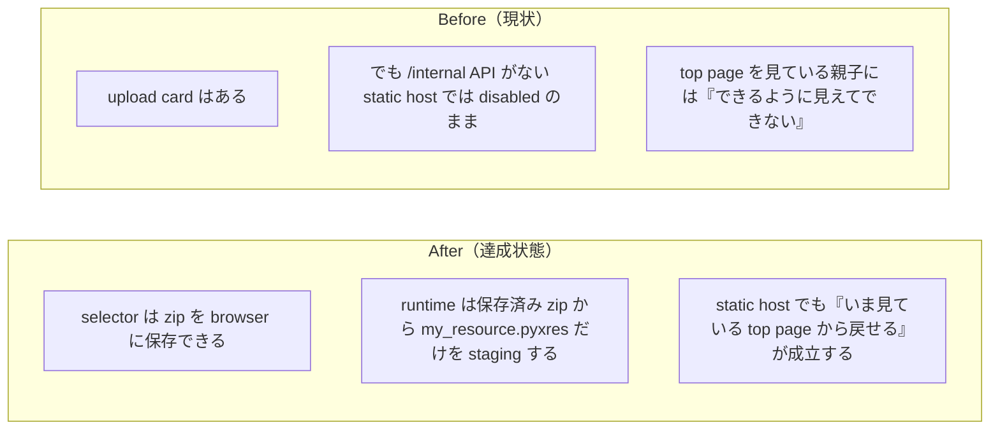

# 2026年4月20日 CJ26 static な top page でも Code Maker zip を戻せるようにする

> 状態：`done`
> 次のゲート：なし

---

## 1) 改善対象ジャーニー

- **根拠となるカスタマージャーニー**：`CJ26 「自分たちのゲーム」と言えるようになる`
- **関連するカスタマージャーニー**：`CJG26`, `CJG37`, `CJG41`
- **深層的目的**：top page が `tools/web_runtime_server.py` 前提で黙って死なず、static host でも親子が `code-maker.zip` を戻して次の play に反映できるようにする
- **やらないこと**：zip 内 `main.py` の採用、`.pyxres` の中身の自動編集、Code Maker を別 UI に置き換えること

### 人間の期待

- **この note が `done` なら、人間は何が成立していると思うか**：今見ている top page からいつでも `code-maker.zip` を選べて、その browser で次に開く game page が人の resource を使う
- **その期待を裏切りやすいズレ**：upload カードは見えても server API がないと動かない、zip 内 `main.py` を巻き戻す、runtime が人の resource ではなく canonical を読んでしまう
- **ズレを潰すために見るべき現物**：`index.html` の upload UI、browser localStorage、`main.py` / `main_development.py` の `.pyxres` 読み込み順、`development/play.html` / `production/play.html`

### 現状

- upload UI は `templates/selector.html` に見えていたが、実際には `/internal/codemaker-resource-import/status` がないと disabled のままだった
- つまり static な `index.html` では `CJ26` の「selector から戻せる」が成立していなかった

### 今回の方針

- **service**：`src/shared/services/browser_resource_override.py` で browser 保存済み zip から `my_resource.pyxres` を復元する
- **ui**：`templates/codemaker_import_ui.js` は file picker と localStorage 保存だけを持ち、zip の意味解釈をしない
- **tool**：`tools/build_web_release.py` は UI script を selector へ埋め込み、top page を static host でも同じ見え方に保つ
- **runtime**：`main.py` / `main_development.py` には Code Maker 単一ファイル制約のため restore helper を inline で持たせる

### 委任度

- 🟡 browser UI と runtime の境界をまたぐが、`zip 保存` / `resource 復元` / `build 生成` の責務は分けられる

---

## 2) カスタマージャーニーgherkin（完了条件）

### シナリオ1：正常系

> {親が static host の index.html を開いている} で {selector から code-maker.zip を取り込む} と {その browser で次に開く game page が人の resource を使う}

### シナリオ2：異常系

> {zip に `main.py` が入っている} で {top page から取り込む} と {browser 側も runtime 側も `my_resource.pyxres` だけを使う}

### シナリオ3：回帰確認

> {runtime server がなく static host だけで配信している} で {同じ upload UI を使う} と {console error を出さず browser 保存だけで完了する}

### 対応するカスタマージャーニーgherkin

- `CJG26: Code Maker から戻す時は resource だけを取り込む`
- `CJG37: runtime は人の resource を勝手に別物へ更新しない`
- `CJG41: 技術基盤の変更が配信経路を壊さない`

---

## 3) Design（どうやるか）

- **関連スキル・MCP**：`systematic-debugging`, `test-driven-development`, `verification-before-completion`, `playwright`
- **MCP**：追加なし

### 調査起点

- `templates/selector.html`
- `tools/build_web_release.py`
- `tools/web_runtime_server.py`
- `main.py`, `main_development.py`
- `docs/cj-gherkin-platform.md`

### 実世界の確認点

- **実際に見るURL / path**：
  `/home/exedev/code-quest-pyxel/index.html`
  `/home/exedev/code-quest-pyxel/production/play.html`
  `/home/exedev/code-quest-pyxel/development/play.html`
- **実際に動いている process / service**：
  `python -m http.server 8898`
- **実際に増えるべき file / DB / endpoint**：
  `src/shared/services/browser_resource_override.py`
  `templates/codemaker_import_ui.js`
  browser localStorage key `blockquest_codemaker_zip_v1`

### 検証方針

- selector / service の Red を先に作る
- `python -m pytest test/ -q` を通す
- `python tools/build_web_release.py --development` と `python tools/build_web_release.py` を通す
- static server 上の `index.html` を Playwright で開き、file input upload と status 変化、localStorage 保存を確認する

---

## 4) Tasklist

- [x] docs / カスタマージャーニー / gherkin の根拠をそろえる
- [x] static host で upload が死ぬ根本原因を固定する
- [x] service / ui / tool の責務を切り分ける
- [x] 実装する
- [x] 実世界の path / process / file を直接確認する
- [x] `python -m pytest test/ -q` を実行する

---

## 5) Discussion（記録・反省）

### 2026年4月20日 08:09（起票）

**Observe**：top page には upload カードが見えていたが、実際には `web_runtime_server` の API がないと disabled のままだった。  
**Think**：問題は UI が「server import API と browser local preview」を一つの責務に混ぜていたことだった。static host で必要なのはまず browser 保存であり、そこを server API から切り離すべきだった。  
**Act**：browser 保存 UI、runtime 復元 service、selector build の 3 役に分ける note として切り出した。

### 2026年4月20日 08:21（修正・検証完了）

**Observe**：`templates/codemaker_import_ui.js` で zip を localStorage に保存し、`main.py` / `main_development.py` は起動前に保存済み zip から `my_resource.pyxres` だけを staging するようにした。static host に optional mirror POST を打つ案は console error を必ず残すため採用しなかった。  
**Think**：これで static host でも UI は成立し、「できそうに見えて動かない」を消せた。`main.py` 側の helper を外部 module import に逃がすと Code Maker 単一ファイル制約を壊すため、そこだけ inline のまま残すのが妥当だった。  
**Act**：`python -m pytest test/test_browser_resource_override.py -q`、`python -m pytest test/test_build_web_release.py -q`、`python -m pytest test/test_web_runtime_server.py -q` を通し、最後に `python -m pytest test/ -q` を回した。さらに `python -m http.server 8898` で static 配信し、Playwright で `index.html` から `development/code-maker.zip` を upload して status と localStorage 保存を確認した。
