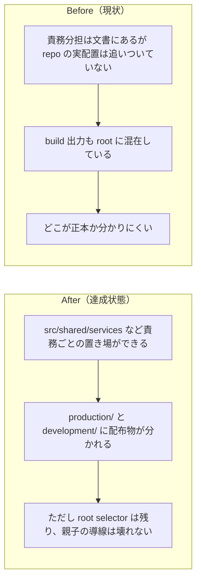

# 2026年4月20日 J51 architecture.md に沿って repo 構成と build 出力を再構成した

> 状態：done
> 次のゲート：次段で runtime の本格的な Scene 分割を進める

---

## 1) 改善対象ジャーニー

- **根拠となるカスタマージャーニー**：`CJ21`, `CJ26`, `CJ31`, `CJ33`
- **関連するカスタマージャーニー**：`CJ12`, `CJ43`
- **深層的目的**：repo の責務分担を見える形にし、ソース配置と build 出力を `architecture.md` に近づける
- **やらないこと**：この note 1 本で `main.py` の巨大 `Game` クラスを完全に Scene 単位へ解体し切ること

### 人間の期待

- **この note が `done` なら、人間は何が成立していると思うか**：`architecture.md` の責務分担が repo の実ファイル構成に反映され、build 出力も `production/` と `development/` に整理されている
- **その期待を裏切りやすいズレ**：文書だけ新構成でも実ファイルは旧配置のまま、または `production/` / `development/` 化で root selector が壊れて親子の導線が消える
- **ズレを潰すために見るべき現物**：`docs/architecture.md`、`tools/build_web_release.py`、`test/test_build_web_release.py`、root `index.html`、`production/`、`development/`

### 現状

- `docs/architecture.md` は責務ベースの理想構造を示している
- 実コードは `main.py` / `main_development.py` に巨大な `Game` クラスを持ち、独立モジュールも `src/` 直下に散っている
- build 出力は root に `play.html` / `pyxel.html` / `code-maker.zip` などを置いている
- ただし `CJ21/CJG21`, `CJ31/CJG31`, `CJ33/CJG33` の観点では、親子が最初に開く root selector は維持が必要

### 今回の方針

- `architecture.md` は実 repo に合わせて章構成と使用ライブラリ責務を明確化する
- `src/shared/services` など、独立して移せるモジュールから先に新構成へ移し、repo 内 import も新 path に切り替える
- build 出力は `production/` / `development/` に寄せる
- ただし root `index.html` の selector は残し、そこから `production/` / `development/` の wrapper へ飛ばす
- `main.py` の全面 Scene 分割は今回の scope 外とし、まずは窓口と置き場を作る

### 委任度

- 🔴

---

## 2) カスタマージャーニーgherkin（完了条件）

### シナリオ1：正常系

> {通常 build または開発版 build を実行する} で {root selector と配布物を確認する} と {root selector は残りつつ配布物は `production/` と `development/` に分かれている}

### シナリオ2：異常系

> {開発版入力がない} で {通常 build を実行する} と {root selector は本番だけを見せ、`development/` の stale 配布物は残らない}

### シナリオ3：回帰確認

> {shared service を新配置へ移す} で {既存 import と新 import の両方でテストする} と {テストが通り、既存 runtime と build が壊れない}

### 対応するカスタマージャーニーgherkin

- `docs/cj-gherkin-platform.md` `CJG21`
- `docs/cj-gherkin-platform.md` `CJG26`
- `docs/cj-gherkin-platform.md` `CJG31`
- `docs/cj-gherkin-platform.md` `CJG33`
- `docs/cj-gherkin-platform.md` `CJG43`

---

## 3) Design（どうやるか）

- **関連スキル・MCP**：`writing-plans`, `test-driven-development`, `verification-before-completion`
- **MCP**：追加なし

### 調査起点

- `docs/architecture.md`
- `tools/build_web_release.py`
- `test/test_build_web_release.py`
- `src/audio_system.py`
- `src/save_store.py`
- `src/input_bindings.py`
- `src/play_session_logging.py`
- `src/structured_dialog.py`

### 実世界の確認点

- **実際に見るURL / path**：root `index.html`、`production/index.html`、`production/play.html`、`development/index.html`、`development/play.html`
- **実際に動いている process / service**：`python tools/build_web_release.py`、`python tools/build_web_release.py --development`
- **実際に増えるべき file / DB / endpoint**：`src/shared/services/*`、`src/core/scene_manager.py`、`src/scenes/*`、`production/*`、`development/*`

### 検証方針

- 先に build 出力先と新 import path の failing test を足す
- build flow を `production/` / `development/` に寄せる
- 既存独立モジュールを新構成へ移す
- full test と build 実物確認で締める

---

## 4) Tasklist

- [x] `architecture.md` を章立てとライブラリ責務つきで書き直す
- [x] build 出力先の failing test を追加する
- [x] `production/` / `development/` 出力へ build を寄せる
- [x] `src/shared/services` などへモジュールを移し、repo 内 import を新 path に切り替える
- [x] 新しい `src/core` / `src/scenes` / `src/shared/ui` の窓口を作る
- [x] root selector と build 実物を確認する
- [x] `python -m pytest test/ -q` を実行する

---

## 5) Discussion（記録・反省）

> Observe → Think → Act を刻む。未来の自分が復元できることが目的。

### 2026年4月20日 00:00（起票）

**Observe**：`architecture.md` は責務分担を示しているが、repo の現実は monolith + root 出力が中心で、まだ一致していない。  
**Think**：build/release をいきなり理想形へ寄せると root selector を壊しやすい。`CJ21/CJ31/CJ33` を守るには親子の入口を残しつつ、配布物だけ `production/` / `development/` へ寄せるべき。  
**Act**：J51 を起票し、root selector 維持を明示したうえで段階的移行を始める。

### 2026年4月20日 06:00（完了確認）

**Observe**：`docs/architecture.md` に沿って `src/app.py`、`src/core/scene_manager.py`、`src/scenes/*`、`src/shared/services/*`、`src/shared/ui/*` が追加され、build 出力も root 直下から `production/` / `development/` に移った。root `index.html` には `開発版` / `本番` の 2 カードと Code Maker 導線が残っている。  
**Think**：J51 の scope は repo 構成と build 出力の再構成であり、`main.py` の巨大 `Game` を完全解体することではない。したがって、実ファイル配置・selector 導線・Code Maker zip・full test がそろえば `done` にできる。  
**Act**：次を確認したうえで `done` とした。

- `python -m pytest test/ -q` -> `244 passed`
- `python tools/build_web_release.py`
- `python tools/build_web_release.py --development`
- `curl -I http://127.0.0.1:8765/`
- `curl -I http://127.0.0.1:8765/production/play.html`
- `curl -I http://127.0.0.1:8765/development/play.html`
- `curl -I http://127.0.0.1:8765/production/pyxel.html`
- `curl -I http://127.0.0.1:8765/development/pyxel.html`
- headless Chrome で root `index.html` の実画面を撮影し、`開発版` / `本番` カードと Code Maker 導線を確認
- Pyxel 実行キャプチャでゲームが起動してタイトル画面が出ることを確認
- `production/code-maker.zip` / `development/code-maker.zip` に `block-quest/main.py` と `block-quest/my_resource.pyxres` が入り、`STUDENT AREA` を含み、開発版 zip の `main.py` は `main_development.py` から再生成されたものと一致することを確認
