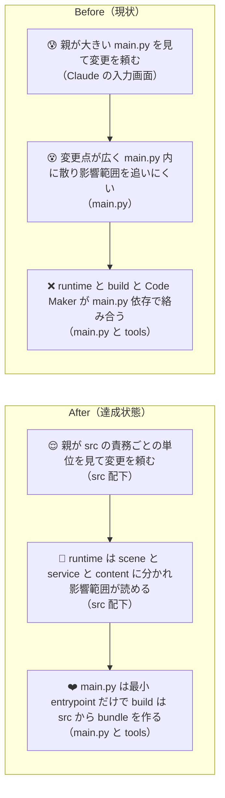
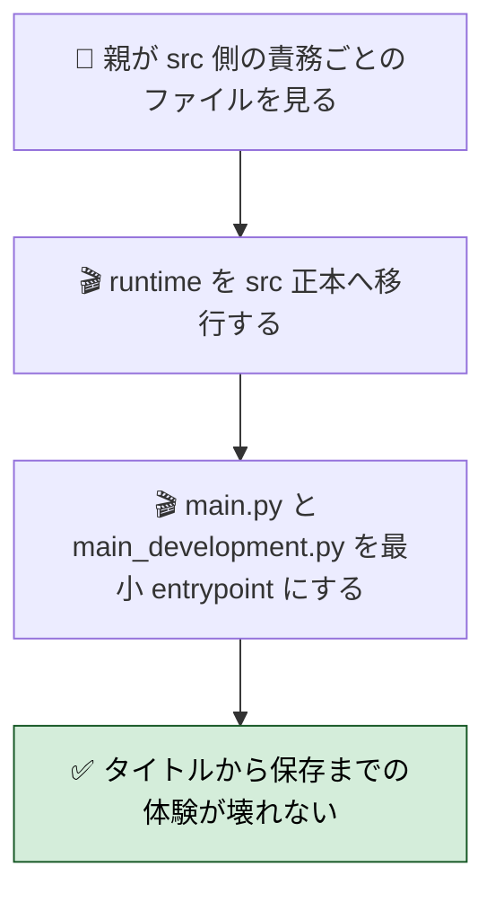
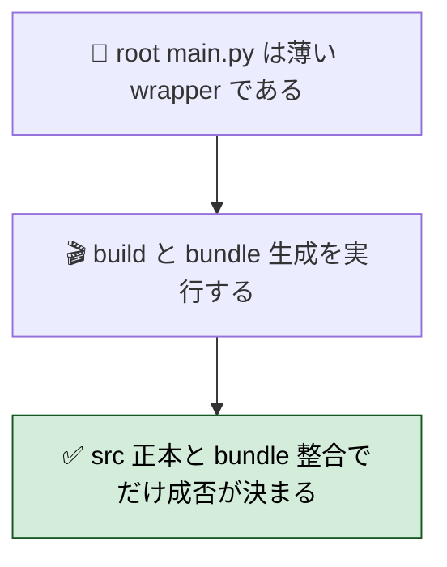
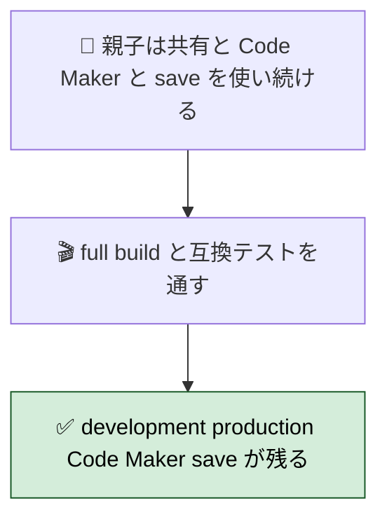
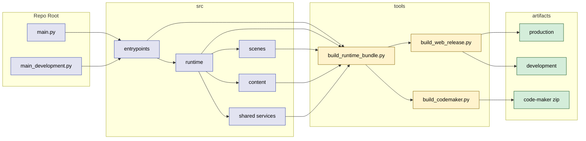
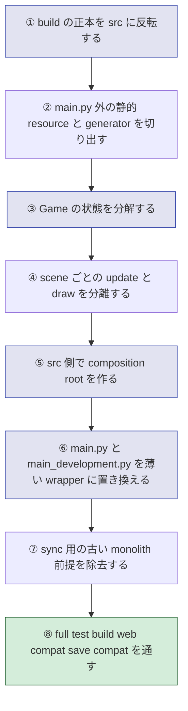

# 2026年4月22日 J52 main.py / main_development.py を thin wrapper にし runtime 本体を src/runtime へ移した

> 状態：`done`
> 次のゲート：必要なら次段で `src/runtime/*.py` の内部 monolith を scene / state / renderer へさらに分解する

---

## 1) 改善対象ジャーニー

- **根拠となるカスタマージャーニー**：`CJ39 システムを変えたらゲーム全体が壊れた`
- **関連するカスタマージャーニー**：`CJ35`, `CJ36`, `CJ38`, `CJ40`, `CJ41`, `CJ26`
- **深層的目的**：大改造しても壊さない
- **やらないこと**：`.pyxres` を Codex が直接編集すること、一気に書き換えて無検証で landing すること

### 人間の期待

- **この note が `done` なら、人間は何が成立していると思うか**：`src/` が runtime の唯一の正本になり、`main.py` と `main_development.py` は数行の entrypoint だけになり、Web build / Code Maker / development / production / save/load がそのまま動く
- **その期待を裏切りやすいズレ**：repo 上の `main.py` だけ薄くして、実際の build はまだ旧 monolith に依存していること。`main.py` は空でも `main_development.py` や `build_codemaker.py` が旧前提のまま残ること。Code Maker zip と development build が壊れること
- **ズレを潰すために見るべき現物**：`main.py`、`main_development.py`、`tools/build_web_release.py`、`tools/build_release_artifacts.py`、`tools/build_codemaker.py`、`tools/resolve_release_source_of_truth.py`、`production/code-maker.zip`、`development/code-maker.zip`

### 現状

- root `main.py` / `main_development.py` は `src/runtime/*.py` を読む thin wrapper になった
- `Game` クラスと runtime 本体は `src/runtime/main_runtime.py` / `src/runtime/main_development_runtime.py` に移った
- build は wrapper だけでなく `src/` を stage へ含め、Code Maker zip も runtime source から生成するように変わった
- preview metadata / promote / cache token も runtime file 基準に切り替わった
- ただし runtime 本体はまだ `src/runtime/*.py` の大きい monolith であり、scene / state / renderer への分割は次段の仕事

### 今回の方針

- 到達形を最初に固定する
  - `src/` が runtime の唯一の正本
  - `main.py` / `main_development.py` は import + `run()` だけの最小 entrypoint
  - build / package / Code Maker zip は root monolith ではなく `src/` から生成した bundle を使う
- 既存の `src/scenes/*` は捨てず、そこを本物の runtime scene に育てる
- `main.py` を空にする前に、build の正本を root から `src/` へ反転させる
- production / development の差分は `main.py` と `main_development.py` の巨大 diff ではなく、`src` 側の entrypoint / config / scene override で表す
- `CJ26` を守るため、Code Maker build と `.pyxres` の round-trip は最後まで壊さない

### 委任度

- 🔴 runtime / build / preview flow / Code Maker をまたぐため、勝手な実装着手ではなく計画固定が先

---

## 2) カスタマージャーニーgherkin（完了条件）

### シナリオ1：正常系

> 🧱 Given: 親が `src/` の scene や service を見ながら機能変更を頼み、子どもが Web 版や Code Maker を使い続けている。🎬 When: runtime を `src/` ベースへ完全移行し、`main.py` / `main_development.py` を最小 entrypoint にする。✅ Then: タイトル、探索、戦闘、会話、メニュー、セーブ、development / production の切り替えがそのまま動き、root monolith に戻らなくて済む。

### シナリオ2：異常系

> 🧱 Given: 誰かが root `main.py` を直接いじっても、そこは正本ではないはずである。🎬 When: build や Code Maker zip 生成を実行する。✅ Then: build は `src/` と bundle 生成物の整合だけを見て進み、root の薄い wrapper を編集しただけでは runtime 本体の source of truth にならず、壊れた bundle はテストで止まる。

### シナリオ3：回帰確認

> 🧱 Given: 親子は development / production の共有、Code Maker zip の持ち出し、save/load の継続を期待している。🎬 When: monolith を最後まで切り出し切ったあとで build と互換テストを通す。✅ Then: `production/`、`development/`、`code-maker.zip`、save 互換、resource import の体験が今まで通り残り、`main.py` を空にしたせいで導線が消えない。

### 対応するカスタマージャーニーgherkin

- `CJG35 起動しない版は承認キューに出さない`
- `CJG36 データ定義は SSoT に集約し散在による不整合を防ぐ`
- `CJG38 新イベント追加で既存進行を壊さない`
- `CJG39 システム変更でゲーム全体を壊さない`
- `CJG40 構造変更でも save 互換を壊さない`
- `CJG41 技術基盤変更で配信と build を壊さない`
- `CJG26 持ち出した Code Maker bundle は今見ている版と一致する`
- `CJG37 人が編集した resource を build がそのまま届ける`

---

## 3) Design（どうやるか）

- **関連スキル・MCP**：`manage-tasknotes`, `brainstorming`, `writing-plans`, `test-driven-development`, `verification-before-completion`
- **MCP**：追加なし

### 方式比較

- **案A: root `main.py` を generated monolith のまま残し、`src/` 側へ少しずつ逃がす**
  - 利点：build 変更が少ない
  - 欠点：ユーザーが求める `main.py がスッカラカン` に最後まで到達しない。root monolith を source of truth と見る発想も残る
- **案B: root `main.py` を薄くするが、build はその import 連鎖をそのまま package する**
  - 利点：repo の見た目はすぐ薄くできる
  - 欠点：Pyxel package / Code Maker / preview build が import 解決にどこまで追随するか不透明で、壊れた時に責務境界が曖昧
- **案C: build の source of truth を先に `src/` へ反転し、package / Code Maker 用 single-file bundle は build 時に生成する**
  - 利点：repo の runtime 正本と配布用 bundle の責務が明確になる。`main.py` / `main_development.py` を最後に数行まで縮められる
  - 欠点：build 系テストと tooling の改修が大きい

**推奨は案C**。`main.py` を本当に空に近づけるには、まず build の支点を root monolith から外す必要がある。

### 次段の目標構成（今回は未実施）

- **`src/entrypoints/`**
  - `production.py`
  - `development.py`
  - production / development の起動差分だけを持つ
- **`src/runtime/`**
  - `game.py`
  - `context.py`
  - `state/`
  - Pyxel 実行、共有 runtime context、状態集約を持つ
- **`src/scenes/`**
  - 既存 `title / explore / battle / dialog` を本物の runtime scene に育てる
  - `menu / settings / town / shop / ending / splash / ai_help / professor` を追加する
- **`src/content/`**
  - `font_data.py`
  - `tiles.py`
  - `sprites.py`
  - `world_map.py`
  - `dungeon_map.py`
  - いま `main.py` に残る静的 resource と generator を切り出す
- **`src/shared/services/`**
  - 既存 service の整理継続
  - `sfx_system.py` を追加し、SFX 本体も root monolith から外す
- **`tools/build_runtime_bundle.py`**
  - `src/` 正本から package / Code Maker 用の単一 `main.py` を生成する
- **`main.py` / `main_development.py`**
  - 最終形は数行の wrapper
  - repo 内では人が読む入口だけを担い、配布用 single-file bundle の正本ではない

### 調査起点

- `main.py`
- `main_development.py`
- `src/app.py`
- `src/core/scene_manager.py`
- `src/scenes/*`
- `src/shared/services/*`
- `tools/build_web_release.py`
- `tools/build_release_artifacts.py`
- `tools/build_codemaker.py`
- `tools/resolve_release_source_of_truth.py`
- `tools/sync_main_data.py`
- `test/test_build_web_release.py`
- `test/test_build_codemaker.py`
- `test/test_scene_responsibilities.py`
- `docs/architecture.md`
- `docs/customer-journeys.md`
- `docs/product-requirements-guardrails.md`

### 実世界の確認点

- **実際に見るURL / path**：root `index.html`、`production/play.html`、`development/play.html`、`production/code-maker.zip`、`development/code-maker.zip`
- **実際に動いている process / service**：`python tools/build_web_release.py`、`python tools/build_web_release.py --development`、`python tools/build_codemaker.py`、`python tools/test_headless.py`、`python tools/test_save_compat.py`、`python tools/test_web_compat.py`
- **次段で増える候補の file / DB / endpoint**：`src/entrypoints/*`、`src/content/*`、`src/shared/services/sfx_system.py`、`tools/build_runtime_bundle.py`

### 検証方針

- 先に「`main.py` が薄くなったこと」ではなく、「build が root monolith を正本にしていないこと」をテストで固定する
- その上で、静的 data / generator / service / scene / renderer / controller の順に monolith を切る
- 最後に `main.py` / `main_development.py` の薄さをテストで固定する
- 毎段、最低でも次を回す
  - `python -m pytest test/ -q`
  - `python tools/test_headless.py`
  - `python tools/test_save_compat.py`
  - `python tools/test_web_compat.py`

---

## 4) Tasklist

- [x] `src/runtime/main_runtime.py` と `src/runtime/main_development_runtime.py` を作り、root runtime 本体を `src/` へ移す
- [x] root `main.py` / `main_development.py` を 20 行以内の thin wrapper に置き換える
- [x] wrapper から runtime source を `exec` で読み込み、既存テストや補助スクリプトが `main.py` モジュール名のまま動くようにする
- [x] `tools/build_release_artifacts.py` を更新し、stage へ `src/` を含め、Code Maker zip は runtime source から生成する
- [x] `tools/build_codemaker.py` を更新し、`def run()` 型 entrypoint を教材版 `main.py` へ変換できるようにする
- [x] `tools/resolve_release_source_of_truth.py` と `tools/build_web_release.py` を更新し、preview metadata / promote / cache token を runtime file 基準へ切り替える
- [x] `test/test_architecture_layout.py`、`test/test_build_codemaker.py`、`test/test_build_web_release.py`、`test/test_dialogue_integration.py`、`test/test_structured_dialog.py` を新構成へ合わせる
- [x] `docs/architecture.md` を root thin wrapper + `src/runtime/*.py` の現実に合わせる
- [x] `python -m pytest test/ -q` を通す
- [x] `python tools/test_headless.py`
- [x] `python tools/test_save_compat.py`
- [x] `python tools/test_web_compat.py`
- [x] `python tools/build_web_release.py`
- [x] `python tools/build_web_release.py --development`
- [x] `python tools/build_codemaker.py`

### 作業記録

#### 2026年4月22日 16:08（起票）

**Observe**：`main.py` はまだ巨大 monolith で、`src/scenes/*` と `src/app.py` は受け皿のまま、build も `main.py` / `main_development.py` を直接正本としている。  
**Think**：`main.py` を本当に空にするなら、runtime より先に build の source of truth を反転させないと途中で配布物が壊れる。`main.py` だけ薄くしても、Code Maker と preview build が旧前提なら目的未達になる。  
**Act**：J52 を起票し、終着点を `src 正本 + thin wrapper + bundle build` に固定した。

---

## 5) Discussion（記録・反省）

> Observe → Think → Act を刻む。未来の自分が復元できることが目的。

### 2026年4月22日 16:08（planning draft）

**Observe**：J51 は repo 構成の土台づくりまでで、runtime monolith の完全解体は scope 外だった。  
**Think**：この次段は単なる refactor ではなく、`main.py` と build pipeline の source-of-truth inversion を含む。したがって、Phase を飛ばすと `main.py が薄いだけで build は旧 monolith 依存` という偽ゴールになりやすい。  
**Act**：最終到達形と phase 順を tasknote に固定した。次はこの note をもとに、ユーザー確認のうえで実行順をさらに bite-sized に割る。

### 2026年4月22日 16:29（実装・検証完了）

**Observe**：root `main.py` / `main_development.py` を薄くするには、単に import wrapper にするだけでは足りず、Code Maker zip・preview metadata・promote・既存テストの前提も runtime file 基準へ直す必要があった。  
**Think**：今回の完了条件は「scene 分解の最終形」ではなく、「root main がスッカラカンで、build / Code Maker / preview flow が壊れないこと」。runtime monolith 自体は `src/runtime/*.py` に残っているが、root からは外せた。  
**Act**：次を実施して `done` とした。

- `src/runtime/main_runtime.py` / `src/runtime/main_development_runtime.py` を新設し、root runtime 本体を移動
- root `main.py` / `main_development.py` を thin wrapper 化
- build / Code Maker / preview metadata / promote を runtime file 基準へ更新
- 関連 test と `docs/architecture.md` を更新
- `python -m pytest test/ -q` で `272 passed`
- `python tools/test_headless.py`、`python tools/test_save_compat.py`、`python tools/test_web_compat.py`、`python tools/build_web_release.py`、`python tools/build_web_release.py --development`、`python tools/build_codemaker.py` を通過
