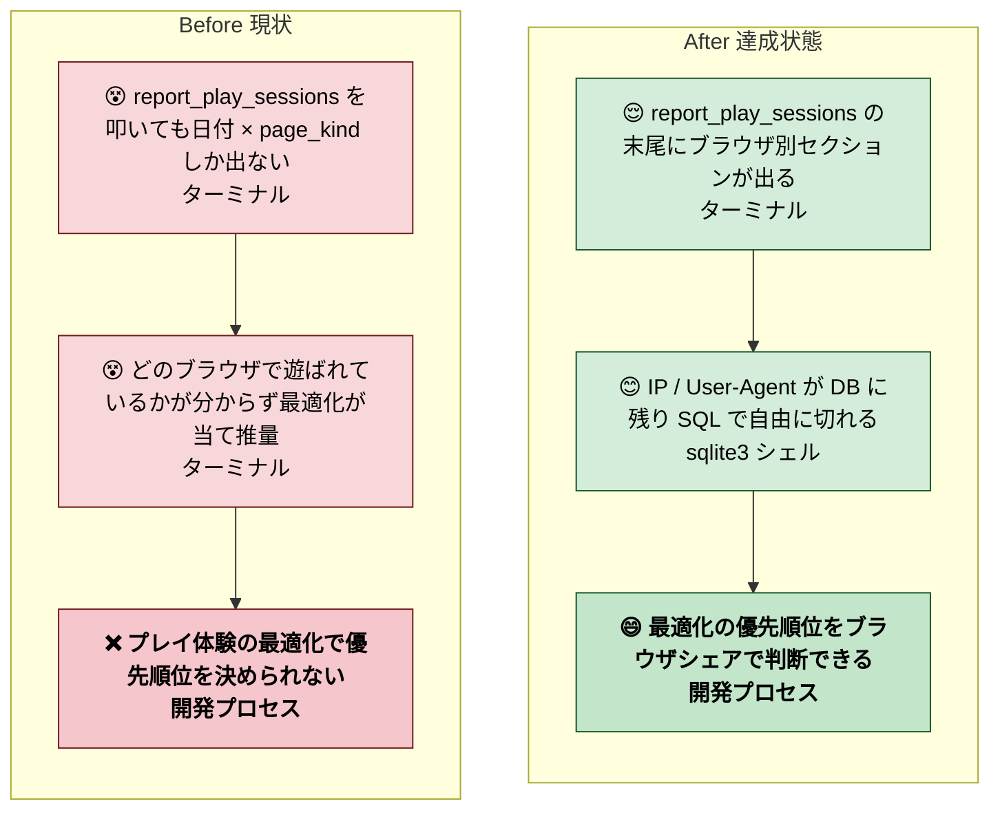
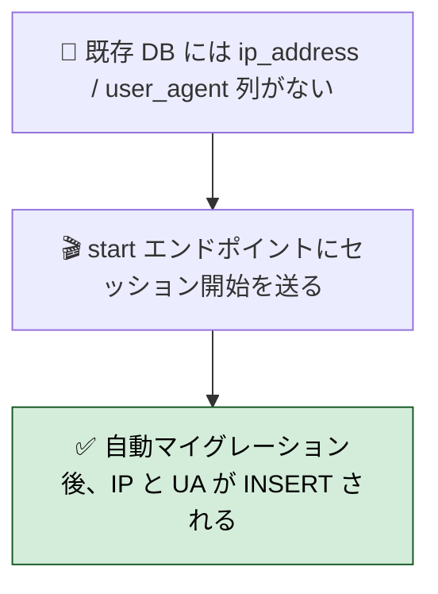
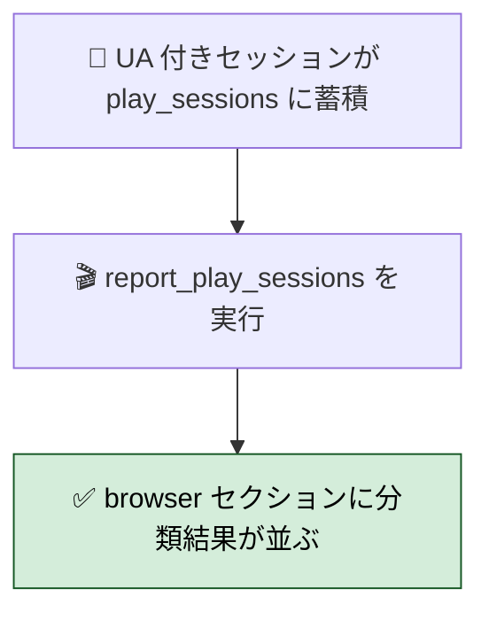
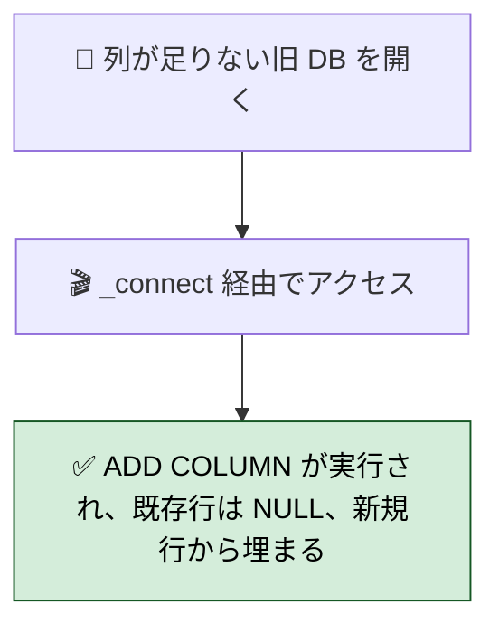
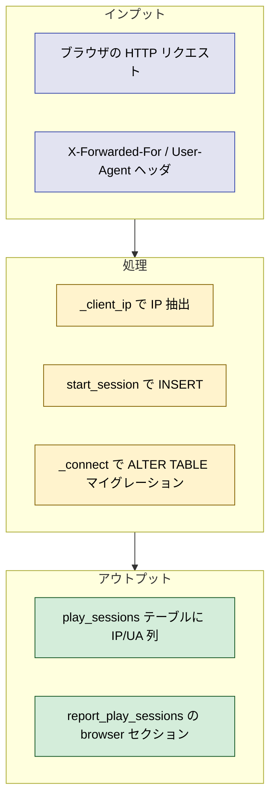

# 2026年4月22日 play_sessions SQLite に IP / User-Agent / ブラウザ分類を足す（さかのぼり）

> 状態：(6) Discussion / done（さかのぼり記録）
> 完了内容：commit 25dbc78 に IP / UA 列追加・X-Forwarded-For 対応・ブラウザ分類集計を同梱済み。実施時には note が無かったため、2026-04-25 に対話の中でさかのぼり起票。

---

## 1) Journey（どこへ行くか）

- **深層的目的**：誰がどのブラウザ環境で何分遊んでいるかを把握する
- **やらないこと**：
  - 個別ユーザー identification（社内配布の学習用ゲームなので IP 単位の粒度で十分）
  - 地域判定・デバイス種別などの外部サービス連携
  - 既存 46 セッションの IP/UA を遡って推定すること（以降の新規のみ埋める）

---

## 2) Gherkin（完了条件）

### シナリオ1：正常系（新規セッションに IP と UA が記録される）

> 🧱 Given: サーバが起動し、既存 DB は IP/UA 列を持っていない。🎬 When: ブラウザから `/internal/play-sessions/start` を叩く。✅ Then: DB に列が自動追加され、IP（X-Forwarded-For 優先、なければ peer IP）と User-Agent が保存される。

### シナリオ2：分類系（ブラウザ別集計が report で表示される）

> 🧱 Given: セッションが蓄積され、UA が保存されている。🎬 When: `python tools/report_play_sessions.py` を実行する。✅ Then: 末尾に `-- browser --` セクションが出て、Edge / Chrome / Firefox / Safari / Unknown のカウントと平均秒数が並ぶ。

### シナリオ3：互換系（旧フォーマットの DB を開いても壊れない）

> 🧱 Given: IP/UA 列の無い旧スキーマの play_sessions.sqlite3 が既にある。🎬 When: 新版サーバがその DB に接続して最初のリクエストを処理する。✅ Then: `ALTER TABLE ADD COLUMN` が一度だけ走り、既存 46 行は IP/UA が NULL のまま残り、新規行から値が入る。

---

## 3) Design（どうやるか）

- **関連スキル・MCP**：`manage-tasknotes` / `test-driven-development`
- **MCP**：追加なし（sqlite3 / http.server 標準ライブラリで完結）

### 決定事項

1. スキーマは `ADD COLUMN ip_address TEXT` / `ADD COLUMN user_agent TEXT` の後方互換マイグレーションにする（`_MIGRATIONS` タプルで管理）
2. `start_session(ip_address=None, user_agent=None)` としてデフォルト引数で追加。既存呼び出しは NULL 保存にフォールバック
3. IP は `X-Forwarded-For` の先頭値を優先、なければ `self.client_address[0]` を使う（将来 nginx / CloudFront 経由にも対応）
4. UA は生文字列のまま保存し、分類は集計 SQL の CASE WHEN で行う（Edge の UA に Chrome が混在するので順序が重要：Edg → OPR → Chrome → Firefox → Safari → Other）
5. 分類関数は `summarize_sessions_by_browser` として既存 `summarize_sessions` と並置し、report 側で二段セクションとして出す

---

## 4) Tasklist（さかのぼり：実施済みとして記録）

- [x] `play_session_logging.py` の SCHEMA に ip_address / user_agent 列を足す
- [x] `_MIGRATIONS` タプルで既存 DB 向けの `ALTER TABLE` を追加
- [x] `start_session()` に `ip_address` / `user_agent` 引数を追加
- [x] `_client_ip()` ヘルパーを `tools/web_runtime_server.py` に追加（X-Forwarded-For 優先 → peer IP フォールバック）
- [x] `_handle_start` で IP / UA を抽出して `start_session` に渡す
- [x] `summarize_sessions_by_browser()` を追加（CASE 分類：Edge / Opera / Chrome / Firefox / Safari / Other / Unknown）
- [x] `tools/report_play_sessions.py` に `render_browser_summary` と `-- browser --` セクションを追加
- [x] `test/test_play_session_logging.py` に IP/UA 保存・NULL 保存・既存 DB マイグレーション・ブラウザ分類の 4 テストを追加
- [x] `test/test_web_runtime_server.py` に X-Forwarded-For 優先とピア IP フォールバックの 2 テストを追加
- [x] 全 233+ テスト green 維持

### 作業記録

#### 2026年4月22日 24:14（commit 25dbc78 に同梱）

**Observe**：
- `refactor: extract shared services` の一連の変更に同梱する形で IP/UA/ブラウザ分類も完成
- `src/{ => shared/services}/play_session_logging.py` 70 行追加、`test/test_play_session_logging.py` 129 行追加、`tools/report_play_sessions.py` 20 行追加

**Think**：
- 既存 46 セッション（UA なし）は `Unknown` に分類されるが、これは仕様通り
- X-Forwarded-For 優先にしたのは、将来 nginx/CloudFront 経由にするときに再改修を避けるため
- UA を生で保存し分類を SQL に寄せたのは、分類ルールの更新が DB 書き戻し不要で済むため

**Act**：
- `25dbc78 refactor: extract shared services` に機能同梱してコミット
- さかのぼり note 起票は 2026-04-25 に実施（本ファイル）

---

## 5) Result（成果物）

- `src/shared/services/play_session_logging.py`
  - `SCHEMA` に `ip_address TEXT` / `user_agent TEXT` 追加
  - `_MIGRATIONS` で既存 DB 向けマイグレーション
  - `start_session(ip_address=None, user_agent=None)` 拡張
  - `summarize_sessions_by_browser()` 新設（CASE で分類）
- `tools/web_runtime_server.py`
  - `_client_ip()` ヘルパー追加（X-Forwarded-For 優先）
  - `_handle_start` で IP / UA を抽出して保存
- `tools/report_play_sessions.py`
  - `render_browser_summary` 追加、末尾に `-- browser --` セクション出力
- `test/test_play_session_logging.py`
  - IP/UA 保存 / NULL 保存 / 既存 DB マイグレーション / ブラウザ分類の 4 テスト追加
- `test/test_web_runtime_server.py`
  - X-Forwarded-For 優先とピア IP フォールバックの 2 テスト追加

---

## 6) Discussion（反省）

### さかのぼり note であることの学び

- 本来は実装着手前にタスクノートを起票すべきだった。commit 25dbc78 は「extract shared services」の refactor commit に機能追加が混ざっており、変更の動機が commit message から読み取りにくい
- 次回からは機能追加は別 commit に分離し、note を立ててから着手する
- さかのぼり note は「意思決定の経緯」を思い出せる範囲で記録する。今回は対話の中で設計判断を文字起こしできたが、時間が経つと失われやすい

### 反省とルール化

- 記入先：manage-tasknotes（「さかのぼり note はコミット時点でなく作成時点を dateCreated に書く」を明示済み）
- 次にやること：
  - 他 scene（battle / explore / menu / professor / title / ending / shop / settings / ai_help / splash）の framework-rule 適合化を scene 単位で起票
  - ブラウザ別の平均プレイ時間が蓄積してきたら、端末別の UX 最適化方針を別 note で検討
