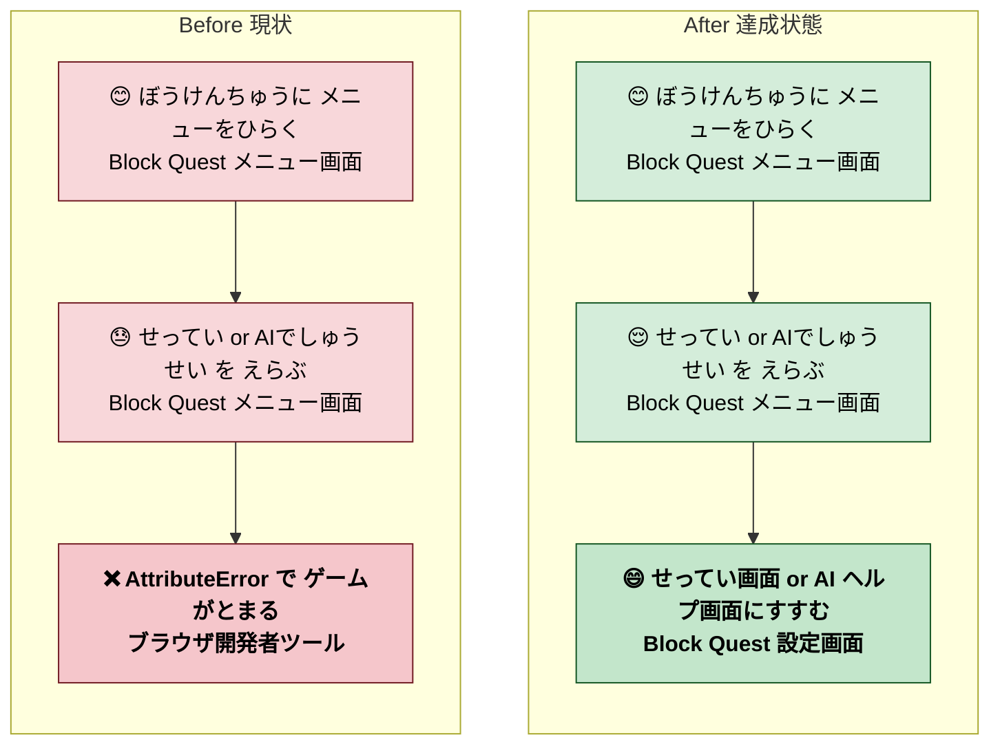

# 2026年4月25日 メニューの せってい / AIでしゅうせい 選択で AttributeError（さかのぼり）

> 状態：(6) Discussion / done（同日中に修復）
> 完了内容：`game._open_settings("menu")` と `game._enter_ai_help()` を Game に
> 実在しないメソッドなのに menu/scene.py が呼んでいた。settings_scene.open /
> ai_help_scene.enter 直呼びに切り替えて修復。新規 regression test も追加

---

## 1) Journey（どこへ行くか）

- **深層的目的**：メニューから遊びを中断しても再開ができる（設定変更・AI 相談で離脱しない）
- **やらないこと**：
  - menu の他機能（ステータス / アイテム / そうび）の作り直し（既にテスト green）
  - 他 scene の shim 呼び出し調査（本 note は menu だけの修復に絞る）

---

## 2) Gherkin（完了条件）

### シナリオ1：正常系（menu から settings_scene.open が直接呼ばれる）

> 🧱 Given: 冒険中にメニューを開いてカーソルを 3（せってい）に置いた。🎬 When: 決定を押す。✅ Then: `game.settings_scene.open("menu")` が呼ばれて設定画面に入る。`game._open_settings` は存在しないので呼び出してはいけない。

### シナリオ2：正常系（menu から ai_help_scene.enter が直接呼ばれる）

> 🧱 Given: 冒険中にメニューを開いてカーソルを 4（AIでしゅうせい）に置いた。🎬 When: 決定を押す。✅ Then: `game.ai_help_scene.enter()` が呼ばれて AI ヘルプ画面に入る。

### シナリオ3：回帰（menu/scene.py のソースに禁止 shim が復活しない）

> 🧱 Given: 修復後のリポジトリ。🎬 When: `grep -nE '\bgame\._(open_settings|enter_ai_help)\(|\bgame\.use_item\(' src/scenes/menu/scene.py` を実行する。✅ Then: マッチ 0 件。

---

## 3) Design（どうやるか）

### 決定事項

1. menu/scene.py の shim 呼び出しは、scene インスタンス直呼びに統一する
   （title / explore / town も既に同じパターン）
2. 禁止 shim の復活を検出する grep ガードを `test_cjg_menu_navigation.py` の
   `MenuDoesNotCallNonexistentGameShimTest` に追加
3. 既存 `test_cjg_menu_navigation.py` の `_FakeGame._open_settings` /
   `_enter_ai_help` を実体に合わせて削除し、`_FakeSettingsScene.open` /
   `_FakeAiHelpScene.enter` に差し替え

---

## 4) Tasklist（さかのぼり）

- [x] grep で `game\._[a-z_]+\(` が src/scenes/menu/scene.py に残っていることを発見
- [x] Game クラス（src/runtime/app.py）のメソッドと突き合わせて不在を確認
- [x] menu/scene.py の 2 行を `settings_scene.open("menu")` / `ai_help_scene.enter()` に差し替え
- [x] 既存 test を実体ベース fake に更新
- [x] MenuDoesNotCallNonexistentGameShimTest を追加（regression）
- [x] 全 501 passed を確認
- [x] 再ビルド + top_changes.json に 4/25 行を追加
- [x] commit d24b123（fix）+ 45a480f（rebuild）

### 作業記録

#### 2026年4月25日 05:00（発覚→修復）

**Observe**：
- テスト書きの random sampling で menu を触っていたとき、menu/scene.py:68,70 の `game._open_settings` / `game._enter_ai_help` が目に入った
- `grep -rn "def _open_settings\|def _enter_ai_help" src/` → 0 件。Game に実体なし
- 既存 `test_cjg_menu_navigation.py` の _FakeGame には `_open_settings` / `_enter_ai_help` が生えていたため test は green になっていた（fake が実体を裏切っていた）

**Think**：
- 「fake が実体と合っていない」パターン。fake を細かく書くほどこの罠が増える
- 対策: (α) menu/scene.py が Game に **実在するメソッドだけ** を呼ぶように直す、(β) grep 静的ガードで禁止 shim が復活しないようにする
- 他 scene にも同種の問題がないか `game._[a-z_]+\(` で追加調査する価値はあるが、本 note では menu だけに絞る

**Act**：
- menu/scene.py の 2 行を修正（d24b123）
- MenuDoesNotCallNonexistentGameShimTest を追加
- production/ を rebuild（45a480f）
- 本 note を事後起票

---

## 5) Result（成果物）

- `src/scenes/menu/scene.py` — `game._open_settings / _enter_ai_help` を
  `game.settings_scene.open("menu") / game.ai_help_scene.enter()` に差し替え
- `test/test_cjg_menu_navigation.py` — _FakeGame を実体準拠に更新、
  MenuDoesNotCallNonexistentGameShimTest を追加
- `top_changes.json` — 4/25「メニューから せってい と AIでしゅうせい を えらんでも おちなくなった」
- `production/*` — 再ビルド

---

## 6) Discussion（反省）

### 反省

- **fake が実体を裏切るパターンは grep 静的ガードで補完するしかない**。unit test
  だけでは「実装は間違っているが fake が実装を信じている」状態を検出できない
- **Game にメソッドが無いのに scene から `game._method(` を呼ぶ**  のは menu 以外
  にもあるかもしれない。要追加調査（別 note で scene 全部に `game._*(` が無いか
  grep する）
- **random sampling が効いた**。テストを書く過程で実機バグを発見するのは既に 2 件目
  （shop KeyError, menu shim）

### ルール化

- `game.<method>(` 呼び出しが scene から生えるたびに、Game 側の実体有無を確認する
- fake オブジェクトのメソッド定義は本物の API 署名と突き合わせる（docstring 参照）
- 静的 grep ガードを M5 系テストに足していく

### 次にやること

- 他 scene の `game._*(` 呼び出しを grep して、Game にあるか突き合わせる（別 note）
- test_cjg_framework_rule_guards.py に「禁止 shim 呼び出し」カテゴリを足す
- fake オブジェクトの API 署名をソース（settings_scene.open / ai_help_scene.enter）
  と揃えるルールを team convention として残す
