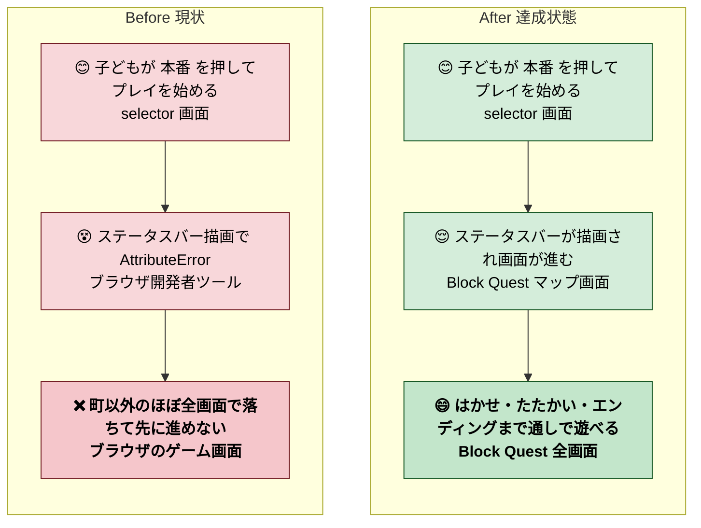
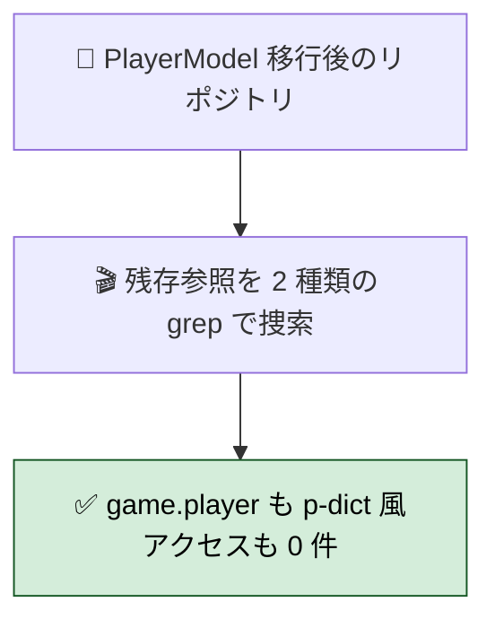
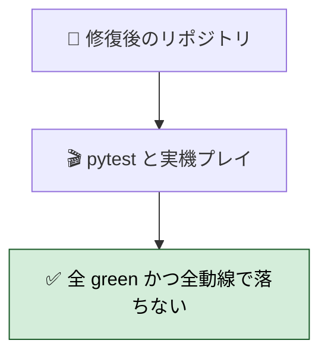
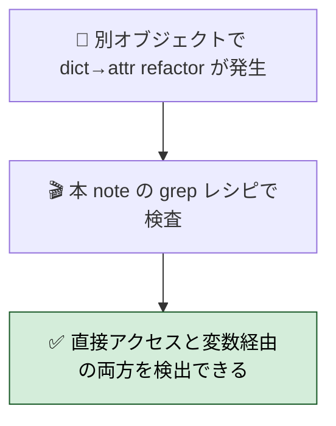
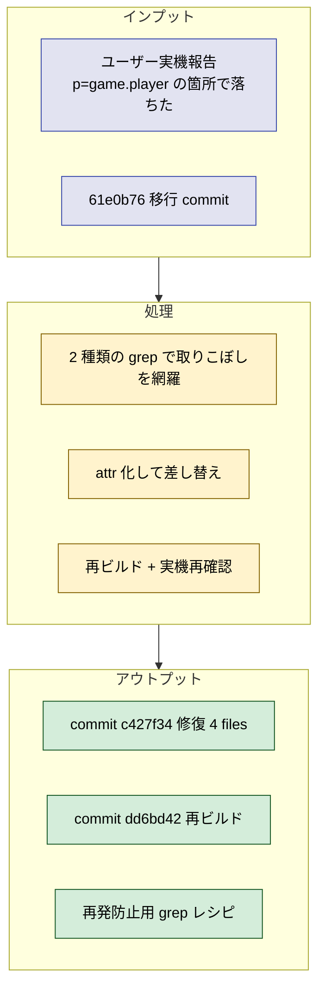

# 2026年4月25日 game.player dict 参照の取りこぼしで落ちる現象の修復（さかのぼり）

> 状態：(6) Discussion / done（同日中に修復・実機未検証）
> 完了内容：61e0b76 で PlayerModel 全廃したつもりが 4 ファイル 6 箇所で dict-style アクセスが残っており、ユーザー実機で落ちた。grep を広げて全廃、再ビルドしてクローズ

---

## 1) Journey（どこへ行くか）

- **深層的目的**：町以外の画面でも子どもが最後まで遊べる状態を取り戻す（ステータスバーは常時描画されるのでトップ画面以降どこでも落ちる致命度）
- **やらないこと**：
  - 他 scene の framework-rule 適合化（別タスクで順次やる）
  - CI ガード整備（このバグの再発防止は推奨事項として残し、別タスクで）

---

## 2) Gherkin（完了条件）

### シナリオ1：正常系（残存 dict アクセスが全廃されている）

> 🧱 Given: 61e0b76 の PlayerModel 移行後のリポジトリ。🎬 When: `grep -rnE 'game\.player[^_a-zA-Z0-9]|game\.player$' src/ --include="*.py" | grep -v player_model` と `grep -rnE '\bp\[['\"']' src/ --include="*.py"` を実行する。✅ Then: いずれも 0 件。

### シナリオ2：回帰確認（既存テストと実機動線が通る）

> 🧱 Given: 修復後のリポジトリ。🎬 When: `python -m pytest test/ -q` を実行し、再ビルドした production/ をブラウザで立ち上げてプレイする。✅ Then: 全 233 テスト + 2 skipped で green、マップ移動→戦闘→教授イベント→エンディングの全動線で AttributeError が出ない。

### シナリオ3：再発防止（変数経由 dict アクセスも検知できる grep レシピが残っている）

> 🧱 Given: 今後も PlayerModel 以外のオブジェクトで dict→attr 化する refactor が予想される。🎬 When: その際に本 note の grep レシピを参照する。✅ Then: `game\.X\b`（word boundary）と `\bp\[['"]`（変数経由）の 2 段 grep でチェックされ、今回と同じ取りこぼしが検出できる。

---

## 3) Design（どうやるか）

- **関連スキル・MCP**：`systematic-debugging`（原因特定） / `manage-tasknotes`（事後記録）
- **MCP**：追加なし

### 決定事項

1. 残存取りこぼしは **2 パターン**あると認識する：
   - (α) 直接アクセス：`game.player["key"]` / `game.player` 単独参照
   - (β) 変数経由：`p = game.player_model` と書き換えたのに `p["key"]` の dict 風アクセスが残る
2. 検出は **2 段 grep** で：
   - (α) `grep -rnE 'game\.player[^_a-zA-Z0-9]|game\.player$' src/ --include="*.py" | grep -v player_model`
   - (β) `grep -rnE '\bp\[['"']' src/ --include="*.py"`（変数名が `p` / `pm` / `player` など refactor ごとに変わるので都度調整）
3. 今回は 4 ファイル 6 箇所を attr アクセスへ統一：
   - `src/shared/ui/status_bar.py:40` — **常時描画のため影響が最も広い**
   - `src/scenes/ending/scene.py:57`
   - `src/scenes/professor/scene.py:54`（intro）
   - `src/scenes/professor/scene.py:121`（ending main）
   - `src/scenes/battle/scene.py:456-457`（`p = game.player_model` と書きながら `p['lv']` / `p['hp']` / `p['max_hp']` / `p['mp']` / `p['max_mp']` の 5 参照）
4. user-visible changelog には端的に「ステータスバー・はかせ・エンディング・たたかいで おちなくなった」と書く（子ども向けひらがな）

---

## 4) Tasklist（さかのぼり：実施済み）

- [x] ユーザー報告「p=game.player で落ちた」を受けて grep で全取りこぼしを列挙
- [x] 4 ファイル 6 箇所を `game.player_model` + attr アクセスに書き換え
- [x] `python -m pytest test/ -q` で 233 + 2 skipped green 確認
- [x] `python tools/build_web_release.py` で再ビルド
- [x] top_changes.json に 4/25 の changelog エントリ追加
- [x] commit c427f34（fix）と dd6bd42（rebuild）を分けて記録

### 作業記録

#### 2026年4月25日 02:10（報告→修復）

**Observe**：
- ユーザー：「p=game.playerと表示されて落ちました」
- grep 結果：`status_bar.py:40` / `ending/scene.py:57` / `professor/scene.py:54,121` で `p = game.player`、さらに `battle/scene.py:456-457` で `p["key"]` 変数経由
- ステータスバーは常時描画層で、マップ画面に入った瞬間から落ちていた可能性大

**Think**：
- 61e0b76「migrate all scenes from player dict to PlayerModel」で grep が `game.player[` にしか絞られていなかったのが原因
- `game.player\b` や `game.player$`（行末）、さらに変数経由（`p[...]`）の両方をチェックしていれば発見できた
- battle/scene.py は `p = game.player_model` と正しく書いた直後に `p['lv']` と dict 化アクセスしていて、**書き換え途中で二重の意図が混ざった** ケース

**Act**：
- 4 ファイル 6 箇所を attr アクセスへ統一（c427f34）
- 再ビルド + top_changes.json に changelog 追加（dd6bd42）
- 本 note を事後起票（本ファイル）

---

## 5) Result（成果物）

- `src/shared/ui/status_bar.py` — `p = game.player_model`、`p.y / p.in_dungeon / p.lv / p.hp / p.max_hp / p.mp / p.max_mp`
- `src/scenes/ending/scene.py` — `p = game.player_model`、`p.lv`
- `src/scenes/professor/scene.py` — `p = game.player_model`、`p.professor_intro_seen` / `p.professor_ending_seen`（属性代入も attr で）
- `src/scenes/battle/scene.py` — `p.lv / p.hp / p.max_hp / p.mp / p.max_mp`（既存の `p = game.player_model` 行はそのまま）
- `top_changes.json` — 4/25 行追加
- `production/*` — 再ビルド

---

## 6) Discussion（反省）

### 反省

- **grep パターンが甘かった**。`game.player[` だけ見て `game.player\b` / `game.player$` を見落とし
- **変数経由のアクセスも対象**。`p = game.X` と書き換えた箇所の下流で `p["key"]` が残るパターンは見落としやすい
- **常時描画層（status_bar）のテストカバレッジが薄い**。unit test は通るが実機で最初に落ちる層。pytest だけで満足せずブラウザ検証を通す手順を必須化すべき
- 自動化された検証として pre-commit / CI に grep ガードを仕込むと再発防止できる（本 note ではルール化のみ、実装は別 note）

### ルール化

- 記入先：**framework-rule.md の M5（命名・テスト）に grep ガード推奨ルールを追記** or 新 tasknote で CI 追加
- dict → dataclass 系 refactor の commit には、以下の 2 段 grep を実行した痕跡を commit message に残す運用とする：
  1. `grep -rnE '<prefix>\.<old_name>[^_a-zA-Z0-9]|<prefix>\.<old_name>$' src/ --include="*.py"`
  2. `grep -rnE '\b<var_name>\[['\"']' src/ --include="*.py"`

### 次にやること

- 他 scene（battle 518行 / explore 395行 / professor 202行 / menu 179行 / など）の framework-rule 適合化（scope 大きいので scene 単位で note を立てる）
- grep ガードの CI / pre-commit 組み込み（別 note）
- ステータスバーの smoke test 追加（Model だけでなく UI 層も unit テストする）
