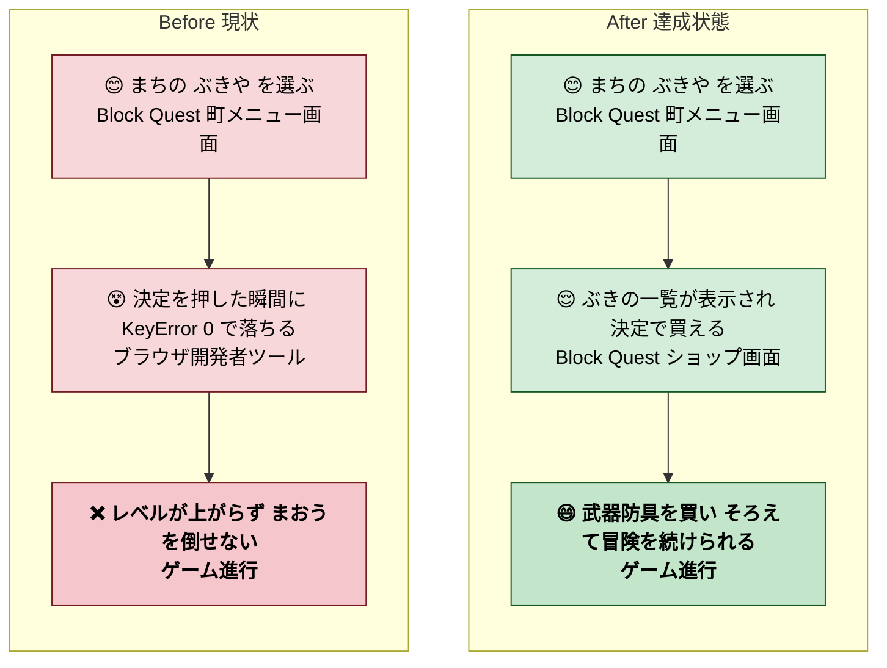
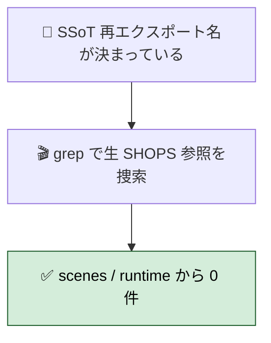
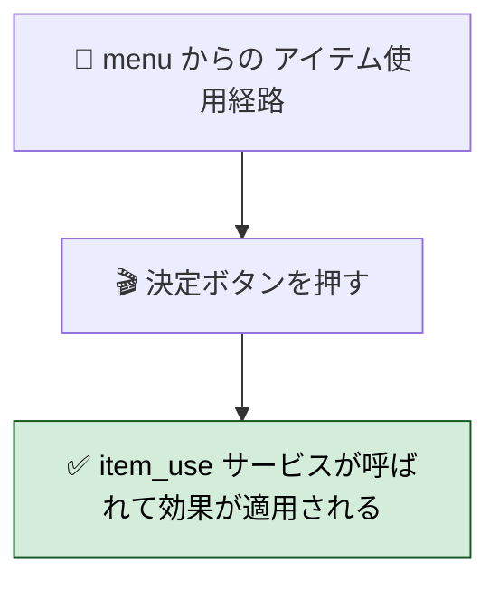

# 2026年4月25日 shop で KeyError：SHOPS 辞書形状の unpack 取りこぼし（さかのぼり）

> 状態：(6) Discussion / done（同日中に修復）
> 完了内容：`generated/shops.py` が dict 形状に変わっていたのに shop/scene.py が list 扱いしていて `KeyError: 0`。`SHOP_LIST` 経由に切り替えて修復、menu の存在しない `game.use_item()` 呼び出しも同時に修正

---

## 1) Journey（どこへ行くか）

- **深層的目的**：町で武器・防具・道具を買える状態を取り戻し、ゲームの進行に必要な経済サイクルを回せるようにする
- **やらないこと**：
  - SHOPS の YAML スキーマ変更（`inn_prices` と `shops` を分離した今の形は残す）
  - 全 `generated/` の shape 確認（今回は shop だけ実害が出た。他は別 note）



---

## 2) Gherkin（完了条件）

### シナリオ1：正常系（町 index で shop を引ける）

> 🧱 Given: `src/generated/shops.py` が dict 形状（`{'shops': [...], 'inn_prices': [...]}`）で生成されている。🎬 When: ぶきや を選んで `ShopScene.enter("weapons")` が呼ばれる。✅ Then: `M.SHOP_LIST[idx]` で該当町の shop dict を取得でき、`shop["weapons"]` でインベントリが配列として返る。

```mermaid
flowchart TD
    A1[🧱 SHOPS = 辞書形状 / SHOP_LIST = 町リスト] --> A2[🎬 shop/scene.py enter weapons]
    A2 --> AOK[✅ SHOP_LIST[idx] weapons がインベントリとして読める]
    classDef ok fill:#d4edda,stroke:#155724,color:#000000;
    class AOK ok;
```

### シナリオ2：再発防止（SSoT 再エクスポート経路に揃っている）

> 🧱 Given: generated/ の YAML 由来データは `src/game_data.py` で unpack 済みの名前（`SHOP_LIST` / `INN_PRICES` 等）として再エクスポートされる運用。🎬 When: `grep -rnE 'M\.SHOPS\b|SHOPS\[' src/ --include="*.py"` を generated / game_data.py を除外して実行する。✅ Then: 0 件（生の辞書を直接参照するコードが残っていない）。



### シナリオ3：道具使用も同様（副次バグの修復）

> 🧱 Given: メニュー画面の「どうぐ」からアイテム使用する経路がある。🎬 When: アイテムを選んで決定を押す。✅ Then: `game.use_item(item_data)`（存在しない）ではなく `src.shared.services.item_use.use_item` サービスが呼ばれ、HP/MP 回復や毒治療が反映される。



---

## 3) Design（どうやるか）

- **関連スキル・MCP**：`systematic-debugging`（原因特定） / `manage-tasknotes`（事後記録）
- **MCP**：追加なし

```mermaid
flowchart TD
    subgraph INPUT[インプット]
        I1[ユーザー実機報告<br>武器を買おうとして KeyError]
        I2[src/generated/shops.py の dict 形状]
        I3[src/game_data.py の SHOP_LIST / INN_PRICES 定義]
    end
    subgraph PROCESS[処理]
        P1[SHOPS shape を確認]
        P2[shop/scene.py の M.SHOPS[idx] を SHOP_LIST[idx] に差し替え]
        P3[menu/scene.py の game.use_item を item_use 直呼びに統一]
    end
    subgraph OUTPUT[アウトプット]
        O1[commit 769fbbf 修復 2 files]
        O2[commit d6d5130 再ビルド]
    end
    INPUT --> PROCESS --> OUTPUT
    classDef io fill:#e2e3f1,stroke:#3949ab,color:#000000;
    classDef proc fill:#fff3cd,stroke:#856404,color:#000000;
    classDef out fill:#d4edda,stroke:#155724,color:#000000;
    class I1,I2,I3 io;
    class P1,P2,P3 proc;
    class O1,O2 out;
```

### 決定事項

1. **SSoT 由来データは generated/ を直接参照しない**。必ず `src/game_data.py` が unpack した名前（`SHOP_LIST` / `INN_PRICES` / `WEAPONS` / `ARMORS` / `ITEMS` 等）を参照する
2. 生 dict と unpack 済み名は **意味的に別物**として扱う（`SHOPS` は YAML ルート全体、`SHOP_LIST` が町ごとの shop 配列）
3. `game.use_item(...)` のような「存在しない shim メソッド」が残っていないか、他 scene も確認対象にする（今回は menu と battle が対照的に書かれていたため混在を発見）

---

## 4) Tasklist（さかのぼり：実施済み）

- [x] ユーザー報告「武器を買おうとしたら KeyError で落ちました」を受けて `shop[idx]` の動きを追跡
- [x] `src/generated/shops.py` の dict 形状と `src/game_data.py` の `SHOP_LIST = SHOPS['shops']` unpack を確認
- [x] `src/scenes/shop/scene.py:45` を `M.SHOPS[idx]` → `M.SHOP_LIST[idx]` に修正
- [x] 副次発見：`src/scenes/menu/scene.py:96` の `game.use_item(item_data)` を `item_use` サービス直呼びに統一（battle/scene.py と同じパターン）
- [x] `python -m pytest test/ -q` で 233 + 2 skipped green 確認
- [x] 再ビルド + top_changes.json に 4/25 の changelog 追加
- [x] commit 769fbbf（fix）と d6d5130（rebuild）を分けて記録

### 作業記録

#### 2026年4月25日 02:20（報告→修復）

**Observe**：
- ユーザー：「武器を買おうとしたら KeyError で落ちました」
- 調査で `src/generated/shops.py` が `SHOPS: dict[str, Any] = {'shops': [...], 'inn_prices': [...]}` の辞書形状とわかる
- `src/game_data.py:63` で `SHOP_LIST = SHOPS['shops']` として unpack されていたが、shop/scene.py は `M.SHOPS[idx]` と list 扱いしていた

**Think**：
- 既に unpack 済みの `SHOP_LIST` が存在するのに使われていなかった → SSoT 再エクスポートの運用が scenes 側に伝わっていない
- `inn_prices` は `src/game_data.py:62` で `INN_PRICES = SHOPS['inn_prices']` として unpack され、こちらは `src/scenes/town/presenter.py:43` が正しく `M.INN_PRICES` を参照している。だから INN は動いていた
- なぜ shop だけ `M.SHOPS` を直接参照していたかは履歴を追わないと不明だが、おそらく shop 機能の初期実装時点で `SHOPS` が list 形状だった名残
- 同時に `menu/scene.py:96` が `game.use_item(item_data)` と呼んでいるが Game にこのメソッドはない。battle/scene.py は `from src.shared.services.item_use import use_item as _use_item_fn` で正しく service を呼んでいる。どうぐ使用経路は menu と battle の 2 本ある

**Act**：
- shop/scene.py の 1 行を修正（769fbbf）
- menu/scene.py も同 commit に含めて item_use 直呼びに統一
- 再ビルド + changelog（d6d5130）
- 本 note を事後起票（本ファイル）

---

## 5) Result（成果物）

- `src/scenes/shop/scene.py:45` — `M.SHOPS[idx]` → `M.SHOP_LIST[idx]`
- `src/scenes/menu/scene.py:96` — `game.use_item(item_data)` → `from src.shared.services.item_use import use_item as _use_item_fn` + `_use_item_fn(game, item_data)`
- `top_changes.json` — 4/25「ぶきや ぼうぐや どうぐや で かいものできるようになった」追加
- `production/*` — 再ビルド

---

## 6) Discussion（反省）

### 反省

- **SSoT 再エクスポートの運用が scenes 側に明示されていない**。generated/ の shape が変わったときに scenes が追従する責任が曖昧
- **unit test が shop enter→purchase まで通っていなかった**。`test_shop.py` のようなファイルがなく、hit-the-endpoint テストが薄い
- **「存在しないメソッド」が scene 間で混在**。menu と battle で同じ「アイテム使用」なのにコード経路が違った（片方はバグ、片方は正しい）
- `grep -rnE 'M\.SHOPS\b|SHOPS\['` のような「生 SSoT を直接参照」検出 grep を pre-commit か CI に入れれば、今後の同種バグは検出できる

### ルール化

- 記入先：**AGENTS.md / framework-rule.md M5（命名・テスト）に「SSoT 再エクスポート経路のみ参照する」を追記候補として残す**（実装は別 note）
- 新規 scene を書くとき、または既存 scene を触るときのチェックリストに以下を加える：
  1. `src/generated/*.py` を直接 import していないか（許可されるのは `src/game_data.py` のみ）
  2. `game.<shim_method>` の呼び出しは Game に実体があるか（scene 間で同じ機能を別 API で呼んでいないか）

### 次にやること

- shop / weapon / armor / item の購入〜使用〜セーブ〜ロードを通す integration 風の smoke test 追加（scene を headless で動かせる薄いハーネス）
- 他 scene の `game.<method>` shim 呼び出しの存在確認 grep（`grep -rnE 'game\.[a-z_]+\(' src/scenes/` で洗い出し、Game にその method があるか突き合わせ）
- `generated/*.py` → `game_data.py` → scenes の一方通行を framework-rule.md M4 系に明文化（現状 M4-4 の下に追記余地あり）
