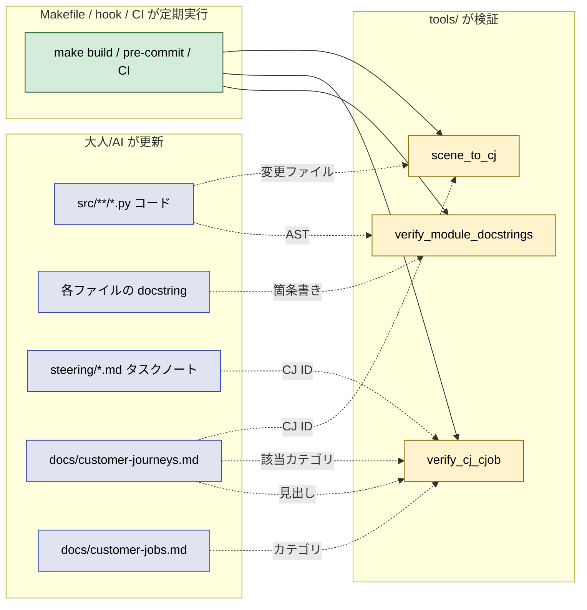

# 2026年5月7日 src/ ファイル先頭に関数一覧コメント（battle/view.py）

> 状態：⑥ Discussion（完了 / archived）
> 次のゲート：—（成果確認済み）

---

## 1) Journey（どこへ行くか）

- **上流ジョブ**：JIS 親（主体性支援）を支える
- **上流CJ**：CJ37（修正しやすい状態を維持する）

### コメントの書き方

1. （大人、AI）💦 src/scenes/battle/view.py を開いて中で何をやっているか知りたい（VS Code エディタ画面）
2. Before
  1. 👀 ファイルを上から下まで読む（VS Code エディタ画面）
  2. 💦 関数定義を1つずつ目で拾う（VS Code エディタ画面）
  3. 💦 BGM 系か描画系か判別に時間がかかる（VS Code エディタ画面）
  4. ❌ （大人、AI）全体像をつかむまでに時間を消費する（VS Code エディタ画面）
3. After
  1. 👀 ファイル先頭のコメントを読む（VS Code エディタ画面）
  2. ✈️ BGM 系2個・描画系2個と一瞬で把握する（VS Code エディタ画面）
  3. ❤️ （AI）必要な関数だけにジャンプして作業に入れる（VS Code エディタ画面）
  4. ❤️ （大人）好循環が高速で回る

### コメントを最新に維持する仕組み（スクリプト？）

1. 💦 （大人、AI）コード修正する
2. Before
  1. 💦 コメント修正が遅れる
  2. 💦 コメントが実態と乖離する
  3. 💦 コメントを読んでもわからない
  4. 💦 （AI）修正時間がかかる
  5. ❌ （大人、AI）好循環が回らない
3. After
  1. ✈️ コメント修正がすぐに行われる
  2. 👀 コメントが常に実態と一致している
  3. ✈️ （AI）修正が早く終わる
  4. ❤️ （大人、AI）好循環が回る

### カスタマージョブ、カスタマージャーニー（スクリプト？）

1. 💦 （大人、AI）コード修正する
2. Before
  1. 💦 だんだんコードとカスタマージョブ、カスタマージャーニーが乖離してくる
  2. 💦 何を基軸にしたらいいかわからなくなる
  3. 💦 製品がブレる
  4. 💦 目的・目標を達成しにくくなる
  5. ❌ 疲れてくる
3. After
  1. ✅ カスタマージョブ、カスタマージャーニーも修正する
  2. ✅ 基軸が現状に一致している
  3. ✅ 現状も基軸に一致している
  4. ✅ 製品の目的・目標が明確で最新
  5. ✈️ 目的・目標を達成しやすくなる
  6. ❤️ 幸せ

---

## 2) Gherkin（完了条件）

> 各シナリオは 3 層構造：
> 1. **ユーザーストーリーマップ**：誰が・何のために・何が嬉しいか
> 2. **Gherkin（自然言語）**：人間が会話レベルで読める Given / When / Then
> 3. **AI 検収レベル Gherkin**：ファイルパス・コマンド・期待出力で AI / CI が自動判定できる Given / When / Then
>
> Journey の 3 トピックに対応してシナリオを 3 グループに分ける：
>
> - **A. コメントの書き方**（src/ 配下の全 Python ファイルが対象）
> - **B. コメントを最新に維持する仕組み**（drift 検出スクリプト・定期実行）
> - **C. カスタマージョブ／カスタマージャーニーとの整合**（コード ↔ docs 乖離検出）
>
> グループ A は「今この瞬間に正しいか」、グループ B / C は「時間が経っても正しい状態を保てるか」を検証する。

---

## A. コメントの書き方

### シナリオ A1：ファイルを開いた瞬間に役割一覧が見える

**ユーザーストーリーマップ**

- As a 大人 / AI（コードを開いて中身を知りたい側）
- I want to src/ 配下の任意の Python ファイルを開いた最初の数行で「このファイルに何があるか」を役割レベル（例: BGM 系・描画系のような分類軸）で把握したい
- So that 必要な関数だけにジャンプして修正に入れる（= CJ37「修正しやすい状態を維持する」が効く）

**Gherkin（自然言語）**

```gherkin
Feature: src/ 配下の Python ファイルの自己説明性
  Scenario: どのファイルでも先頭で役割一覧が読める
    Given src/**/*.py のうち任意の 1 ファイルを開く
    When  先頭から最初の空行までを読む
    Then  そのファイルに含まれる関数・クラスの役割が箇条書きで日本語で並んでいる
    And   各項目はファイル本文を読まなくても役割が分かる
```

**AI 検収レベル Gherkin**

```gherkin
Feature: src/ 配下の自己説明性（AI 検収）
  Scenario: モジュール docstring がタイトル + 箇条書きで構成される
    Given リポジトリルート /home/exedev/code-quest-pyxel
    When  対象ファイル <path> ∈ src/**/*.py（__init__.py / generated/ 配下を除く）について
          python -c "import ast,sys; sys.stdout.write(ast.get_docstring(ast.parse(open(sys.argv[1]).read())) or '')" <path> を実行する
    Then  終了コードは 0 である
    And   標準出力が空文字列ではない
    And   標準出力の1行目は文末が句点（。）で終わるファイル概要タイトルである
    And   標準出力の2行目以降に 1 行以上の空行があり、その後に箇条書きが続く
    And   正規表現 ^- .+ にマッチするトップレベル箇条書き行が 1 行以上ある
    And   AST に ClassDef が 1 つ以上ある場合、トップレベル箇条書きのうち少なくとも 1 行はその直下に ^  - .+ のネスト箇条書きを持つ
    And   箇条書き行はいずれも関数シグネチャ（識別子トークン + 半角 "("）を含まない
```

---

### シナリオ A2：実態整合（箇条書き件数 == AST 件数）

**ユーザーストーリーマップ**

- As a 大人 / AI（コードを修正しに来た側）
- I want to docstring の箇条書きと AST 上の関数・クラス・メソッド数が一致していると保証したい
- So that 「実装にあるのに docstring にない／docstring にあるのに実装にない」という乖離が出たら即検出できる（= CJ37 の前提を守る）

**Gherkin（自然言語）**

```gherkin
Feature: docstring 箇条書きと実コードの整合
  Scenario: トップレベルの def / class の数が箇条書きトップレベル数と一致する
    Given src/ 配下の任意のファイル
    When  AST からトップレベル関数・クラスを抽出する
    Then  抽出された数は docstring のトップレベル箇条書き行数と等しい

  Scenario: クラス内メソッド数がネスト箇条書き数と一致する
    Given クラスを含むファイル
    When  AST から各クラス直下のメソッドを抽出する
    Then  抽出された数は docstring の対応ネスト箇条書き行数と等しい
```

**AI 検収レベル Gherkin**

```gherkin
Feature: docstring 箇条書きと実コードの整合（AI 検収）
  Scenario: トップレベル件数が一致する
    Given 対象ファイル <path>
    When  AST で module.body 直下の FunctionDef + ClassDef の総数 N_top を数える
    And   docstring 内で正規表現 ^- .+ にマッチする行数 M_top を数える
    Then  N_top == M_top
    And   N_top >= 1（公開シンボルが最低 1 つある）

  Scenario: 各クラスのメソッド件数が一致する
    Given 対象ファイル <path>
    When  AST で各 ClassDef の body 直下にある FunctionDef の総数 N_method を数える
    And   docstring 内で正規表現 ^  - .+ にマッチする行数 M_method を数える
    Then  すべての ClassDef について N_method == M_method

  Scenario: トップレベル関数にはネスト箇条書きが付かない
    Given docstring のトップレベル箇条書き
    When  AST で ClassDef ではなく FunctionDef に対応する箇条書きを特定する
    Then  その直下に ^  - .+ で始まるネスト箇条書きは 0 行である
```

---

### シナリオ A3：簡潔さ（中身をネタバレしない）

**ユーザーストーリーマップ**

- As a 大人 / AI（コードを修正しに来た側）
- I want to 各項目を 1 行で読み終わりたい
- So that 役割の分類が一目で頭に入り、必要な関数本体に即ジャンプして修正できる（実装詳細は本文で読めばよい）

**Gherkin（自然言語）**

```gherkin
Feature: docstring 箇条書きの簡潔さ
  Scenario: 各項目は1行・役割レベル
    Given docstring の箇条書き
    When  各項目の長さと内容を確認する
    Then  各項目は改行を含まない単一行で終わっている
    And   各項目に実装手順を示す制御フローキーワードは含まれない
```

**AI 検収レベル Gherkin**

```gherkin
Feature: docstring 箇条書きの簡潔さ（AI 検収）
  Scenario: 箇条書き行の長さと内容を機械的に検証する
    Given 対象ファイル <path> の docstring 全文
    When  正規表現 ^[ ]*- .+ にマッチする行をすべて抽出する
    Then  抽出された行はすべて改行を含まない単一行である
    And   各行の長さは 200 文字以下である
    And   どの行にも " for " " while " " if " " return " " elif " のキーワードが含まれない
    And   どの行にも半角 "(" と ")" の両方は同時に現れない（引数シグネチャ列挙の禁止）
```

---

### シナリオ A4：副作用がない（既存ロジックを壊さない）

**ユーザーストーリーマップ**

- As a 大人 / AI（このあと別の修正に入る側）
- I want to 先頭コメント追加で既存テストが落ちないことを保証したい
- So that 「修正しやすくするための準備」自体がバグの種にならず、安心して次の修正に入れる

**Gherkin（自然言語）**

```gherkin
Feature: 副作用なし
  Scenario: docstring 追加だけが差分で、既存テストは green のまま
    Given 変更前と変更後のファイルを比較する
    When  docstring 追加以外の差分を探す
    Then  import 行・関数定義・クラス定義・関数本体に差分はない
    And   関連テストはすべて green のままである
```

**AI 検収レベル Gherkin**

```gherkin
Feature: 副作用なし（AI 検収）
  Scenario: docstring 追加以外の差分がない
    Given git diff <path> の出力
    When  追加行（"+" 始まり、"+++" 除く）を全て抽出する
    Then  追加行はすべて docstring の一部（トリプルクォート / 説明文 / 空行）である
    And   削除行（"-" 始まり、"---" 除く）は 0 行である
    And   "def " および "class " で始まる差分行は無い
    And   import 行に差分は無い

  Scenario: テストが green である
    Given リポジトリルート
    When  pytest（ファイル所属のテストスイートのみ、または全体）を実行する
    Then  終了コードは 0 である
    And   標準出力に "passed" を含む行が 1 行以上ある
    And   "failed" "error " を含む行は無い
```

---

### シナリオ A5：書式（モジュール docstring として置く）

**ユーザーストーリーマップ**

- As a 大人 / AI（IDE / 静的解析ツール経由でコードを読む側）
- I want to 先頭コメントが Python のモジュール docstring 形式であってほしい
- So that `help()` / IDE ホバー / `ast.get_docstring()` から取得でき、src/ 全体に同一テンプレで横展開できる

**Gherkin（自然言語）**

```gherkin
Feature: docstring 形式の遵守
  Scenario: トリプルクォート docstring が from __future__ より前に置かれる
    Given Python のモジュールはトリプルクォート docstring を最初の文として置ける（PEP 257 / PEP 236）
    When  ファイル先頭から順にトークンを読む
    Then  最初の文はトリプルクォート文字列である
    And   その次に from __future__ import annotations が続く（ある場合）
    And   ハッシュコメント "#" の連続による関数一覧記述は使われていない
```

**AI 検収レベル Gherkin**

```gherkin
Feature: docstring 形式の遵守（AI 検収）
  Scenario: AST でモジュール docstring を取得でき、future import がそれより後にある
    Given 対象ファイル <path>
    When  ast.parse(...).body を取得する
    Then  body[0] は ast.Expr であり、body[0].value は ast.Constant (str) である
    And   ast.get_docstring(module) は None ではない
    And   __future__ ImportFrom が存在する場合、その lineno は body[0].lineno より大きい
    And   ファイル先頭から body[0].lineno までの間に、"#" で始まる関数一覧らしきコメントブロック（連続 3 行以上）は存在しない
```

---

## B. コメントを最新に維持する仕組み

### シナリオ B1：drift をワンコマンドで検出できる

**ユーザーストーリーマップ**

- As a 大人 / AI（コードを変えるたびに docstring を整合させ続けたい側）
- I want to コードを変えた直後に「docstring と実コードが乖離していないか」を 1 コマンドで確認したい
- So that コメントが古くなって信用できなくなる前に修正が回り、好循環が回り続ける

**Gherkin（自然言語）**

```gherkin
Feature: docstring drift のワンコマンド検出
  Scenario: src/ 配下を一括チェックして drift があれば失敗する
    Given src/ 配下の任意のファイルでコードが変更された
    When  整合性チェックを 1 コマンドで走らせる
    Then  drift があれば exit code は 0 にならず、どのファイルがズレているかが標準出力に出る
    And   drift が無ければ exit 0 で「OK」相当のメッセージが出る
```

**AI 検収レベル Gherkin**

```gherkin
Feature: docstring drift 検出スクリプト（AI 検収）
  Scenario: ワンコマンドで全ファイル検証できる
    Given リポジトリルート
    When  以下のいずれかを実行する
      - python tools/verify_module_docstrings.py src/
      - python -m tools.verify_module_docstrings src/
      - make verify-module-docstrings
    Then  対象は src/**/*.py から __init__.py と generated/ 配下を除いた全ファイルである
    And   各ファイルについて N_top == M_top と N_method == M_method を判定する
    And   1 つでも drift があれば終了コードは非 0、stderr に "<path>: top mismatch (N=.., M=..)" のような行が出る
    And   全件 OK なら終了コードは 0、stdout に "<件数> files OK" が出る

  Scenario: drift を意図的に作って検出される
    Given 任意のファイルに新しいトップレベル def を追加し、docstring 箇条書きを更新しない
    When  上記検証コマンドを実行する
    Then  終了コードは非 0
    And   stderr に当該ファイルパスを含む不一致メッセージが出る
```

---

### シナリオ B2：定期実行に組み込める（pre-commit / CI / Makefile）

**ユーザーストーリーマップ**

- As a 大人 / AI（毎回検証コマンドを思い出したくない側）
- I want to コミット前 / push 前 / 週次に自動で drift 検出が走ってほしい
- So that 検証を「思い出したらやる」ではなく「仕組みで走る」状態にして、継続性を運用に乗せる

**Gherkin（自然言語）**

```gherkin
Feature: 定期実行のエントリポイント
  Scenario: 検証ターゲット / フックが用意されている
    Given 検証スクリプトがある
    When  Makefile / pre-commit / GitHub Actions のいずれかを確認する
    Then  少なくとも 1 つの自動起動エントリが存在する
    And   それを叩けば検証が走る
```

**AI 検収レベル Gherkin**

```gherkin
Feature: 定期実行エントリ（AI 検収）
  Scenario: Makefile または pre-commit または CI に検証エントリがある
    Given リポジトリルート
    When  grep -rEln "verify-module-docstring|verify-cj-link|verify_module_docstrings" Makefile .pre-commit-config.yaml .githooks .github 2>/dev/null
    Then  ヒット件数は 1 以上である
    And   そのエントリを叩くコマンドが README または AGENTS.md / CLAUDE.md に記載されている
```

---

### シナリオ B3：drift 修正の雛形を生成できる（オプション）

**ユーザーストーリーマップ**

- As a 大人 / AI（drift を直すコストを最小にしたい側）
- I want to drift を検出したファイルに対して「このファイルの docstring 雛形」を自動生成してほしい
- So that 手で docstring を書き直すのではなく、雛形を貼り直すだけで済むため修正が高速化する

**Gherkin（自然言語）**

```gherkin
Feature: docstring 雛形の自動生成
  Scenario: AST から docstring 雛形を出力する
    Given drift しているファイル
    When  雛形生成コマンドを実行する
    Then  そのファイルの関数・クラス・メソッドに対応する箇条書き雛形（役割は空欄）が標準出力に出る
    And   コピペすれば形式 A1〜A5 を満たす docstring が完成する
```

**AI 検収レベル Gherkin**

```gherkin
Feature: docstring 雛形生成（AI 検収）
  Scenario: AST から箇条書き雛形を出力する
    Given 対象ファイル <path>
    When  python tools/gen_module_docstring_template.py <path> を実行する
    Then  終了コードは 0
    And   stdout はトリプルクォートで始まり、トリプルクォートで終わる
    And   stdout の1行目は "<モジュール概要を1行で>。" のようなプレースホルダ
    And   stdout には AST のトップレベル def / class の数だけ ^- <役割を1行で> が並ぶ
    And   各 ClassDef のメソッド数だけ ^  - <役割を1行で> がネストで並ぶ
    # 注: 現時点ではスクリプト未実装。将来 TODO として扱う
```

---

## C. カスタマージョブ／カスタマージャーニーとの整合

### シナリオ C1：タスクノートの上流 CJ ID がリンク切れしていない

**ユーザーストーリーマップ**

- As a 大人 / AI（タスクの上流 CJ を辿りたい側）
- I want to タスクノートが参照する CJ ID がすべて customer-journeys.md に実在することを保証したい
- So that 「上流CJ：CJxx」が嘘になって、コード変更の理由が辿れなくなる事態を防ぐ

**Gherkin（自然言語）**

```gherkin
Feature: タスクノート → カスタマージャーニーのリンク健全性
  Scenario: タスクノート内の CJ ID は customer-journeys.md に実在する
    Given steering/*.md のうちの任意のタスクノート
    When  本文中の "CJ\d+" を全て抽出する
    Then  各 CJ ID は docs/customer-journeys.md 内に "### CJ\d+:" の見出しを持つ
    And   1 つでも欠ければリンク切れとして検出される
```

**AI 検収レベル Gherkin**

```gherkin
Feature: CJ リンク健全性（AI 検収）
  Scenario: タスクノート内の CJ ID 集合が customer-journeys.md の見出し集合に含まれる
    Given 対象タスクノート <note>
    When  以下を実行する
      - 本文から正規表現 \bCJ\d+\b にマッチする ID を集合 S として抽出する
      - docs/customer-journeys.md から正規表現 ^### (CJ\d+): にマッチする ID を集合 H として抽出する
    Then  S ⊆ H が成り立つ（差集合 S \ H が空）
    And   差集合が空でない場合、stderr に欠けている ID を列挙して exit 非 0
```

---

### シナリオ C2：CJ ↔ カスタマージョブカテゴリの整合

**ユーザーストーリーマップ**

- As a 大人 / AI（CJ がジョブのどこに効くかを辿りたい側）
- I want to 各 CJ セクションが指す customer-jobs.md のカテゴリが実在していることを保証したい
- So that 「ジャーニーは書いたが、ジョブとの紐付けが切れている」状態を防ぎ、製品の基軸がブレない

**Gherkin（自然言語）**

```gherkin
Feature: CJ → カスタマージョブカテゴリの健全性
  Scenario: 各 CJ の「該当カテゴリ」表記が customer-jobs.md にも実在する
    Given customer-journeys.md の各 CJ セクションには "該当カテゴリ：…" 行がある
    When  カテゴリ表記を抽出する
    Then  customer-jobs.md 内に対応する記述が見つかる
```

**AI 検収レベル Gherkin**

```gherkin
Feature: CJ ↔ カスタマージョブカテゴリ整合（AI 検収）
  Scenario: 該当カテゴリのキーワードが customer-jobs.md にヒットする
    Given タスクノートが参照する CJ ID 群
    When  各 CJ について customer-journeys.md から「該当カテゴリ：(.+?) →」のキャプチャを抽出する
    And   全角丸数字 ① 〜 ⑨ を含むカテゴリ名トークンを得る
    Then  各カテゴリ名トークンは customer-jobs.md 内に少なくとも 1 件ヒットする
    And   ヒットしない場合は exit 非 0
```

---

### シナリオ C3：コード変更時に CJ / CJob 影響範囲を提示できる

**ユーザーストーリーマップ**

- As a 大人 / AI（コードを変えると、上流のどの CJ / ジョブに効くのか即知りたい側）
- I want to コードを変更したコミットに対して「このコミットが触れた scene / 機能領域 → 関連する CJ・カスタマージョブ」を提示できる仕組みがほしい
- So that 「コードは変わったが上流 docs はそのまま」を放置せず、必要なら CJ/CJob 側も更新するきっかけを得られる

**Gherkin（自然言語）**

```gherkin
Feature: コード変更 → 上流 docs 影響範囲の提示
  Scenario: 触れた scene から関連 CJ/CJob 候補が出せる
    Given 直近のコミットで src/scenes/<scene>/ 配下のファイルが変更された
    When  影響範囲提示コマンドを走らせる
    Then  その scene / 機能領域に紐づく CJ ID 候補が列挙される
    And   各 CJ の「該当カテゴリ」も合わせて表示される
    And   ユーザーは「上流 docs 側も更新が要るか」を判断できる
```

**AI 検収レベル Gherkin**

```gherkin
Feature: 影響範囲提示（AI 検収）
  Scenario: scene 名 ↔ CJ の対応表があり、コミットの差分から候補を列挙できる
    Given リポジトリ内に scene 名 ↔ CJ の対応表がある（docs/ または tools/scene_to_cj.yml 等）
    When  以下を実行する
      - git diff --name-only HEAD~1 HEAD で変更ファイルを取得する
      - 変更ファイルから scene 名（src/scenes/<scene>/ パターン）を抽出する
      - 対応表から該当 CJ を引いて表示する
    Then  少なくとも 1 件の CJ 候補が表示される（変更が scene 配下を含む場合）
    And   表示された CJ ID はすべて customer-journeys.md に実在する
    # 注: この対応表は現時点では未整備。シナリオ C3 は未来の TODO として扱う
```

---

### シナリオ C4：CJ / CJob 整合チェックも定期実行に組み込める（ビルド時 / pre-commit / CI）

**ユーザーストーリーマップ**

- As a 大人 / AI（毎回チェックコマンドを思い出したくない側）
- I want to ビルド・コミット前・CI のいずれかのタイミングで、C1（CJ リンク健全性）と C2（CJ → CJob カテゴリ整合）が自動で走ってほしい
- So that コードと docs の乖離が「気づいたとき」ではなく「ビルドが通る前」に必ず可視化される（= 製品の基軸が時間の経過でブレない）

**Gherkin（自然言語）**

```gherkin
Feature: CJ / CJob 整合チェックの定期実行
  Scenario: ビルドを走らせると CJ リンク切れがあれば失敗する
    Given タスクノートのどこかに、customer-journeys.md に存在しない CJ ID（例: CJ999）が混入している
    When  ビルドコマンドを走らせる（例: make build / make verify）
    Then  ビルドは失敗する
    And   どのタスクノートのどの CJ ID がリンク切れか、エラーメッセージで分かる

  Scenario: CJ → CJob カテゴリ参照が壊れたらビルドが失敗する
    Given customer-journeys.md の CJ セクションが指す「該当カテゴリ」が customer-jobs.md に存在しない
    When  ビルドコマンドを走らせる
    Then  ビルドは失敗する
    And   どの CJ のどのカテゴリが整合していないか、エラーメッセージで分かる

  Scenario: 整合が取れていればビルドは静かに通る
    Given タスクノート / customer-journeys.md / customer-jobs.md がすべて整合している
    When  ビルドコマンドを走らせる
    Then  CJ / CJob 整合チェックは exit 0 で抜け、ビルドは通常通り完了する
```

**AI 検収レベル Gherkin**

```gherkin
Feature: CJ / CJob 整合の定期実行エントリ（AI 検収）

  Scenario: ビルド target に CJ / CJob 整合チェックが組み込まれている
    Given Makefile に build / verify ターゲットがある
    When  以下を実行する
      - grep -E "verify-cj-link|verify-cj-cjob|verify_cj_cjob" Makefile
    Then  ヒット件数は 1 以上である
    And   build または verify ターゲットの依存ターゲットに、それらの整合チェックターゲットが含まれている

  Scenario: pre-commit / CI からも同じチェックが起動する
    Given .pre-commit-config.yaml または .github/workflows/*.yml がある
    When  以下を実行する
      - grep -rEln "verify-cj-link|verify-cj-cjob|verify_cj_cjob" .pre-commit-config.yaml .github 2>/dev/null
    Then  少なくとも 1 つのフックまたは CI ジョブに同じチェックエントリがある

  Scenario: CJ / CJob 整合チェックスクリプトが exit code を返す
    Given リポジトリルート
    When  以下のいずれかを実行する
      - python tools/verify_cj_cjob.py
      - make verify-cj-cjob
    Then  ターゲットが対象とするファイル群は steering/*.md と docs/customer-journeys.md と docs/customer-jobs.md である
    And   1 つでもリンク切れ / カテゴリ不整合があれば終了コードは非 0、stderr に該当箇所を列挙する
    And   全件 OK なら終了コードは 0、stdout に "CJ link OK / CJob category OK" のような行が出る

  Scenario: ビルド統合時の挙動
    Given Makefile build ターゲットが verify-module-docstrings と verify-cj-cjob に依存する
    When  make build を実行する
    Then  上記 2 つのターゲットが先に走り、両方 OK のときだけ build 本体が起動する
    And   どちらかが失敗すれば、build 本体は走らずビルドが赤くなる
```

---

## 3) Design（どうやるか）

- **関連スキル・MCP**：Pyxel MCP

### 大まかな責務分担

このタスクは「コード・コメント・カスタマージャーニー・カスタマージョブ」の **4 軸の整合性** を、人間と AI とツールで分担して維持する運用設計。

#### 役割（誰が何をする）

| 役割 | 担当 | やること | 触らないこと |
| ----- | ----- | ----- | ----- |
| **大人（人間）** | 思考・判断 | 上流 CJ を選ぶ／タスクノートで意図を残す／カスタマージャーニーとカスタマージョブを書く・更新する／レビュー | 機械的な drift チェック・件数一致確認（ツールに任せる） |
| **AI** | 実装・更新 | コードを修正するときに docstring も同時に更新する／タスクノートのフェーズ進行／CoVe で自力検証 | 上流 CJ の選定（人が決める）／カスタマージョブ自体の書き起こし |
| **スクリプト群（tools/）** | 機械的検証 | drift 検出／雛形生成／CJ ↔ CJob リンク健全性／scene → CJ 影響範囲 | 役割の判断・自然言語の役割説明（人/AIに残す） |
| **ビルド／フック（Makefile / pre-commit / CI）** | 定期実行 | スクリプト群を「定期的に」呼び出す箱／失敗したらビルドを赤くする | 検証ロジック自体は持たない（薄い配線のみ） |
| **docs/** | 基軸の置き場 | カスタマージャーニーとカスタマージョブの SSoT を保持する | コード本体の重複・実装詳細 |

#### ファイル／ディレクトリの責務マップ

| パス | 責務 | 関連シナリオ | 状態 |
| ----- | ----- | ----- | ----- |
| `src/**/*.py` | 各ファイル先頭にモジュール docstring（タイトル + 役割の箇条書き） | A1〜A5 | battle/view.py のみ実装済 |
| `tools/verify_module_docstrings.py` | drift 検出（AST 件数 == docstring 箇条書き件数） | B1 | 未実装 |
| `tools/gen_module_docstring_template.py` | AST から docstring 雛形を生成 | B3 | 未実装 |
| `tools/verify_cj_cjob.py` | CJ ID リンク健全性 + CJ → CJob カテゴリ整合 | C1 + C2 | 未実装 |
| `tools/scene_to_cj.yml` + CLI | scene 名 ↔ CJ の対応表と差分提示 | C3 | 未実装 |
| `Makefile` | `verify-module-docstrings` / `verify-cj-cjob` ターゲット、`build` から依存 | B2 + C4 | 未実装 |
| `.pre-commit-config.yaml` / `.github/workflows/*.yml` | コミット前 / push 前に同チェックを起動 | B2 + C4 | 未実装 |
| `docs/customer-journeys.md` | カスタマージャーニーの SSoT。CJ ID 見出し（`### CJxx:`） | C1 | 既存 |
| `docs/customer-jobs.md` | カスタマージョブの SSoT。カテゴリ（①〜⑨ で始まる粒度） | C2 | 既存 |
| `steering/*.md` | タスクノート。「上流CJ：CJxx」を明示し、CJ ID で docs を引く | C1 | 既存 |

#### データフロー（4 軸の整合）



### Python 仕様の留意点

PEP 236 により、`from __future__ import` の前に置けるのは「モジュール docstring・コメント・空行・他の future statement」のみ。
よって docstring は **ファイルの一番最初**（`from __future__ import annotations` より前）に置く。

---

## 4) Tasklist

## 5) Result（成果物）

### 作業記録

#### 2026年5月7日 view.py へモジュール docstring 追加

**Observe**：`src/scenes/battle/view.py` の冒頭は `from __future__ import annotations` から始まっており、ファイルが何をするモジュールかは「コードを上から読まないと」分からない状態だった。
**Think**：PEP 236 によれば `from __future__ import` の前に置けるのはモジュール docstring・コメント・空行のみ。docstring 形式で先頭に入れれば、IDE のツールチップ・`help()`・`ast.get_docstring()` から取れて副作用ゼロ。
**Act**：

1. ファイルから関数・クラスを抽出（`_select_battle_bgm` / `play_bgm` / `BattleView` / `render` / `draw`）
2. 各項目に1行の役割説明を日本語で付け、トリプルクォート docstring として先頭に挿入
3. `python -c "import ast; ..."` で docstring が正しく認識されることを確認
4. `pytest test/test_cjg_battle_*.py test/test_battle_run_logic.py` で 37 passed を確認

---

## 6) Discussion（反省）


### 反省とルール化


### 今回守らなかった項目（記録）


### 次にやること（全 Design 実装の試み完了 / 2026-05-07 追記）

12 シナリオのうち未実装だった 4 件を 4 つのサブタスクノートで起票・実装まで完走した：

| サブタスクノート | 対応シナリオ | 判定 |
| ----- | ----- | ----- |
| `steering/20260507-verify-scripts-and-makefile.md` | B1 / C1 / C2 / B2 + C4 の Makefile 部 | ✅ 実施可能（完了） |
| `steering/20260507-gen-module-docstring-template.md` | B3 | ✅ 実施可能（完了） |
| `steering/20260507-scene-to-cj-map.md` | C3 | ✅ 実施可能（完了） |
| `steering/20260507-build-hook-ci-integration.md` | B2 + C4 の pre-commit / CI 部 | ✅ 実施可能（ローカル完了 / CI 実起動はリモート確認待ち） |

#### 実装サマリ

新規スクリプト：
- `tools/verify_module_docstrings.py`（drift 検出 / 段階移行モード対応）
- `tools/verify_cj_cjob.py`（CJ ID リンク + CJ → CJob カテゴリ整合 / コードブロック false positive 除外つき）
- `tools/gen_module_docstring_template.py`（AST → 雛形）
- `tools/scene_to_cj.json` + `tools/scene_to_cj.py`（scene / area → CJ 影響範囲提示）

統合：
- `Makefile`：`verify-module-docstrings` / `verify-cj-cjob` / `verify-scene-cj-map` / `verify` ターゲット、`build: verify gen test` に変更
- `.pre-commit-config.yaml`：pre-commit フレームワーク向け local hook 3 つ
- `tools/install_hooks.sh`：pre-commit / post-commit を冪等インストール
- `.github/workflows/verify.yml`：push / PR 時に `make verify` + `make test`
- `README.md`：hook 有効化と CI 統合の説明追記

副次修正：
- `docs/customer-journeys.md` の `⑨友達（気軽な体験）` 2 箇所 → `⑧友達` に統一

#### 検証結果（最終）

```
$ make verify
83 files OK
CJ link OK: 36 unique CJ IDs in steering/, all resolved
CJob category OK: 73 category tokens checked
scene_to_cj map OK
→ exit 0

$ .git/hooks/pre-commit
pre-commit: make verify ... (上記 4 検証 OK)
pre-commit: pytest ...
675 passed, 2 skipped, 14233 subtests passed in 6.58s
→ exit 0
```

#### さらなる残課題

- **CI 初回起動確認**：push 後にワークフローが実起動し green になることを目視（環境依存）
- **src/ 残りファイル横展開**：A1〜A5 を残り数十ファイルに適用 → 完了後 Makefile から `--skip-missing-docstring` を外して strict 化
- **scene_to_cj.json 精度向上**：横展開と並行して紐付けを見直す
- **`@property` セッター/ゲッターの扱い**：A2 の件数判定で 2 度数えされる点をどう扱うか方針決定

これらはすべて「実施可能」だが、本セッションの担当外（環境依存・大量横展開・運用判断）として別タスクで起票する候補。

### 褒め記録

