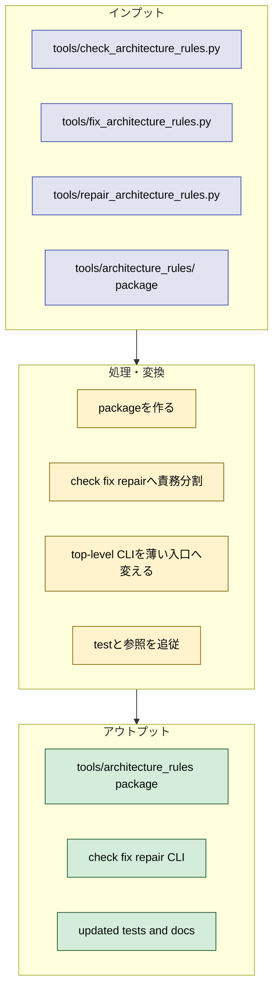
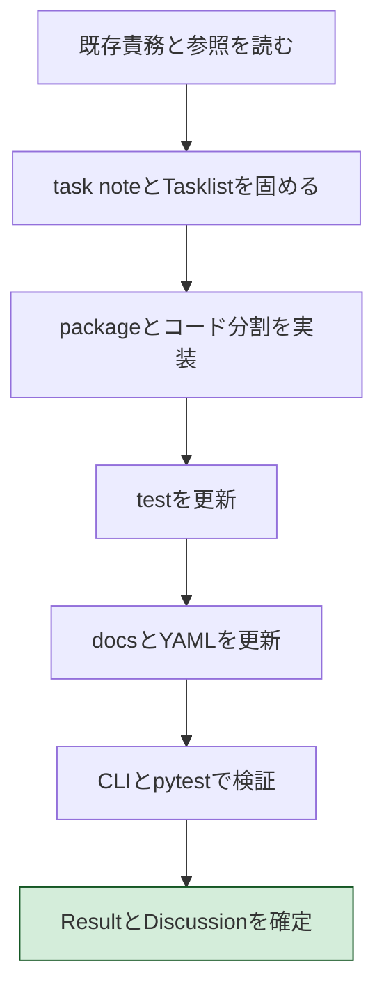
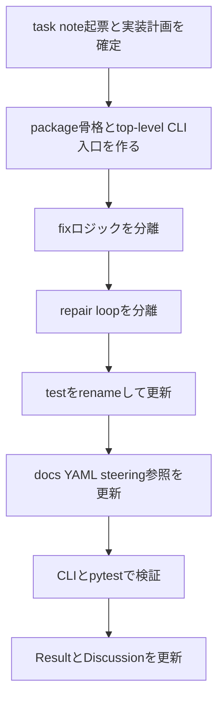

# 2026年5月9日 architecture rules check fix repair split

> 状態：⑥ Discussion（実装完了 / 検証済み）
> 次のゲート：（CC）Discussion を rule 化し、必要なら次の task note を起票する

---

## 1) Journey（どこへ行くか）

- **深層的目的**：責務名を実装に揃える
- **やらないこと**：architecture rule 自体の意味変更

**Before（現状）**：
- 💦 `architecture_guardian.py` という名詞中心の名前に、fixer 実装と repair loop が同居している
- 💦 import / test / docs の前提が `guardian` 名に引きずられ、責務境界が読みにくい

**After（達成状態）**：
- ❤️ `check / fix / repair` の3責務が分離される
- ❤️ `tools/check_architecture_rules.py` / `tools/fix_architecture_rules.py` / `tools/repair_architecture_rules.py` は薄い入口になり、実装は `tools/architecture_rules/` package 配下に集約される
- ❤️ 結果として、名前・責務・テスト対象が一致する

---

## 2) Gherkin（完了条件）

### シナリオ1：正常系（check / fix / repair が責務ごとに分かれる）

🧱 Given：architecture rule の CLI 群を見ている人がいて
🎬 When：`tools` と `tools/architecture_rules/` を読むと
✅ Then：check は診断だけ、fix は autofix だけ、repair は orchestration だけを持つ

---

### シナリオ2：再試行系（既存 CLI 呼び出しが壊れない）

🧱 Given：既存の test や runbook が `python tools/check_architecture_rules.py` / `python tools/fix_architecture_rules.py` / `python tools/repair_architecture_rules.py` を実行していて
🎬 When：rename / split 後に同じコマンドを実行すると
✅ Then：CLI は継続動作するか、意図した新コマンド名へ全面更新されて整合が取れる

---

### シナリオ3：異常系（旧 guardian 名が残って曖昧になるケース）

🧱 Given：code / docs / YAML / steering のどこかに `architecture_guardian` 前提が残っていて
🎬 When：refactor 後の検証をすると
✅ Then：残存箇所が洗い出され、修正されるか、実装不能なら理由つきで記録される

---

## 3) Design（どうやるか）

- **関連スキル・MCP**：`superpowers:writing-plans`、`superpowers:subagent-driven-development`、`superpowers:test-driven-development`、`manage-tasknotes`
- **委任度**：🟢
- **実装系方針**：1. rule 意味は変えない 2. deterministic check は維持する 3. repair は安全な正規化だけを束ねる

---

## 4) Tasklist

> 必ず上から順に実施。CCがCoVeで自力検証しながら進める。

- [x] （CC）`/superpowers:writing-plans` 相当で計画を立てる（このセクションに記入）
- [x] （CC）`tools/architecture_rules/` package を作り、check / fix / repair の責務境界を固定する
- [x] （CC）`check / fix / repair` のコードと CLI を分割する
- [x] （CC）テストを更新し、TDD で split 後の責務を固定する
- [x] （CC）docs / YAML / steering の参照を更新する
- [x] （CC）作業結果をまとめ、全Gherkinを満たしているかCoVeで検証する

### 作業記録

#### 2026年5月9日 00:00（task note起票）

**Observe**：`architecture_guardian.py` に fix 実装と repair loop が同居し、命名と責務がずれている。  
**Think**：`check / fix / repair` へ分け、さらに `tools/architecture_rules/` package に寄せると、top-level CLI を薄くできる。  
**Act**：task note を起票し、Journey / Gherkin / Design / Tasklist を確定した。

#### 2026年5月9日 00:20（TDD red と package split）

**Observe**：active test を `fix` / `repair` 前提へ切り替えると、wrapper 不在と package 不在で 16 fail になった。  
**Think**：これは意図した red で、flat import 互換の shim と package 実装を入れれば回復できる。  
**Act**：`tools/architecture_rules/` package、top-level `check / fix / repair` wrappers、`test/test_fix_architecture_rules.py`、`test/test_repair_architecture_rules.py` を実装し、旧 `architecture_guardian` を削除した。

#### 2026年5月9日 00:35（repair_autofix への完全移行）

**Observe**：targeted suite は通ったが、live YAML に `guardian_autofix` が残り、checker も legacy key 互換を持っていた。  
**Think**：active code / docs から旧名を消し切るには、test を強めてから `repair_autofix` へ一本化する必要がある。  
**Act**：checker test を強化し、`docs/architecture_rules.yml` を `repair_autofix` へ更新し、checker の legacy key 互換を削除した。

#### 2026年5月9日 00:50（最終検証）

**Observe**：architecture rules 周辺の targeted suite と CLI は通った。  
**Think**：repo ルール上、最後は full pytest まで通して done と言える。  
**Act**：`python tools/check_architecture_rules.py`、`python tools/fix_architecture_rules.py`、`python tools/repair_architecture_rules.py`、`python -m pytest test/ -q` を実行して green を確認した。

---

## 5) Result（成果物）

- 2026-05-09 00:10
  - task note を起票し、`check / fix / repair + tools/architecture_rules package` の到達点を固定した。
  - 非コード参照の探索を委任し、live 更新対象を `docs/architecture_rules.yml`、live plan docs、この task note に絞る方針を確定した。
  - `steering/done/` は履歴として残し、名称置換のためだけには更新しない方針を確定した。
- 2026-05-09 00:16
  - コード探索を委任し、`test/test_architecture_rules_checker.py` は top-level `tools/check_architecture_rules.py` shim を残せば大きく崩さずに済むことを確認した。
  - `architecture_guardian` は旧名として履歴に残し、活参照は `tools/check_architecture_rules.py` / `tools/fix_architecture_rules.py` / `tools/repair_architecture_rules.py` と `tools/architecture_rules/` package に移す方針を確認した。
  - package import は `architecture_rules.*` に寄せるのが安全で、`python tools/*.py` 実行は薄い wrapper で受ける方針を固定した。
- 2026-05-09 00:28
  - `tools/architecture_rules/__init__.py`
  - `tools/architecture_rules/check_architecture_rules.py`
  - `tools/architecture_rules/fix_architecture_rules.py`
  - `tools/architecture_rules/repair_architecture_rules.py`
  - `tools/check_architecture_rules.py`
  - `tools/fix_architecture_rules.py`
  - `tools/repair_architecture_rules.py`
  - を追加し、`tools/architecture_guardian.py` を削除した。
- 2026-05-09 00:29
  - `test/test_fix_architecture_rules.py` と `test/test_repair_architecture_rules.py` を追加し、`test/test_architecture_guardian.py` を削除した。
  - `test/test_architecture_rules_checker.py` は flat CLI shim を前提に維持しつつ、coverage key を `repair_autofix` 前提へ更新した。
- 2026-05-09 00:31
  - TDD の red を確認した。
  - 実行コマンド：`python -m pytest test/test_architecture_rules_checker.py test/test_fix_architecture_rules.py test/test_repair_architecture_rules.py -q`
  - 結果：`16 failed, 4 passed`
- 2026-05-09 00:40
  - `fix` CLI の stdout/JSON 振る舞いを test で追加し、`tools/fix_architecture_rules.py` と package 側 `main()` を実装した。
  - 実行コマンド：`python -m pytest test/test_fix_architecture_rules.py -q`
  - 結果：`3 passed`
- 2026-05-09 00:45
  - live YAML / checker から `guardian_autofix` を除去し、`repair_autofix` へ一本化した。
  - 実行コマンド：`python -m pytest test/test_architecture_rules_checker.py::ArchitectureRulesCheckerTest::test_validation_rules_include_coverage_metadata -q`
  - 結果：`1 passed`
- 2026-05-09 00:50
  - architecture rules 周辺の targeted suite を完了した。
  - 実行コマンド：`python -m pytest test/test_architecture_rules_checker.py test/test_fix_architecture_rules.py test/test_repair_architecture_rules.py test/test_architecture_layout.py -q`
  - 結果：`31 passed`
- 2026-05-09 00:55
  - 実 CLI を確認した。
  - 実行コマンド：
    - `python tools/check_architecture_rules.py`
    - `python tools/fix_architecture_rules.py`
    - `python tools/repair_architecture_rules.py`
  - 結果：
    - `check`: `run_ok: true`, `has_warnings: false`
    - `fix`: `status: OK`
    - `repair`: `status: OK`, `cycles: 1`
- 2026-05-09 01:00
  - repo 全体の test を完了した。
  - 実行コマンド：`python -m pytest test/ -q`
  - 結果：`697 passed, 2 skipped, 14233 subtests passed in 9.02s`

---

## 6) Discussion（反省）

- **結論**：option `3` は完了した。active tooling は `check / fix / repair` の3責務に分離され、実装は `tools/architecture_rules/` package、top-level scripts は薄い CLI shim になった。
- **結論**：`architecture_guardian.py` と `test/test_architecture_guardian.py` は active code から消え、coverage key も `repair_autofix` へ一本化した。
- **懸念**：`docs/superpowers/plans/2026-05-09-architecture-guardian.md` など、履歴として残した plan docs は旧名を保持している。実装上の問題ではないが、grep では引っかかり続ける。
- **懸念**：作業ツリーにはこの task と無関係な `dist/code-maker.zip` の差分と、既存 steering note の移動差分が残っている。今回の作業では触れていない。
- **次に起票すべき task note**：`docs/superpowers/plans/` 配下の architecture tooling 旧 plan を「履歴である」と明示する整理タスク。live docs と history docs の境界を grep 上でも分かりやすくする価値がある。

---

### 反省とルール化

- `guardian` のような曖昧な責務名を分解するときは、先に test 名と CLI 名を `verb + object` に寄せ、その後に package へ寄せると崩れにくい。
- live YAML / live docs に旧 key や旧 script 名が残ると、compat shim が不要に延命する。rename 系は code だけでなく facts/doc まで同時に切る。
- 次にやること：必要なら history docs の扱いを別 note で明文化する。
