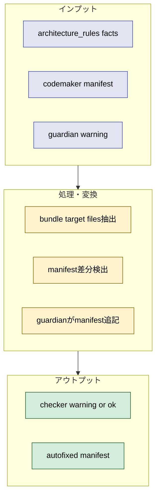
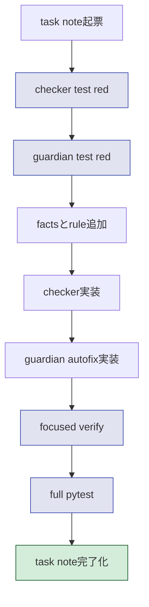
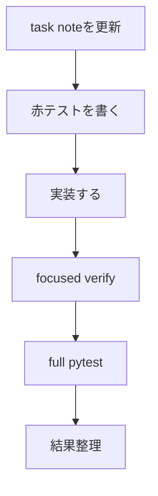

# 2026年5月9日 Code Maker manifest 完全性 rule と guardian autofix

> 状態：⑥ Discussion（実装完了 / 検証済み）
> 次のゲート：（CC）同種の bundle 契約を増やすときは facts と guardian の section ルールを同時に更新する

---

## 1) Journey（どこへ行くか）

- **深層的目的**：bundle 漏れを自動で止める
- **やらないこと**：手動確認頼みで終えること

**Before（現状）**：
- 💦 `tools/codemaker_manifest.txt` の漏れは scene 系テストの守備範囲外だと bundle 実行時まで気づけない
- 💦 `docs/architecture_rules.yml` には facts はあるが、manifest 完全性を deterministic に照合する rule がない
- 💦 guardian は manifest 漏れを自動修復できない

**After（達成状態）**：
- ❤️ `architecture_rules.yml` に Code Maker bundle 対象の facts と rule がある
- ❤️ checker が manifest 漏れを warning にできる
- ❤️ guardian が安全な追記だけで manifest 漏れを自動修復できる

---

## 2) Gherkin（完了条件）

### シナリオ1：bundle 必須ファイルの漏れを checker が検知する

🧱 Given：Code Maker bundle に必須な shared/ui や shared/services の file が facts に登録されている  
🎬 When：`tools/codemaker_manifest.txt` からその file が抜ける  
✅ Then：`check_architecture_rules.py` が warning を返し、欠けた path を示す

---

### シナリオ2：安全な漏れは guardian が自動修復する

🧱 Given：manifest から bundle 必須 file が抜けている  
🎬 When：`tools/architecture_guardian.py` を実行する  
✅ Then：guardian が適切な section に path を追記し、再検査後に warning が消える

---

### シナリオ3：実 repo で full test と bundle build が壊れない

🧱 Given：新 rule / checker / guardian を追加した repo がある  
🎬 When：関連テスト、bundle build、full pytest を実行する  
✅ Then：今回の rule 追加で既存の bundle 経路と test suite は壊れない

---

## 3) Design（どうやるか）

- **関連スキル・MCP**：`manage-tasknotes`、`test-driven-development`、`verification-before-completion`
- facts 側に `bundle_targets: [code_maker]` を持つ file node を追加し、checker はその node 群を manifest と照合する
- 既存の scene-only manifest test は残しつつ、新 rule は non-scene support file の漏れも止める
- guardian は warning を受けたら不足 path を manifest の適切な section に追記し、再検査で clean にする





---

## 4) Tasklist



> 必ず上から順に実施。CCがCoVeで自力検証しながら進める。

- [x] （CC）manifest 完全性 rule と guardian autofix の赤テストを書く
- [x] （CC）facts / validation_rules / checker / guardian を最小実装で通す
- [x] （CC）focused verify と full pytest を実行し、結果を整理する

### 作業記録

#### 2026年5月9日（task note 起票）

**Observe**：`architecture_rules.yml` には bundle 関連 facts はあるが、manifest 完全性 rule がなく、guardian も manifest を直せない。  
**Think**：scene file だけを見ている既存 test では今回の `DebugService` / `text_renderer.py` 型漏れを止め切れない。checker と guardian に同じ正本を持たせる必要がある。  
**Act**：この task note を作成し、Gherkin / Design / Tasklist を先に固定した。

#### 2026年5月9日（赤テストを追加）

**Observe**：`test_architecture_rules_checker.py` と `test_architecture_guardian.py` に新 rule 前提の期待値を足すと、real repo の rule 数不足と unknown check で失敗した。  
**Think**：今回必要なのは tree node 追加より先に、「manifest に必須 path がある」という contract を facts として持ち、checker と guardian がそれを共有すること。  
**Act**：checker の count/coverage 更新、manifest 漏れ warning fixture、guardian autofix fixture の赤テストを追加した。

#### 2026年5月9日（rule / checker / guardian 実装）

**Observe**：existing deterministic rule は entry chain / dist / generated / runbook のみで、manifest completeness は未実装だった。  
**Think**：scene は既存 test が守っているので、新 rule は non-scene bundle support file に絞るのが最小で十分。  
**Act**：`docs/architecture_rules.yml` に `codemaker_bundle_contracts` と `codemaker_manifest_non_scene_paths` を追加し、`tools/check_architecture_rules.py` に contract 比較 check、`tools/architecture_guardian.py` に manifest 追記 autofix を実装した。

#### 2026年5月9日（検証）

**Observe**：focused test、checker CLI、guardian CLI、bundle build、full pytest のすべてが通った。  
**Think**：これで `DebugService` / `text_renderer.py` 型の non-scene manifest 漏れは deterministic に検知でき、safe な漏れなら guardian に任せられる。  
**Act**：`python -m pytest test/test_architecture_rules_checker.py test/test_architecture_guardian.py -q`、`python tools/check_architecture_rules.py`、`python tools/architecture_guardian.py`、`python tools/build_codemaker.py`、`python -m pytest test/ -q` を実行して green を確認した。

---
## 5) Result（成果物）

### 実施内容

- `docs/architecture_rules.yml` に Code Maker non-scene bundle の contract list を追加した
- validation rule `codemaker_manifest_non_scene_paths` を追加した
- `tools/check_architecture_rules.py` に manifest required path の deterministic check を追加した
- `tools/architecture_guardian.py` に manifest の safe autofix を追加した
- checker / guardian の回帰テストを追加した

### 検証結果

```text
$ python -m pytest test/test_architecture_rules_checker.py test/test_architecture_guardian.py -q
16 passed

$ python tools/check_architecture_rules.py
run_ok: true, has_warnings: false
total_rules: 9, executed_rules: 5

$ python tools/architecture_guardian.py
status: OK, cycles: 1

$ python tools/build_codemaker.py
OK: dist/code-maker.zip を生成

$ python -m pytest test/ -q
694 passed, 2 skipped, 14233 subtests passed
```

### 変更ファイル

- `docs/architecture_rules.yml`
- `tools/check_architecture_rules.py`
- `tools/architecture_guardian.py`
- `test/test_architecture_rules_checker.py`
- `test/test_architecture_guardian.py`
- `codemaker_bundle_contracts` は checker と guardian の共有契約として効いた。今後 manifest 対象を増やすときは contract と autofix bucket を同時に更新する
- scene file は既存の `test_codemaker_manifest_matches_scene_files` が守り、今回の新 rule は non-scene support file の穴を埋める役割に分けた
- guardian の autofix は「追記だけ」に限定したので安全性を保てている。削除や並べ替えまで自動化したくなっても、それは別 rule に分けるべき
---
## 6) Discussion（反省）


---

### 反省とルール化

- 次にやること：bundle 契約を広げるときは facts 側の required path と guardian の section 挿入規則を先に設計する
