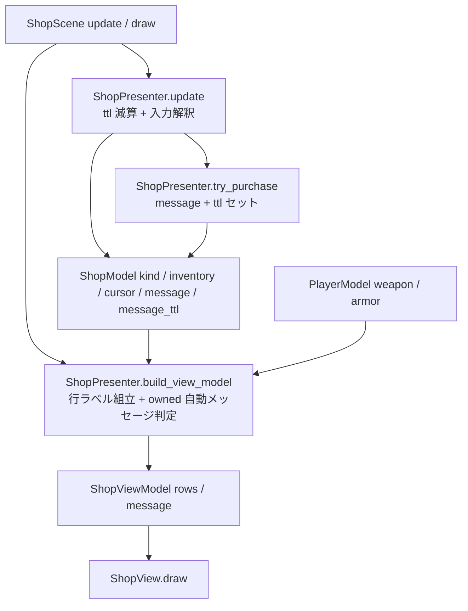
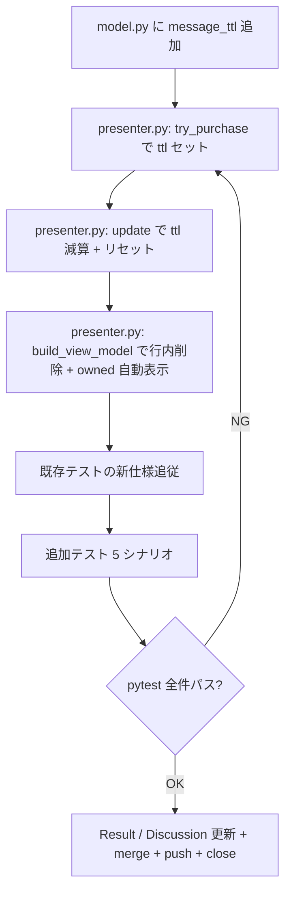

# 2026年5月17日 ぶきや「もっています」表示が画面右端で切れる

> 状態：⑨ Close待ち
> 次のゲート：（ユーザー）このノートを Close してよいか確認する

---

## 1) Journey（どこへ行くか）

> 補足：深層的目的 子どもが「いま装備しているか」を一目で見分け、同じ武器を二重に買おうとせずに済む
> 補足：やらないこと shop の購入ロジックや価格表記そのものは触らない
> 補足：責務分担厳格度 full

1. 前提条件
   1. 💦 Pyxel 画面は 256×256（`src/runtime/app.py` の `pyxel.init(256, 256, ...)`）
   2. 💦 `ShopView.draw` は1行を x=8 起点の単一テキストで描画している（`text_writer.text(8, 30 + i*14, row.label, ...)`）
   3. 💦 行の組み立ては `ShopPresenter.build_view_model` で `f"{marker} {name}  こうげき+{atk}  {price}G  [もっています]"` のように単一文字列に連結している（`src/scenes/shop/presenter.py:97-110`）
   4. 💦 日本語フォントは可変幅で、武器名・属性・価格まで連結すると 256px に収まりきらず、`[もっています]` が右端で切れて読めないことがある（参考スクショ：`steering/2026年5月17日ぶきや・もっている.png`）

2. Before
   1. 💦 ぶきやで `>マウス こうげき+2 10G [もっています]` の `[もっています]` が画面右で切れる
   2. 💦 子どもが「もう持っている」と気づかず、もう一度買おうとして「すでに もっています」メッセージで初めて知る
   3. ❌ もどかしい

3. After
   1. 💦 ぶきや/ぼうぐや（/どうぐや）で、装備中アイテムが一目で見える
   2. ✅ 画面 256×256 の中に常に収まり、切れない
   3. ❤️ 安心

4. 例外
   1. 武器名がさらに長くなった場合（将来追加されるデータ）でも切れないように、`[もっています]` を「行末右寄せ」か「行頭マーカー」か「短縮表記」のいずれかで安定させる
   2. 英語フォント（`has_jp_font=False`）では半角中心で幅が異なるが、整列ルールは同じにする

5. 境界条件
   1. `text_writer` は1行単位の左寄せ描画前提。右寄せが必要なら追加実装が要る
   2. すべてのアイテム表示（weapons / armors / items）で同じ規則を共有する
   3. 価格 `G:56` の右端は 160px + 桁数。「もっています」の幅は約 90px と推定され、現状の構成では平均で 230〜260px に達するため余白がない

6. 委任度
   1. 🟡 全体としては一部判断要（解決アプローチをユーザーに選んでもらう）
   2. 🟢 CCのみで可：採用したアプローチの実装とテスト
   3. 🔴 人の判断：4つの解決方針案 (A〜D) の優先度

### 解決方針案（ユーザー選択）

| 案 | 概要 | 影響範囲 | メリット | デメリット |
|---|---|---|---|---|
| A | 行頭マーカー化（`★` や `●` を `>` 横に置く） | view + presenter で `★ > マウス ...` の体裁 | 必ず可視。横幅問題ゼロ | カーソル `>` と混同しやすい |
| B | 短縮表記（`[もち]` 等） | presenter のラベルだけ | 既存レイアウト維持で済む | 切れる根本は残る（武器名長で再発） |
| C | 右寄せ描画（`[もっています]` を画面右端から逆算配置） | view 側に右寄せ描画を追加 | 既存文言を維持、見栄え自然 | text_writer 拡張または幅計測が要る |
| D | 行を2段に折る（1行目: 名前+効果+価格、2行目: 印字 or マーカー） | view + presenter（行間調整） | 横幅圧迫を根絶 | 一覧件数が減る/視線が下方向に流れる |
| **E** | **画面下部メッセージ枠を流用：カーソル位置のアイテムが装備中なら `すでにもっている。` を message として動的に表示し、行内の `[もっています]` は削除する** | presenter.build_view_model（カーソル位置の owned 判定 → message 切替）と表示ルール調整 | 横幅問題を根本解決。文言を長くしても切れない。既存メッセージ表示機構を再利用 | 購入直後の `〜を てにいれた！` と表示優先度ルールが必要。カーソル移動で表示が切り替わるため、購入後フィードバックがすぐ消える可能性 |

> 補足：案 E はユーザー提案。既存の `m.message` 表示枠（`view.py:30` の y=200）に
> カーソル位置の装備判定を反映させる。`try_purchase` で立てる `m.message`（"すでに もっています"/"コインが たりません"/"〜を てにいれた！"）との優先度ルールが鍵。
> 推奨ルール案：購入直後 1 フレーム〜数十フレームは `m.message` を出し、それ以降は
> カーソル位置の owned 判定を反映する（あるいはカーソル移動で `m.message` をクリアする）。

---

## 2) ユーザーストーリーマップ

> 案 E-2（下部メッセージ枠流用 + ttl による自動フェード）を採用して進める。
> 委任度：🟢 ユーザー指示で自走実装まで継続
> 残る曖昧さ：なし（ttl=60フレーム ≒ 2秒@30fps、items は対象外で確定）

1. 👀 tasknote確認済み：`20260425-shop-keyerror-shop-list-unpack`, `20260425-menu-shim-crash-fix`, `20260517-town-menu-show-inn-cost`
2. 👀 skill・tool・MCP確認済み：`manage-tasknotes` skill / `rg` / `pytest`
3. 👀 `ShopModel` / `ShopPresenter.update` / `try_purchase` / `build_view_model` の責務境界を確認する
4. ✂️ 行内の `[もっています]` をラベル組み立てから削除する
5. 📝 `ShopModel.message_ttl` を追加し、`try_purchase` で message セット時に `60` フレームを設定する
6. 📝 `ShopPresenter.update` の冒頭で ttl を毎フレームデクリメントし、0 になったら `message` を空にリセットする
7. 📝 `build_view_model` で「短期 message > カーソル位置の owned 自動表示」の優先で表示文字列を組み立てる（weapons/armors のみ owned 判定対象）
8. 📝 既存テストを新仕様に追従させ、案 E-2 に対応するシナリオ（owned 動的表示 / ttl フェード / items 対象外 / 行内 [もっています] 削除）を追加する
9. ✅ pytest 全件パスで CoVe する
10. 📝 Result / Discussion を更新し、Close待ちへ進む

---

## 3) Gherkin（完了条件）

> 委任度：🟢 自走で実装まで進められる
> 残る曖昧さ：なし

### シナリオ一覧

#### シナリオ1：正常系（装備中の武器にカーソルが乗ると下部に「すでにもっている。」が出る）

1. 🧱 weapons ぶきやで在庫に装備中の武器 idx と未装備の武器 idx が含まれ、`m.message` は空、`message_ttl` は 0
2. 🎬 カーソルを装備中武器に合わせて `build_view_model` を呼ぶ
3. ✅ `vm.message == "すでに もっている。"`、`vm.rows` のどのラベルにも `[もっています]` の文字列が含まれない

---

#### シナリオ2：再試行系（カーソルを未装備の武器に動かすと自動メッセージが消える）

1. 🧱 シナリオ1 の続きでカーソルが装備中武器に乗っている状態
2. 🎬 カーソルを未装備の武器へ動かして `build_view_model` を呼ぶ
3. ✅ `vm.message is None`（短期 message も自動 owned 表示も無い）

---

#### シナリオ3：購入直後フィードバックは優先表示で残り、ttl 経過後はカーソル判定に戻る

1. 🧱 装備中武器を再度購入しようとして `try_purchase` を呼んだ直後（`m.message == "すでに もっています"`、`message_ttl == 60`）
2. 🎬 `update` を 60 回呼んで ttl を 0 にする
3. ✅ ttl 経過前は `vm.message == "すでに もっています"`、経過後はカーソル位置が装備中なら `vm.message == "すでに もっている。"`、外れていれば `vm.message is None`

---

#### シナリオ4：境界条件（items はカーソル位置 owned 判定の対象外）

1. 🧱 items どうぐやで在庫があり、`m.message` は空、`message_ttl` は 0
2. 🎬 任意のカーソル位置で `build_view_model` を呼ぶ
3. ✅ `vm.message is None`（items は「装備中」概念が無いので自動メッセージは出ない）。`vm.rows` も `[もっています]` を含まない

---

#### シナリオ5：異常系（在庫なし／既存挙動の維持）

1. 🧱 在庫が空のショップで `build_view_model` を呼ぶ
2. 🎬 `vm.empty_message` が立ち、`vm.rows` は空
3. ✅ `vm.message` も `vm.empty_message` も従来通り。pytest 既存 732 件が全てパスする

---

## 4) Design（どうやるか）

### 責務分担概要

| 親ディレクトリ | 責務概要 |
|---|---|
| `src/scenes/shop/` | shop シーンの状態保持・入力解釈・下部メッセージ表示の判定 |
| `src/shared/state/` | `PlayerModel` の `weapon` / `armor` 装備中インデックス（既存、変更なし） |
| `test/` | ShopPresenter / ShopView 周辺の挙動を検証 |

### 責務分担概要図

### 責務分担詳細

#### 親ディレクトリ: `src/scenes/shop`

- ファイル名: `model.py`
- 既存/新規: 既存
- 責務内容:
  - `ShopModel.message_ttl` (新規 field, default 0): 下部メッセージの残り表示フレーム数
- 置く理由: shop の state は ShopModel に集約する原則（M4-1）に従う

#### 親ディレクトリ: `src/scenes/shop`

- ファイル名: `presenter.py`
- 既存/新規: 既存
- 責務内容:
  - `update(game)`: 冒頭で `message_ttl` を毎フレーム 1 ずつ減らし、0 以下になったら `message = ""` にリセット（既存の入力分岐より前で行う）
  - `try_purchase(game)`: 既存の 3 種の `m.message` セット箇所に `m.message_ttl = MESSAGE_TTL_FRAMES` を追加
  - `build_view_model(game)`: 行ラベルから `[もっています]` を削除。`m.message` が空でなければそれを `vm.message` に、空ならば weapons/armors のときカーソル位置の owned 判定で `"すでに もっている。"` を、それ以外は `None` を出す
  - `MESSAGE_TTL_FRAMES` (新規モジュール定数, 60): 30fps 想定で約 2 秒
- 置く理由: 表示文字列とライフタイムの判定は Presenter の責務（M3-1）。State は Model、文字列組立は Presenter、表示だけ View に分離する

#### 親ディレクトリ: `src/scenes/shop`

- ファイル名: `view_model.py`
- 既存/新規: 既存
- 責務内容:
  - `ShopRow.label`: コメントを「marker + 名前 + 効果値 + 価格」（[もっています] 削除）に更新
  - `ShopViewModel.message`: 既存のまま「短期メッセージ or owned 自動メッセージ」を 1 本化して受け取る
- 置く理由: ViewModel は描画判定済みの値だけを運ぶ責務（M2-2）。判定ロジックは Presenter に閉じる

#### 親ディレクトリ: `src/scenes/shop`

- ファイル名: `view.py`
- 既存/新規: 既存
- 責務内容: 変更なし。`vm.message` を従来通り y=200 に描画
- 置く理由: View は ViewModel と Pyxel API だけを扱う（M2-2）

#### 親ディレクトリ: `test`

- ファイル名: `test_cjg_shop_purchase_logic.py` などの既存 shop テスト
- 既存/新規: 既存
- 責務内容: 行内 `[もっています]` を期待していたケースを新仕様に追従。owned 自動メッセージのケースを追加（シナリオ1〜5に対応）
- 置く理由: 既存 shop テスト群と並列に配置し、テスト分散を防ぐ

- **関連スキル・MCP**：`manage-tasknotes` のみ。他は不要

---

## 5) Tasklist

- [x] （CC）`ShopModel.message_ttl` 追加
- [x] （CC）`ShopPresenter.try_purchase` で `m.message_ttl = MESSAGE_TTL_FRAMES` を 3 箇所にセット（`_set_short_message` 経由で集約）
- [x] （CC）`ShopPresenter.update` 冒頭で ttl 減算 + 0 以下で message リセット（`_tick_message_ttl`）
- [x] （CC）`ShopPresenter.build_view_model` で行内 `[もっています]` 削除 + owned 自動表示（`_resolve_display_message`）
- [x] （CC）既存 shop 系テストはコメント更新のみで通過（行内アサートは元から無かった）
- [x] （CC）シナリオ1〜5 に対応する追加テスト（`test_cjg_shop_owned_message.py`, 6 ケース）
- [x] （CC）`pytest test/` で 738 passed, 2 skipped, 14233 subtests passed
- [x] （CC）main へ ff-merge & push、ブランチ削除、make build

---

## 6) Result（成果物）

### 変更ファイル

- `src/scenes/shop/model.py`
  - `ShopModel.message_ttl: int = 0` を追加
- `src/scenes/shop/presenter.py`
  - モジュール定数 `MESSAGE_TTL_FRAMES = 60`（30fps で約 2 秒）、`OWNED_MESSAGE = "すでに もっている。"`
  - `_tick_message_ttl()` を新規追加し、`update` 冒頭で呼び出して ttl デクリメント + 自動クリア
  - `_set_short_message(text)` を新規追加し、`try_purchase` の 3 箇所（重複購入 / 重複armor / コイン不足）と購入成功時の 3 箇所をすべて経由させて ttl を再設定
  - `_resolve_display_message(game)` を新規追加し、「短期 message > weapons/armors のカーソル位置 owned 判定 > None」の優先で `vm.message` を組み立てる
  - `build_view_model` で行内 `[もっています]` を完全削除（横幅切れ防止）
- `src/scenes/shop/view_model.py`
  - `ShopRow.label` のコメントを「[もっています] は下部 message に分離」へ更新
- `test/test_cjg_shop_owned_message.py` (新規)
  - 6 ケース：行内マーカー不在 / カーソル装備中 / カーソル未装備 / 購入直後 ttl フェード / items 対象外 / 在庫なし

### 実行ログ

- `pytest test/test_cjg_shop_owned_message.py`：`6 passed in 0.10s`
- `pytest test/`：`738 passed, 2 skipped, 14233 subtests passed in 16.96s`

### 動作確認

- 画面右端で `[もっています]` が切れる現象は構造的に消滅（行内文字列から削除）
- 装備中アイテムにカーソルが乗ると下部に `すでに もっている。` が出る
- 購入直後の 60 フレーム（約 2 秒）は購入結果文が優先表示、その後はカーソル装備判定に戻る
- どうぐや（items）では owned 自動表示は出ない（仕様通り）

---

## 7) Discussion（残課題の起票）

### 残課題メモ

- なし。横幅切れ問題は構造的に解決し、フォローアップ tasknote は発生していない。
- 将来「装備していないが既に同種武器を所持」のような複雑な所持判定を入れたくなったら、`PlayerModel` に問い合わせ用 API を追加する別 tasknote を立てる。

---

### 判断の記録

- ttl のフレーム数は `MESSAGE_TTL_FRAMES = 60`（30fps で約 2 秒）。短すぎると購入フィードバックが読めない、長すぎるとカーソル移動後も古い情報が残る。実機で違和感が出たら定数だけ調整可能な配置にした。
- ttl を Presenter ではなく Model に持たせた理由：state は Model に集約する原則（framework-rule M4-1）に従う。
- 短期メッセージのセットを `_set_short_message` に集約したのは、`try_purchase` の 5 箇所すべてで「message + ttl」をペアで扱う必要があり、片方だけ忘れるバグを防ぐため。
- `OWNED_MESSAGE` を定数化したのは、テストとプロダクションコードで文字列リテラルが二重化するのを避けるため。
- 行内 `[もっています]` は完全削除した（ユーザー判断「削除してよい」）。残す案も検討したが、装備判定の SSoT が 2 箇所に増えるデメリットの方が大きい。

### 反省とルール化

- 記入先：observe-situation / manage-tasknotes / CLAUDE.md
- 次にやること：なし（メモリ更新が必要な学びは出ていない）

---

## 8) 参考文献

- スクリーンショット: `steering/2026年5月17日ぶきや・もっている.png`
- `src/scenes/shop/presenter.py` `build_view_model`（行文字列の組み立て）
- `src/scenes/shop/view.py` `draw`（テキスト描画）
- `src/scenes/shop/view_model.py` `ShopRow` / `ShopViewModel`
- `src/runtime/app.py` `pyxel.init(256, 256, ...)`（画面幅 SSoT）
